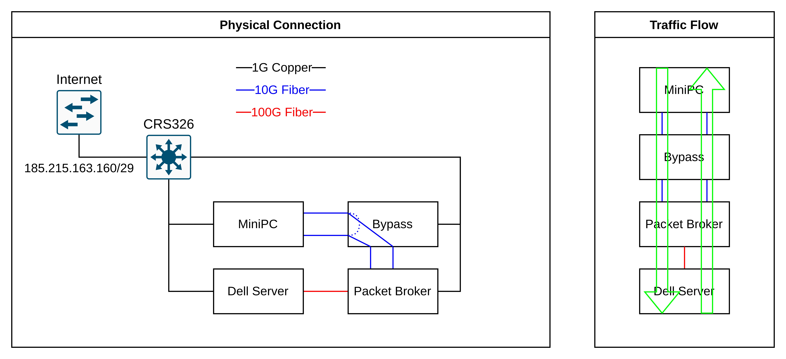
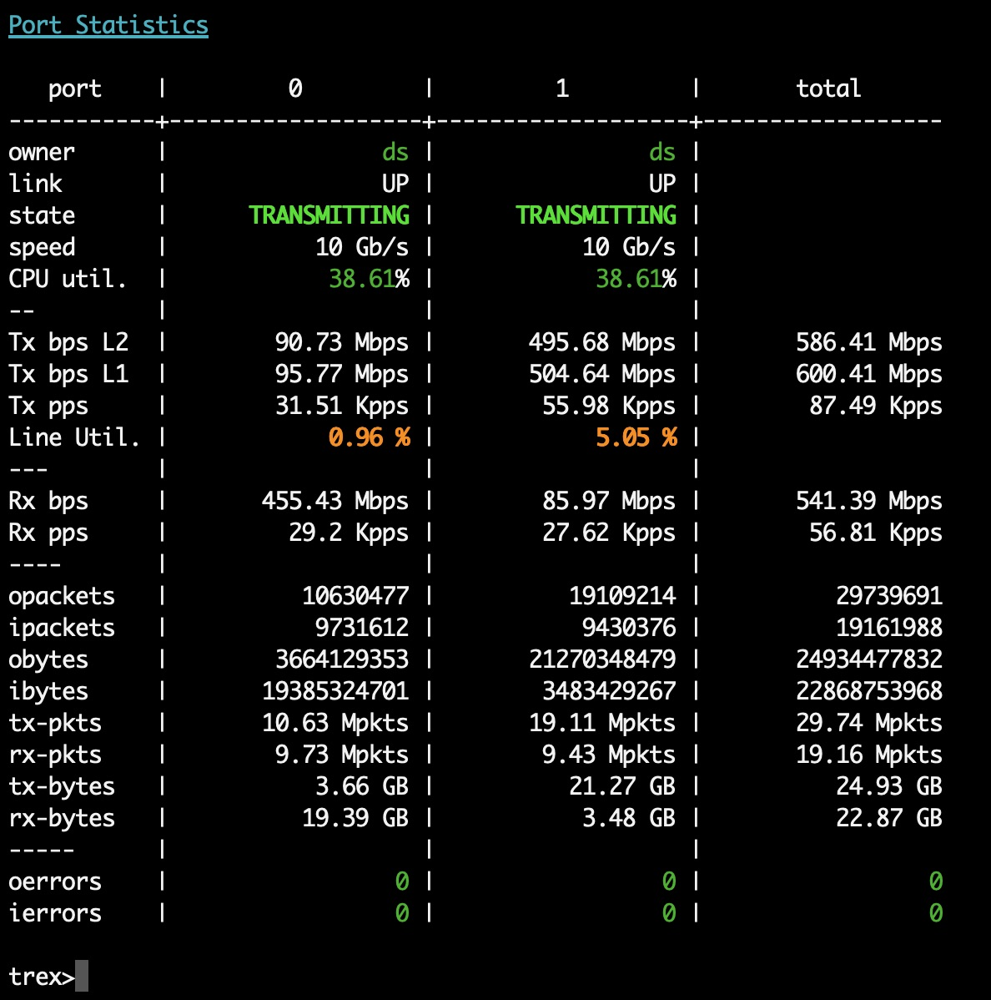
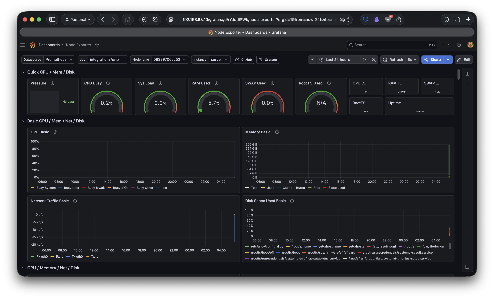
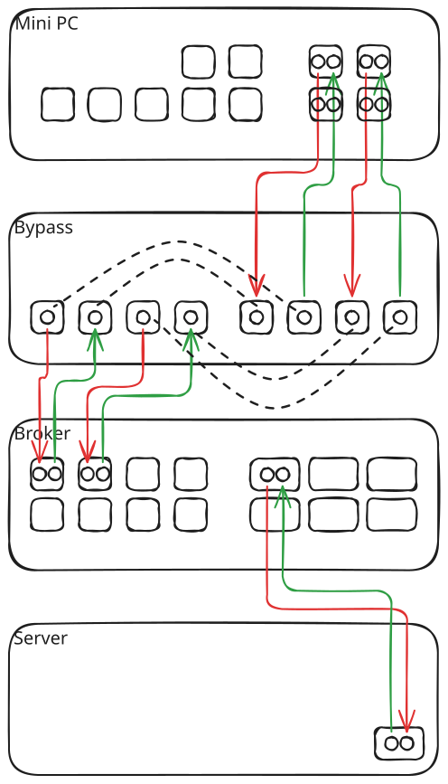
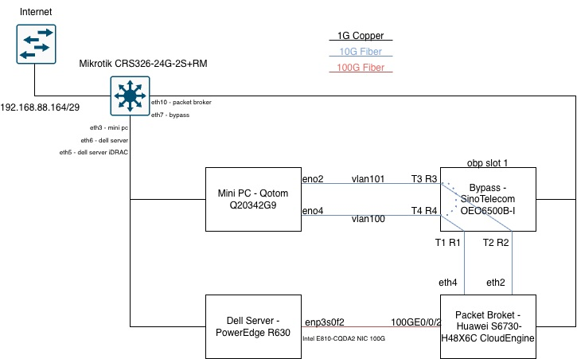
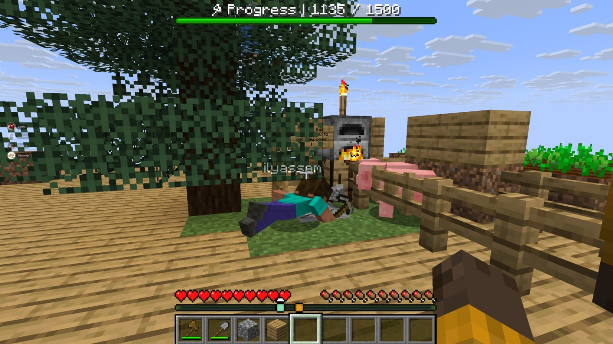

## Introduction

This spring I got the opportunity to complete an internship at a local IT company [7Generation](https://7generation.net), which is the flagship company of [Kazdream IT Holding](https://kazdream.kz). I'll be honest, I hadn't heard anything about them before the internship.

The way I got this opportunity is mysterious. Someone texted me on Telegram asking for my CV, without any further details. I was like, sure 👍 I got invited to take a test after CV screening. Then about a week later I got an invite to an interview.

I looked for the guy who apparently sent them my CV, but he disappeared from my DMs. Never heard from him ever again. Dude, if you are reading this, let me buy you a coffee or something 😆

Well, anyway, that's how I got my first ever internship. I don't want to brag but apparently there were 160 applicants, and 8 of us were selected, all of whom also happened to be from NU.

Onboarding was really welcoming. Got introduced to the company, the team, and the current projects. Apparently, the holding's HR department is so good that they started selling it as a service, and it showed. We were properly supported and guided all throughout the internship and had a great time. 

Did some real job stuff. It was paid, so I had to sign a contract and an NDA for the first time in my life. Got some money in my pension fund now. 

All the holding's companies are co-located in 3 floors of single office building. It is a Gen Z paradise with a game room with PS5, table tennis and bean bags, nice kitchens, free breakfast and snacks. Even got ice cream once. 

### What the Company Does

The very first thing I asked when I got there was "How do you make money?" Gotta know what you're doing it for before doing anything, right?

As far as I understood, 7Generation is a product company that specializes in what is called [Deep Packet Inspection (DPI)](https://www.splunk.com/en_us/blog/learn/deep-packet-inspection-dpi.html) and sells their product to telecom companies.

In simple terms, DPI is used for being able to have granular control over the traffic. Say you want to know if the traffic on your infrastructure is serving YouTube or Instagram content. It is not really possible simply because most packets that go over the internet are encrypted nowadays. However, they still have some distinct signatures. Identifying these signatures and marking them with known targets is, basically, DPI.

The core product they sell is software that analyzes the traffic on very high-load systems and allows the customer to take action based on that information. But they also provide all that comes with it – from deploying server infrastructure, to R&D on packet signatures, to frontend.

This kind of work requires specialist with unique skill set scarce in the market. So that is their rationale behind the internship. 

It lasted for 3 months, and was structured in 3 stages.

First we would attend lectures led by awesome lecturers in 3 different tracks – Computer Networks, Linux System Administration, and Golang Programming Language. All of them were quite intensive in pace and extensive in content, and at the end we had exams. Then we were given tasks from the team leads with deadlines to solve and present. The last part was working in one of the core teams on projects with real tasks. We got to choose which tasks to complete and which team we wanted to join.

## Tasks

There were 5 tasks in total:
- Alternative implementation of sync.Pool in Golang from scratch
- Traffic generator using PCAP files
- High-traffic (100G) packet forwarder and analyzer
- Integrating PCEF with PCRF in 5G Core using Open5GS
- **Infrastructure task from System Integrations Team**

From the very beginning of the internship I wanted to do networking rather than software to be honest. After [Making use of a 15-year-old laptop](https://sagyzdop.com/blog/making-use-of-a-15-year-old-laptop/) I wanted to try working with a proper server equipment on real infrastructure. That is why my task of choice was the last one from the team that they call internally – "System Integrations".

In this blog post I want to tell you more about it, as it was the most memorable thing during my time at the company aside from other interesting stuff we did.

## The Team

From the feel of it what this team does lies somewhere between the traditional dev-ops' and systems administrators' job. They are responsible for setting up infrastructure on site, preparing everything for deploying their products, and any possible troubleshooting maintenance work after that. Led by a young and charismatic team lead, Yernar, the guys on the team were mainly my peers and were very nice to work with. Grateful for all the support and help.

## The Task

### Overview

The task was presented to us almost as a P vs. NP level challenge, but that's exactly what made it interesting. Five of us chose to do it, and I was paired with an incredible teammate, Dulat.

We were handed a one-page brief. The goal was to create a controlled testing environment for traffic analysis and control software – something the company could use to stress-test their own product before deploying it in production. Also this should have been the testing site for the other tasks.

The setup has three main software components:
- **Cisco TRex** on the mini PC to act as a traffic generator.
- **Dell Server** to loop back all incoming traffic. This is where the packet capture, analysis, and forwarding would happen.
- **Monitoring system** covering every device via SNMP. We decided to also deploy it on the mini PC.

The idea is simple: TRex fires traffic into the pipeline, the Dell Server bounces it back, and TRex measures packet loss, latency, and throughput. With that we had to prove the infrastructure was solid and working as intended, being able to withstand the high traffic load.

The monitoring system which we deployed on the mini PC watches things like CPU, port stats, link status via SNMP across the devices.

> SNMP (Simple Network Management Protocol) is a standard protocol built into virtually every network device.

One thing I am so proud of is the fact that I used my own previous work for monitoring, namely the [repo](https://github.com/sagyzdop/simple_monitoring) mentioned in "[Simple Monitoring for a Website](https://sagyzdop.com/blog/simple-monitoring-for-a-website/)" article I wrote about [Nuspace.kz](https://nuspace.kz)'s monitoring solution I made. And the best part – it worked exactly as intended, I just pulled the GitHub repo and ran the containers!

Anyway, for the hardware we got:

| Name          | Model                            | IP Address Mapping |
| ------------- | -------------------------------- | ------------------ |
| Smart Switch  | MikroTik CRS326-24G-2S+RM        | 192.168.88.1       |
| Mini PC       | QOTOM-Q20342G9                   | 192.168.88.10      |
| Packet Broker | HUAWEI Cloud Engine S6730-H48X6C | 192.168.88.30      |
| Bypass        | SinoTelecom OEO6500-OLP-BP-TD    | 192.168.88.40      |
| Server        | Dell PowerEdge R630              | 192.168.88.20      |
|               | DELL iDRAC                       | 192.168.88.21      |

> They apparently bought the MikroTiks just for us interns. We were like damn they got money. Out of the box it has a default IP of `192.168.88.1` on its first port, that's why further port mapping was done in the same subnet range.

We were given carte blanche to do whatever we want with this hardware, as long as we completed the task. I will go through them one by one and tell what interesting things happened while working with them.

### MikroTik

In this context MikroTik Smart Switch (labeled `CRS326`) acts as the central management hub. It has access to internet, and everything connects to it for management. It handles routing, NAT, VPN access and acts as a DNS resolver for all internal devices.

From the first day of lectures we had heard about the MikroTik equipment. I understood why they were so praised when we got to work with them. The biggest W of MikroTiks is WinBox – their native management application.

#### WireGuard VPN

WireGuard is built natively into RouterOS – the Linux-based OS that their equipment ships with – and can be easily configured in WinBox. The configuration process is so intuitive and straightforward that it inspired me to deploy WireGuard with UI on Nuspace. ([Read about it in my recent blog post.](https://sagyzdop.com/blog/wireguard-for-nuspace/))

The process is the following:
- Create the WireGuard interface `wg1` on port `51820`.
- Assign an IP `10.0.0.1/24` to the tunnel interface `wg1`.
- Allow WireGuard through the firewall by allowing input UDP on port `51820` and forwarding on interface `wg1`.
- Add peers. (WinBox can also auto-generate the configs for them.)

I activated the tunnel and confirmed it worked by pinging the devices in the network by their IPs. From this point on, WireGuard gave me full remote access to the lab from anywhere. Ideally I didn't have to go to the cold and loud server room ever again. Unfortunately, that wasn't the case 😅

### "Cybersecurity Does Not Exist"

Shortly after connecting to the internet, though, I noticed something was wrong. The WinBox terminal stopped working, SSH returned permission denied, and I couldn't open certain menus. When I investigated I found that the `admin` user had been stripped of all permissions, and a new user called `system` had been added with full access.

It was getting close to the end of the workday when I noticed that, so I went home. After investigation at home I realized I have been pwned.

To make my life "easier" during the initial setup I set the password to `1234`. The moment it went live bots got in, removed admin permissions and added their own backdoor user. Apparently this is a widely [known MikroTik exploitation pattern](https://forum.mikrotik.com/t/not-enough-permission-to-export-config/179419/4).

I had to go back the next day and physically reset the switch in the server room. Created a new user with a strong-ass password and disabled the default `admin`. Disabled unused services, and set firewall rules.

> Chinese bots became an inside meme from that point on.

### Mini PC

The mini PC was home for the monitoring and the traffic generator.

We installed **[Rocky Linux 9 minimal](https://rockylinux.org/download)** on both the MiniPC and the Dell Server. It is a RHEL-based distro that was allegedly made as a replacement for CentOS. One thing I learned during the lectures was that RedHat distros are better for production – being stabler, better documented, and better supported.

Not much else to say about it other than we got to work with Cisco TRex, getting familiar with different caveats of traffic generators.

Here is a screenshot of TRex report we managed to get:

The load is not that impressive, but that was because we had to run in software mode due to a hardware compatibility issue with the interfaces that was outside of our control.

And here is the screenshot of my monitoring stack I talked about earlier running on the mini PC:

### Bypass

The "Bypass Switch" sits inline between the MiniPC and the Packet Broker. Its job is a hardware-level safeguard against hardware failure. If the Dell Server crashes during testing, the bypass physically reroutes the optical signal around it so the pipeline doesn't completely die.

> "Inline" means the device sits directly in the traffic path – packets must pass through it, not just to it. If an inline device fails, traffic stops entirely unless there's a bypass. In our case, the server lies inline.

The bypass was from some Chinese manufacturer that gets you exactly six Google pages when you search for it, and exactly one result when you search for that specific model. So all of our guidance was limited to a manual that claimed to be for it. But it had different port mapping and provided no help. We even had to pull out a pen and paper to draw out the connection schema. 

We figured it out with trial and error, but I am still not quite sure if we connected it correctly... Seemed to work.

### Packet Broker

"Packet Broker" is basically a glorified switch. At least for our purposes we used it as such. Here it distributes traffic between the bypass and the Dell Server. Another Chinese device, but this time from HUAWEI, so it was quite nice working with it.

Apparently, the whole point of this task was in the trick we had to figure out with packet broker. Notice that there is only one link from the broker to the Dell server on the diagram. But the task supposes 2-way flow of traffic. So how do you do it?

VLANs. The trick was using 2 different VLANs for incoming and outgoing traffic to and from the Dell server, and configuring the single interface as a trunk.

### DELL Server

One interesting thing I got to work with is iDRAC (Integrated Dell Remote Access Controller) – a hardware-based management system built into Dell PowerEdge servers that lets you monitor, update, and control servers remotely. It works completely independently of the server's main operating system and allows access even if the server itself is powered off or crashing.

This saved me a lot of hassle when about 80% of the way I was done with configuration and near the end of the workday the team needed to replace our server with another one exactly like it. That's when I also learned about RAID configuration import.

Upon replacing the server, I just quickly set the iDRAC IP and connected it to MikroTik. From there I thought I needed to start from scratch. Luckily I didn't have to, with team lead's hint I found RAID import in BIOS, and the progress was saved.

We also had to pull it out from the rack several other times to replace the network card, the CPU. Not exactly pleasant experience when you already have 100500 cables connected to different things on the rack, let me tell you.

#### DPDK

One new thing I learned is DPDK. I actually had to open and read the documentation for this one, which was nice. 

The [Data Plane Development Kit (DPDK)](https://www.dpdk.org/) is an open-source set of libraries and poll-mode network drivers. It accelerates packet processing by bypassing the traditional operating system kernel network stack and moving data tasks directly into user space.

It is used on both the mini PC (by TRex) and the server (by the company's software). It is designed to work with high traffic loads (above 100G). As far as I understood, it does so by swapping the drivers of the network interfaces, which make them invisible to the Linux network stack, but allows processing packets extremely fast.

### End Result

What we got at the end looked something like this (credits to Dulat):

> I would have posted a photo of what we built from the server room, but apparently that's under NDA for some reason. I assure you it looks cool.

---

### Side-Quests

I still got time left after I finished the task and started looking for ways to utilize the hardware I got, cause when else will I get such an opportunity again?! So, as one does, I learned how to host a Minecraft server using [Crafty Controller](https://craftycontrol.com/), download mods and stuff. We played [Oneblock](https://www.curseforge.com/minecraft/worlds/oneblock) for a couple of days on 250 bomboclat gigabytes of RAM.

## Conclusion

At the interview for the internship I was offered a part time position in the systems integration team right away, but um, I turned it down. Yeah, I turned it down, just to, do this, just to grind from the rap. Chose to complete the internship first.

At the end of it the same position was still open. I was offered again, but this time I told them my salary expectations...

I didn't get an official offer. Maybe the number I said was too much for the company, but I think it was a fair price 🤠

Anyway, I got much more valuable thing from this internship. Aside from the experience I gained – I got validation. Everything I have studied in university and did up to this point was useful throughout my time there. I got that "connecting the dots" feeling. It's a very gratifying feeling, the one you have to experience for yourself.

I am very grateful for the opportunity and everyone involved in making it possible.

Дальше – больше. Камон эврибади пучехензап!
