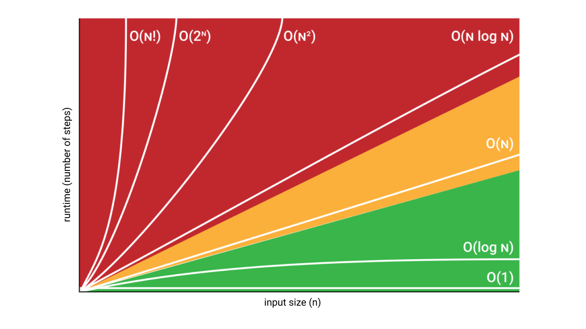
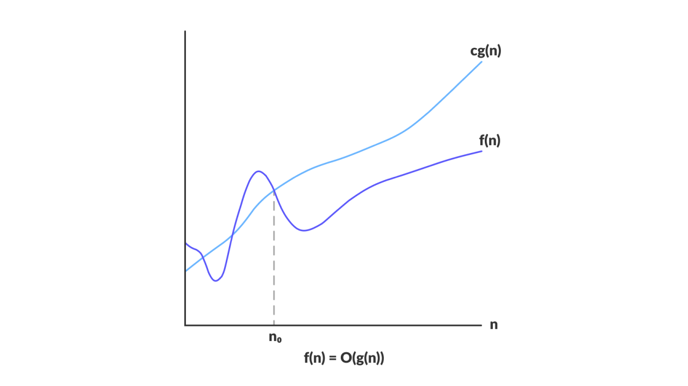
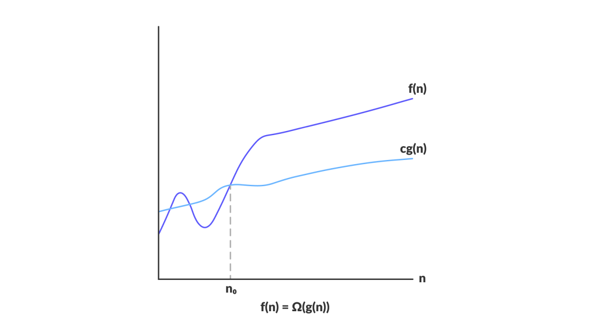
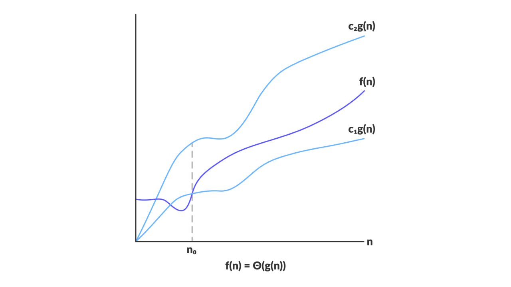

As it turns out algorithms is a course I have to take this semester, and the previous post about [sorting algorithms](../../../2024/12/24/Sorting-Algorithms.html) came in handy. Next step in the topic – asymptotic analysis. These are my notes from the lecture by professor Fatih Demirici. 

> Note that you should have basic understanding of set theory to get this material.

## Overview

### What is asymptotic analysis of an algorithm?

Every algorithm must provide an output, though it may or may not require an input. Analyzing an algorithm **asymptotically** means focusing on the behavior of functions as the input size approaches infinity.

### What are the asymptotic notations?

Most important thing in learning this for me was to understand that the `Big-O`, `Big-Ω` and `Big-Θ` notations actually don't have a direct connection to algorithms or complexities, nor to computer science for that matter. They are rather purely mathematical tools for describing the the **growth rate** of functions.

So the thing we are measuring here – is the **growth rate**.

### Connection between Algorithm Runtime and Functions

> So why do we use these notations to talk about algorithms?

- We use functions to describe algorithm runtime. 
- We use number of steps as a function of input size. 

Let's try to break this down and understand what each word here means. Here is a graph to make this a little more clear:

Since we are doing an asymptotic analysis, the **input size** of a function is $n$ the value of which goes to $\infty$:

$$
n = \text{input size}
$$

We define **runtime** as being directly proportional to the **number of steps** (the number of operations it takes to complete the program):

$$
\text{runtime} \propto \text{number of steps}
$$

then we can represent number of steps (runtime) as a **function of input size**:

$$
\text{number of steps} \approx f(\text{input size})
$$

and, finally, we can see the connection between algorithm's runtime and the input size, and represent it as a function:

$$
\text{runtime} \approx f(n)
$$

Now let's step back a bit and figure out what do these notations really represent. Keep in mind that these are only mathematical tools for describing the **growth rate** of a function. We just represent the runtime (time complexity) as a function, and use these tools to get an idea about the algorithms' efficiency.

___

> Nature of every asymptotic notation is a **set**. So when you think about `Big-O` and others – always imagine a collection of functions.

## Big-O Notation (Upper bound)

### Set Definition

$$
O(g(n)) = \{f(n)\ :\ 
\begin{aligned}[t] % [t] aligns the top of the aligned block with the preceding line
  & \exists\ c > 0,\exists\ n_{0} > 0 \\\\
  & \text{such that} \\\\
  & 0 \le f(n) \le c \times g(n) \\\\
  & \forall n \ge n_{0} 
\end{aligned}
\}
$$

Which reads:

> The `Big-O` of a given function $O(g(n))$ is a set of all the functions $f(n)$ for which there exist constants $c > 0$ and $n_{0} > 0$ such that for all $n \ge n_{0}$ the value of $f(n)$ is bounded above by the $c \times g(n)$.

In simple terms, when we say that $f(n) = O(g(n))$ it means:

> $f(n)$ grows no faster than $g(n)$.

### Graphical Representation

Image: [programiz.com](https://www.programiz.com/dsa/asymptotic-notations)

### Example

$$
2n^{2} \in O(n^{3})
$$

### Proof

The goal is to find such constants $c$ and $n_{0}$ greater than $0$ so that the inequality 

$$
0 \le 2(n_{0})^{2} \le c \times (n_{0})^{3}
$$ 

holds. Let's simplify the inequality. Since we consider only positive values, we can write the following:

$$
\begin{align}
2(n_{0})^{2} &\le c \times (n_{0})^{3} \\\\
2 &\le c \times n_{0}
\end{align}
$$

From here we can see that $c = 1, n_{0} = 2$ fits:

$$
\begin{align}
2 &\le 1 \times 2 \\\\
2 &\le 2
\end{align}
$$

and that it works for any $n$ greater than $n_{0}$. For example if $n = 3$:

$$
\begin{align}
2 &\le 1 \times 3 \\\\
2 &\le 3
\end{align}
$$

Since we are proving an existential statement, this one case of $c = 1, n_{0} = 2$ is enough to say that the inequality holds, and that the function $2n^{2}$ is indeed an element of the set $O(n^{3})$. But usually the notion of the notation being a set is dropped, and we just write:

$$
2n^{2} = O(n^{3})
$$

which reads: "Big-O of $2n^{2}$ is $O(n^{3})$". It is not technically an equality, but it is the convention.

### Notes

Since $O(g(n))$ represents the upper bound, for the example $2n^{2} = O(n^{3})$ above this is also true:
* $2n^{2} = O(n^{2})$
* $2n^{2} = O(n^{4})$
* $2n^{2} = O(n^{5})$

Other examples of the functions in $O(n^{2})$ are:
* $n^{2}$
* $n^{2} + n$
* $1000n^{2} + 1000n$
* $n$
* $\frac{n}{1000}$
* $n^{1.999}$
* $\frac{n^{2}}{lg(n)}$

> `Big-O` notation is an upper bound notation, hence it makes no sense to say "$f(n)$ is at least $O(n^{2})$".

---

## Big-Ω Notation (Lower bound)

### Set Definition

$$
\Omega(g(n)) = \{f(n)\ :\ 
\begin{aligned}[t]
  & \exists\ c > 0,\exists\ n_{0} > 0 \\\\
  & \text{such that} \\\\
  & 0 \le c \times g(n) \le f(n) \\\\
  & \forall n \ge n_{0} 
\end{aligned}
\}
$$

Which reads:

> The `Big-Ω` of a given function $\Omega(g(n))$ is a set of all the functions $f(n)$ for which there exist constants $c > 0$ and $n_{0} > 0$ such that for all $n \ge n_{0}$ the value of $f(n)$ is bounded below by the $c \times g(n)$.

In simple terms, when we say that $f(n) = \Omega (g(n))$ it means:

> $f(n)$ grows at least as fast as $g(n)$.

### Graphical Representation

Image: [programiz.com](https://www.programiz.com/dsa/asymptotic-notations)

### Example

$$
\sqrt{n} \in \Omega (lg(n))
$$

### Proof

The goal is to find such constants $c$ and $n_{0}$ greater than $0$ so that the inequality 

$$
0 \le c \times lg(n_{0}) \le \sqrt{n_{0}}
$$ 

holds. Let's simplify the inequality. Since we consider only positive values, we can write the following:

$$
c \times lg(n_{0}) \le \sqrt{n_{0}}
$$

From here we can see that $c = 1, n_{0} = 16$ fits:

$$
\begin{align}
1 \times lg(16) &\le \sqrt{16} \\\\
4 &\le 4 \\\\
\end{align}
$$

and that it works for any $n$ greater than $n_{0}$. For example if $n = 64$:

$$
\begin{align}
1 \times lg(64) &\le \sqrt{64} \\\\
6 &\le 8 \\\\
\end{align}
$$

Since we are proving an existential statement, this one case of $c = 1, n_{0} = 16$ is enough to say that the inequality holds, and that the function $\sqrt{n}$ is indeed an element of the set $\Omega (lg(n))$. But usually the notion of the notation being a set is dropped, and we just write:

$$
\sqrt{n} = \Omega (lg(n))
$$

which reads: "Big-Omega of $\sqrt{n}$ is $\Omega (lg(n))$". It is not technically an equality, but it is the convention.

### Notes

Since $\Omega (g(n))$ represents the lower bound, for the example $\sqrt{n} = \Omega (lg(n))$ above this is also true:
* $\sqrt{n} = \Omega (1)$

Other examples of the functions in $\Omega (n^{2})$ are:
* $n^{2}$
* $n^{2} + n$
* $1000n^{2} + 1000n$
* $1000n^{2} - 1000n$
* $n^{3}$
* $n^{2.001}$
* $\frac{n^{2}}{lg(n)}$
* $2^{2^{n}}$

> `Big-Ω` notation is a lower bound notation, hence it makes no sense to say "$f(n)$ is at most $\Omega (n^{2})$".

---

## Big-Θ Notation (Tight bound)

### Set Definition

$$
\Theta (g(n)) \ = \{f(n)\ : 
\begin{aligned}[t]
  & \exists\ c_{1} > 0, \exists\ c_{2} > 0, \exists\ n_{0} > 0 \\\\
  & \text{such that} \\\\
  & 0 \le c_{1} \times g(n) \le f(n) \le c_{2} \times g(n) \\\\
  & \forall n \ge n_{0} 
\end{aligned}
\}
$$

Which reads:

> The `Big-Θ` of a given function $\Theta (g(n))$ is a set of all the functions $f(n)$ for which there exist constants $c_{1} > 0, c_{2} > 0$ and $n_{0} > 0$ such that for all $n \ge n_{0}$ the value of $f(n)$ is bounded below by $c_{1} \times g(n)$ and bounded above by $c_{2} \times g(n)$.

In simple terms, when we say that $f(n) = \Theta (g(n))$ it means:

> $f(n)$ grows at the same rate as $g(n)$.

### Graphical Representation

Image: [programiz.com](https://www.programiz.com/dsa/asymptotic-notations)

### Example

$$
\frac{1}{2} n^{2} - 2n \in \Theta (n^{2})
$$

### Proof

The goal is to find such constants $c_{1}, c_{2}$ and $n_{0}$ greater than $0$ so that the inequality 

$$
0 \le c_{1} \times (n_{0})^{2} \le \frac{1}{2} (n_{0})^{2} - 2(n_{0}) \le c_{2} \times (n_{0})^{2}
$$ 

holds. Let's simplify the inequality and divide it up into two inequalities. Since we consider only positive values, we can write the following two:

$$
c_{1} \times (n_{0})^{2} \le \frac{1}{2} (n_{0})^{2} - 2(n_{0})
$$

and

$$
\frac{1}{2} (n_{0})^{2} - 2(n_{0}) \le c_{2} \times (n_{0})^{2}
$$

Simplifying the first inequality we get:

$$
\begin{align}
c_{1} \times (n_{0})^{2} &\le \frac{1}{2} (n_{0})^{2} - 2(n_{0}) \\\\
c_{1} &\le \frac{1}{2} - \frac{2}{n_{0}}
\end{align}
$$

Right-hand side of this is at most $\frac{1}{2}$. Let's pick $n_{0} = 8$ arbitrarily and find $c_{1}$:

$$
\begin{align}
c_{1} &\le \frac{1}{2} - \frac{2}{8} \\\\
c_{1} &\le \frac{1}{4}
\end{align}
$$

So, $c_{1}$ can be any number lower or equal to $\frac{1}{4}$ when $n_{0}$ is $8$. Say it is equal to $\frac{1}{4}$. Now let's deal with the second inequality.

$$
\begin{align}
\frac{1}{2} (n_{0})^{2} - 2(n_{0}) &\le c_{2} \times (n_{0})^{2} \\\\
\frac{1}{2} - \frac{2}{n_{0}} &\le c_{2} 
\end{align}
$$

Substituting $n_{0} = 8$ on the left side we get $\frac{1}{4}$, so $c_{2}$ can be anything greater or equal to that, say $\frac{1}{2}$, since the left side is at most $\frac{1}{2}$.

Finally, we got $c_{1} = \frac{1}{4}, c_{2} = \frac{1}{2}$ and $n_{0} = 8$. Substituting to the initial inequality we get:

$$
\begin{align}
\frac{1}{4} \times 8^{2} \le \frac{1}{2} 8^{2} - 2 \times 8 &\le \frac{1}{2} \times 8^{2} \\\\
&16 \le 16 \le 32
\end{align}
$$

and it works for any $n$ greater than $n_{0}$. For example if $n = 10$:

$$
\begin{align}
\frac{1}{4} \times 10^{2} \le \frac{1}{2} 10^{2} - 2 \times 10 &\le \frac{1}{2} \times 10^{2} \\\\
&25 \le 30 \le 50&
\end{align}
$$

Since we are proving an existential statement, this one case of $c_{1} = \frac{1}{4}, c_{2} = \frac{1}{2}$ and $n_{0} = 8$ is enough to say that the inequality holds, and that the function $\frac{1}{2} n^{2} - 2n$ is indeed an element of the set $\Theta (n^{2})$. But usually the notion of the notation being a set is dropped, and we just write:

$$
\frac{1}{2} n^{2} - 2n = \Theta (n^{2})
$$

which reads: "Big-Theta of $\frac{1}{2} n^{2} - 2n$ is $\Theta (n^{2})$". It is not technically an equality, but it is the convention.

### Notes

`Big-Θ` determines the dominating term of the function. So in the example $\frac{1}{2} n^{2} - 2n = \Theta (n^{2})$ above the terms of lower power than $n^{2}$ don't really matter, so it can simplified to:

$$
n^{2} = \Theta (n^{2})
$$

Moreover, since $\Theta (g(n))$ represents the tight bound, for the example above this is also true:
* $n^{2} = O(n^{2})$
* $n^{2} = \Omega (n^{2})$

> Pay attention to what this means: if the function $f(n)$ is an element of both the set `Big-O` and of the set `Big-Ω`, it is an element of the set `Big-Θ`.

---

## Relation Between Big-O and Big-Ω

$$
\begin{align}
f(n) = O(g(n)) &\to \Omega (f(n)) = g(n) \\\\
f(n) \le c \times g(n) &\to c \times f(n) \le g(n)
\end{align}
$$

Basically what this means is that they imply each other. If some function is a lower bound for some other function, the other function is trivially an upper bound for the first one.

## Little-o, Little-ω and Little-θ?

> What do these guys mean? 

Basically, they are the same thing as their big brothers, only here the function has to be strictly less or strictly greater. Hence, the set definition for a `little-o` would be:

$$
o(g(n)) = \{f(n)\ :\ 
\begin{aligned}[t]
  & \exists\ c > 0,\exists\ n_{0} > 0 \\\\
  & \text{such that} \\\\
  & 0 < f(n) < c \times g(n) \\\\
  & \forall n \ge n_{0} 
\end{aligned}
\}
$$

And it will contain all the functions $f(n)$ that grow slower than $g(n)$.

So if before the function $n^{2}$ was a part of `Big-O` set $O(n^{2})$, as well as a part of any set with functions with higher growth rate as $O(n^{3})$, it is only a part of `little-o` set $o(n^{3})$ and higher. Same thing with the `little-ω`.

Now if you understood all the notations correctly, the fact that **there is no set `little-θ`** should be obvious.

## List of Functions by Growth Rate

The following list is sorted from the fastest growing to the slowest growing function.

1. $f(n^{n})$
2. $f(2^{n})$
3. $f(n^{3})$
4. $f(n^{2})$
5. $f(n \times log(n))$
6. $f(n)$
7. $f(\sqrt{n})$
8. $f(log(n))$
9. $f(1)$

It is important to understand that the efficiency of an algorithm is inversely proportional to the growth rate, i.e. fast growth is bad and means that program runs slow, and slow growth is good, and program runs fast. The color coding in the picture [here](#connection-between-algorithm-runtime-and-functions) highlights this performance difference.

> As professor Fatih put it – "If your algorithm is performing at $n^{n}$, you should stop and think about what you are doing" 😄

## Summary

* We use functions to describe algorithm runtime; we use number of steps as a function of input size $n$. (If this sentence is confusing look again [here](#connection-between-algorithm-runtime-and-functions).)
* `Big-O`, `Big-Ω` and `Big-Θ` are mathematical tools for describing functions' **growth rate**.
* A proof for `Big-O` and `Big-Ω` is basically a chain of inequalities that is proved by finding positive constants $c$ and $n_{0}$ that make it work. The choice of these constants is not unique. In fact there can be infinitely many different combinations. It depends on what inequalities you use while finding the upper/lower boundary.
