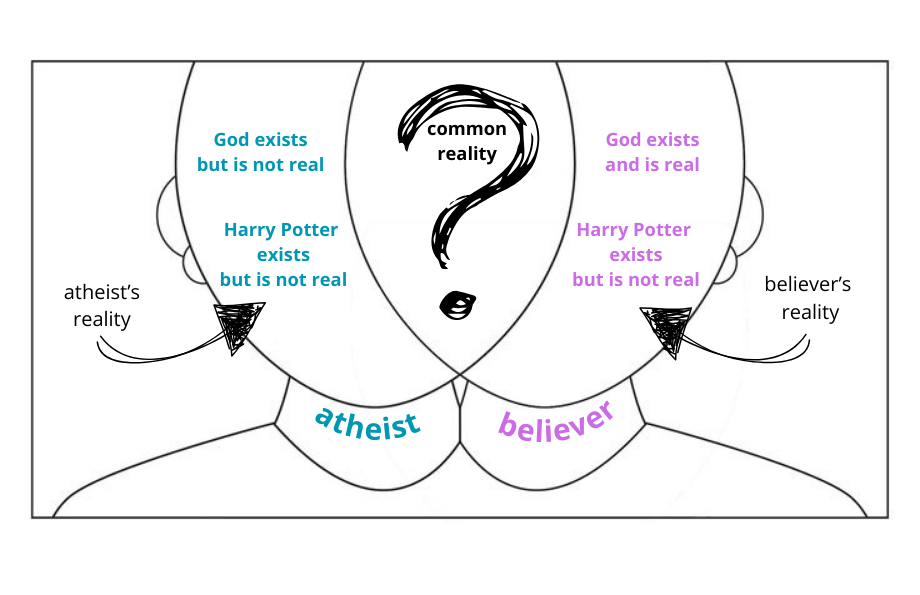

### Introduction

Philosophy has always appeared to me as some elitist discipline. I was scared of being called a poseur if I wasn't fluent in all the relevant literature and didn't quote the big names like Kant from the tip of my tongue. For some reason rocket science seemed more approachable than philosophy.

In reality though, I think I can sum it up to just "thinking about stuff".

This all started from a casual read on ethics. As one does, I went on reddit to pick up something beginner friendly but informative enough to start learning about philosophy. There I found a book by Russ Shafer-Landau called "The Fundamentals of Ethics". The book is written in such a way that the author never takes a side, and makes you constantly question what is being presented. Hence, I remember the moment when I really felt like actually "doing" philosophy and not just reading about it to be when I caught myself disagreeing with Kant. I was like "allow me to object, sir", sipping tea while holding my pinky up.

And maybe philosophy is elitist after all, because if you don't do it for a living, you are doing pretty well if you have the free time to occupy yourself with just thinking about stuff.

Interestingly, it can really drag you in. I was reading and making notes about stuff out of genuine interest. I can't imagine voluntarily spending so much time on it if it was an assignment I had to do. Although I have to admit that it is really demanding. The thing that was supposed to be a satisfaction of casual interest turned into a journey where I questioned my existence, lost my free will, morals, the meaning of life, rebuilt my worldview from scratch and rediscovered God. As you would expect, that took some time.

Disclaimer! I am not an expert in any of the things I will be talking about here, this is all a speculation based on my limited knowledge and research. I am not trying to prove a point to no one but sharing my interpretations of the things I found out. For this reason I am not going to make any appeals to authority in these posts. Also there are almost no references because no one checks them. What is important are the ideas, although my opinion is subject to change and I am glad to be wrong. Although I tried to avoid complete nonsense, beware.

### Definitions

Before getting to the topic of discussion there is one more thing – we have a problem with definitions.

Human languages have an unsolvable problem with definitions and meaning because language is made up. We just collectively agreed upon what a "chair" means. Moreover, while it is easy to define physical objects like chairs, which we can all recognize, it becomes harder with abstract concepts like "love". Albeit there is clearly meaning behind it that we all seem to feel when we talk about love (at least claim to).

Another thing is the ambiguity in the terms used in philosophy itself. Append an "-ism" to the end of any word you like and you get yourself a new philosophical term with an ambiguous definition. I will try to avoid such ambiguity and give definitions where appropriate so you know what I mean.

Moreover, although we live our lives just fine without much trouble with definitions, when you try to get to the bottom of it, it turns out that we don't have a completely settled definition for anything at all! Well, let's at least define "something" to be "anything other than nothing" and that still doesn't solve the problem because there is literally no definition even for "nothing"! Isn't that something?!

Therefore, for any philosophical discussion to make sense and have a meaningful outcome it should be explicit with definitions, I tried to be.

Now let's dive into it.

## Are You Real?

## Ultimate Objective Reality

> By Ultimate Objective Reality I mean the most fundamental level of reality that exists independently of subjective experience.

Here is the ultimate question you could ever ask:

> Why is there something rather than nothing?

There is no answer to this question that will convince everyone, and yet I couldn't move on without dealing with it. So I am going to make a most crucial assumption and say that:

> There exists something.

To justify my assumption, try to imagine that there exists nothing. The best trick I saw in a [YouTube video](https://www.youtube.com/watch?v=RM6_6bXribc&t=1s) 7 years ago was to remember the time before I was born. If "nothing" means (the experience of) that, then, trivially, anything other than that is "something".

And there is clearly something different between now and the time before you were born, isn't there? Therefore, I assume that something exists, and if something exists, there also exists a reality constituted by it. More formally:

### Argument for Ultimate Objective Reality

1. There exists something.
2. If there is something, there also exists a reality that is constituted by it.
3. Therefore, there exists some ultimate objective reality.

Good, right? There is another problem. We cannot ever prove that the world we exist in is the ultimate objective reality. That is to say we cannot say for sure that our world is not a simulation, or someone's imagination. Trying to prove it is a pointless endeavor and a waste of time. (That also implies that we cannot ever reach objective truth and acquire any true knowledge, which I will talk about in another article.)

However, since we made the assumption that there exists something, we can extend the first argument to make things more manageable:

4. Something can only exist in either objective reality, subjective reality, or simulation
5. Subjective reality and simulation can only exist within some ultimate objective reality.
6. Therefore, anything that exists is, or is a part of some ultimate objective reality.

This has following implications:

1. There can be more than one reality. (In other words, there can be many definitions of reality.)
2. The fact that something exists does not entail that it is real.
3. Anything can be a part of any reality.

The first implication allows for reality to be anything you want. You can believe we live in a matrix, or you can be a [solipsist](https://www.youtube.com/watch?v=YqsgEPjYQJU) and argue everything is merely the product of your imagination. You can believe in all Gods to be real or don't believe in anything at all. You can construct any reality and call that "The reality" as long as it does not contain contradictions.

One thing you can't argue is that your reality is the **Ultimate Objective Reality**. If people agree on this, we could possibly reach beneficial pluralism in society – coexistence and mutual respect of diverse worldviews about nature. Besides, this also means that we're all believers – just some believe in God, some in physics, some in nothing.

Second and third one mean everything that you can possibly think of – exists, but might not be real. Take for example an atheist and a believer. First one does not include God in their reality, the second one does, however God exists in both of them. Harry Potter on the other hand is not real to either of them, but he definitely exists in both of their realities as well. Finally, there are some things that exist, and are real in both realities, and these things, in my opinion, should be the foundation of the widely accepted reality.

Now the task is to define reality that works for everyone (or at least the majority of people).

> What reality are we in?

Let's take a pragmatic approach. Since we cannot prove that we live in the ultimate objective reality, there is only one way – to agree, and boy does it get hard sometimes. Our subjective experiences of reality are different, but there are some things that seem to be the same for all of us. So the obvious thing to do would be to identify these facts about the world. But to do that, we have to first define what subjective reality is.

Is your subjective reality real? Do the subjective realities of other people exist or is it only yours that is real? Can subjective experience of any given individual be the same as any other? Even if we assume that you exist, what are and who are "You" is a whole different question.

## What are you?

First question is a metaphysical one. It requires answering the question of what you are made of.

Our most successful theories to describe the world so far are the theories of relativity and quantum mechanics. I am far from competent to make any meaningful claims about these, however, I can tell you what I understood from the unhealthy amount of pop-sci videos I watched on YouTube.

Einstein really messed up the notion of space and time. His theory of special relativity showed that space and time are not fixed, but relative – meaning they change depending on how fast you're moving. The speed of light is the only constant, and everything else – time, space, and even mass – shifts around that. When you move close to the speed of light, time literally slows down for you.

Moreover, relativity theory offers a very counterintuitive perspective about space and time, erasing the distinction between the two and unifying them into one "spacetime". The main idea of general relativity is to describe gravity not as some mysterious force, but as the bending of space and time itself.

It also implies that the world is four-dimensional, and we are just able to understand three of them as space and one of them as time. In other words, time is just another dimension, we just experience it differently.

This has an interesting implication for how we think about the past, present, and future. Instead of time being some kind of flowing river that only moves forward, the theory suggests that all moments in time already exist. That means your past is still "there", and so is your future – they just exist in different places in spacetime. This kind of world is called a "block universe" and the philosophy behind it is known as [eternalism](https://plato.stanford.edu/entries/time/).

To grasp the idea try to imagine time as one of the dimensions of space. If you go from a place A to a place B in space – A doesn't just disappear after you leave it. You could always go back. And you can be relatively certain that place B was there before you got there. Similarly, if time were to be just another dimension – what happened in the past will still be there and what will happen is already there too!

But why does time feel so different from space? Why do we only experience it in one direction, flowing forward from past to future? Honestly, nobody fully knows. I am inclined to think it's just our brains are wired to perceive the world, and that therefore answering this question is beyond our comprehension.

Now, while relativity offers a view on time and space, it doesn't really answer the question of *what* we are made of. To do that, we need to dive into the world of quantum physics, which, if anything, feels like another blow to our common-sense understanding of reality.

Quantum physics describes the world in terms of particles and fields. According to this theory, everything you see, including you, is made of elementary particles like electrons and quarks, and these particles interact through fundamental forces mediated by other particles, like photons for electromagnetic forces. But the picture gets more complex when we introduce the idea of quantum fields. Every particle is actually an excitation of an underlying field that stretches throughout the universe.

So, what are you made of? At a fundamental level, you're not just a collection of individual particles – you're a set of interacting fields, constantly fluctuating. The electrons and quarks that make up your body are just local excitations of these fields. The really interesting part is that the same fields make up everything else. That tree outside? It's made of the same stuff you are. The stars in the sky? Same fields, different arrangements. In a way, quantum physics tells us that we're not distinct from the universe – we're part of a continuous, fluctuating fabric that constitutes everything. We're all made from the same quantum fields, just organized in different ways.

So what are you? As far as physics can tell us, you are a collection of certain fluctuations of quantum fields that existed since the beginning of the universe and will exist till the end of it (if there is an end to it). Quite humbling, isn't it?

## Who are you?

Although the second question is about identity, the discussion about it cannot be entirely apart from metaphysics.

You are most probably the product of the collective effort of two reproductive cells. A zygote holds the complete genetic blueprint for every part of your body and as it divides, it forms trillions of specialized cells – muscle, nerve, blood – that together make up your physical self. The identity question is – when exactly these cells become "You"?

Similarly, when exactly millions of cells that are reading this right now will stop being "You"? The cells in your body are constantly dying and being replaced, atoms within you are swapped out regularly, and yet, somehow, "You" persists.

Is "You" something that emerges from the collective functioning of these cells, or is it your consciousness and memory?

> Where and when did "You" start and where and when will "You" end?

This problem of defining personhood is what makes abortion and euthanasia so controversial. Usually in countries where abortion is allowed there are what is called a gestational limit that marks a certain period after which abortion is prohibited. However, it is usually arbitrary and is not based on anything concrete.

Same thing with euthanasia. If as a result of some terrible accident or illness you end up in a vegetative state – is there even "You" anymore? If not, what is the point of keeping the body alive? Is your identity tied to your biological body, or to your mind and memories?

I think from a metaphysical point of view the solution is quite trivial, but to do that you have to become an eternalist and give up your free will. The answer is "You" is an arbitrary notion and can be set wherever, whenever and how-ever. As mentioned above, from a physics standpoint it doesn't really matter where you choose to set the starting and ending point of your life. In other words, "You" may not be tied to a particular arrangement of particles because the concept of life never starts or ends for all physics cares.

But there is another way to think about it. Let's get conceptual. If your parents named you way before you were born, a major part of your identity for most of your life – your name – existed as an idea before your biological existence.

Similarly, there is a memory of you that will live on after you die that saves your identity. As the famous quote by Bansky goes – "You die twice. One time when you stop breathing and a second time, a bit later on, when somebody says your name for the last time". If that is true, what is the thing that keeps you alive?

This suggests that for your identity to exist there must be a subject (someone with subjective experience, including yourself) that holds the idea of you. However, we cannot entirely separate "You" from some form of physical essence as it would require an assumption that there is something outside of the physical, therefore not real.

So who are you? I don't know. I don't even know who I am. This again comes to the problem of definition – here it is the definition of "life" and "consciousness" – nobody knows exactly what they mean. (Somewhere in this series I will try to explore how these terms can be understood following the ideas mentioned here.)

There are many schools of thought that define identity in different ways. However, for the purposes of this discussion we can say that our identity seems to emerge from consciousness and subjective experience. It doesn't matter what exactly we define ourselves or others, what is important is that it is in principle possible to tell us apart.

To conclude all of the above, I make the following argument.

### Argument for You and Me (Argument for Shared Subjective Reality)

1. Some arbitrary boundary defines You and Me.
2. There is a distinction between You and Me.
3. You and I exist and are real in our own realities.
4.  You and I have some subjective experience about our realities.
5.  Certain experiences about reality are allegedly shared between You and Me.
6.  Therefore, there exists some reality in which both of us exist and are real.

The argument above is very weak, for it requires very bold assumptions without much base for it. Also it is not enough to say that there exist such subjective experiences that are exactly the same for both of us. But I couldn't come up with anything better, so we will have to just trust each other on this one.

Good news! We are real after all (at least to some degree). However, there is still a lot to unpack. With so many different perspectives on the question of existence, your description of reality probably sounds different than the physicalist one I tried to outline here. Therefore, in the next article, we will explore what the intersection of our realities might look like and what implications it could have.
