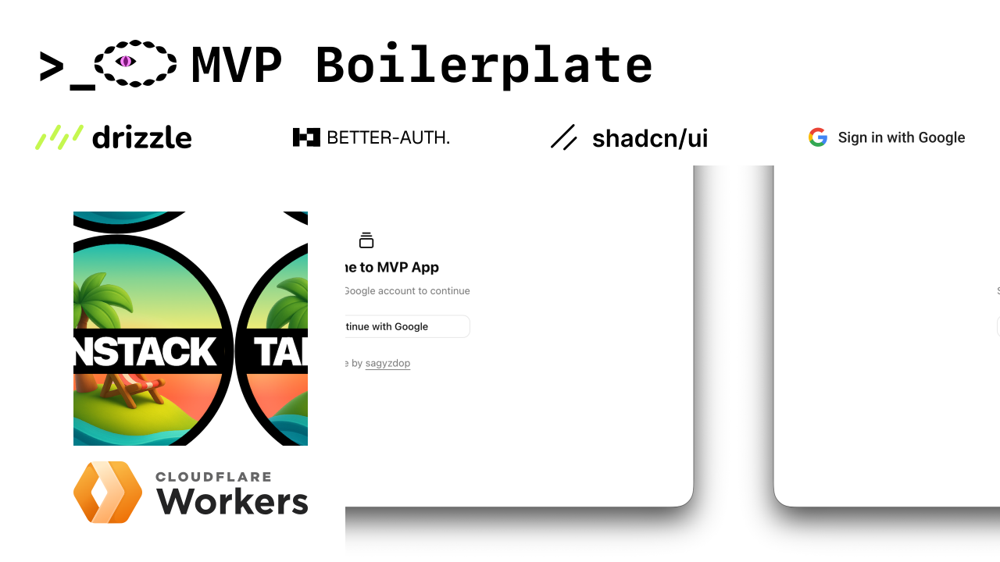
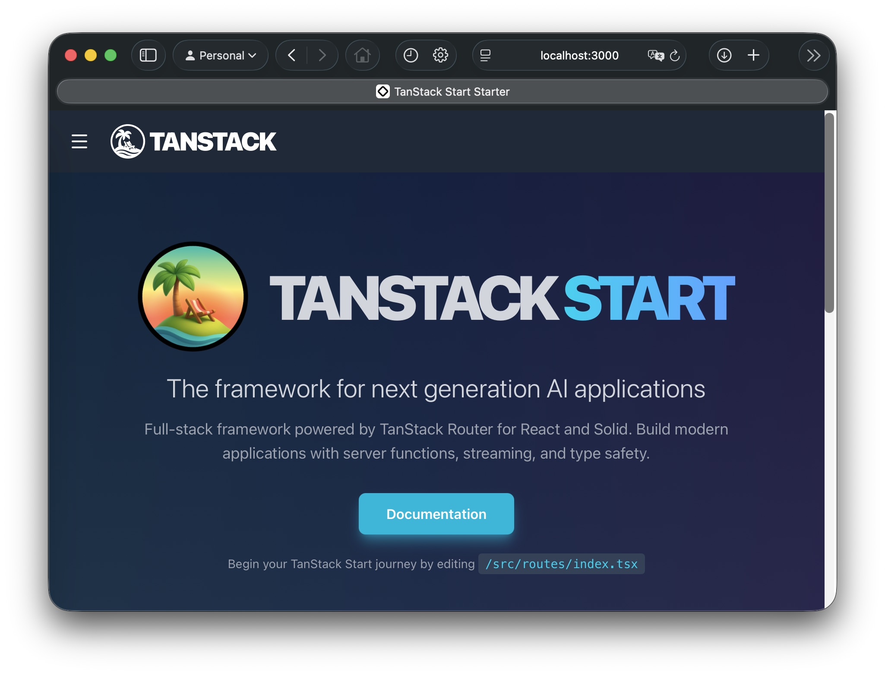
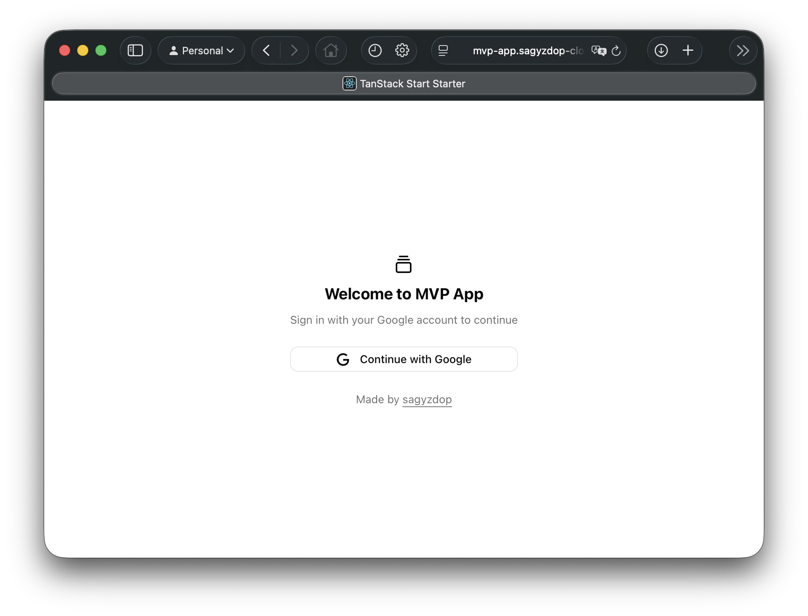
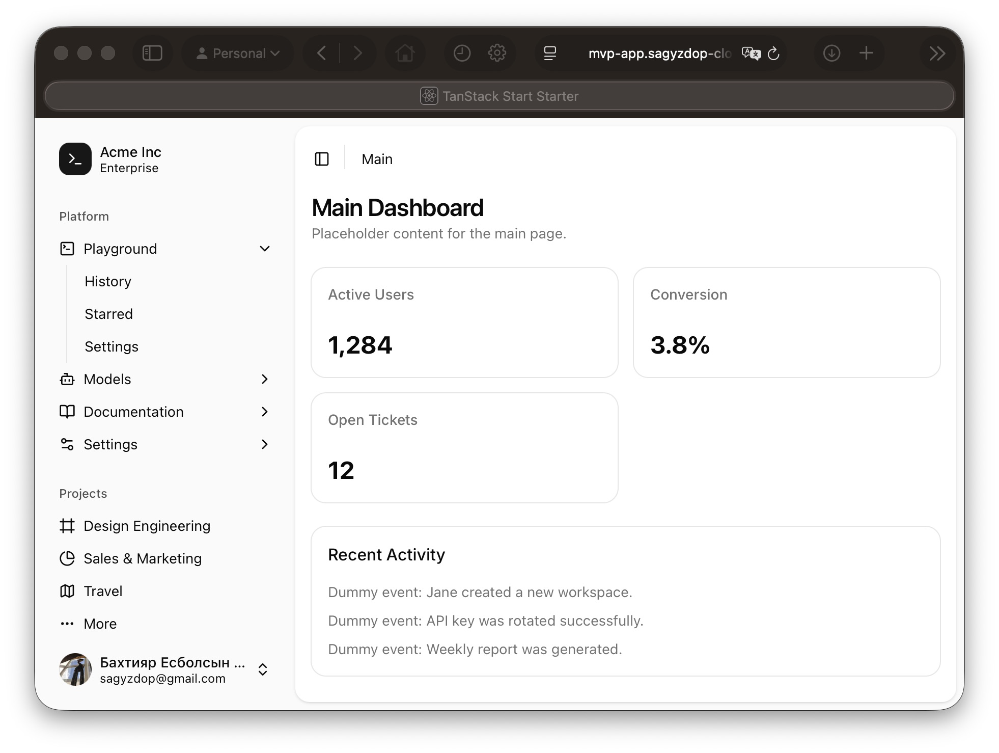
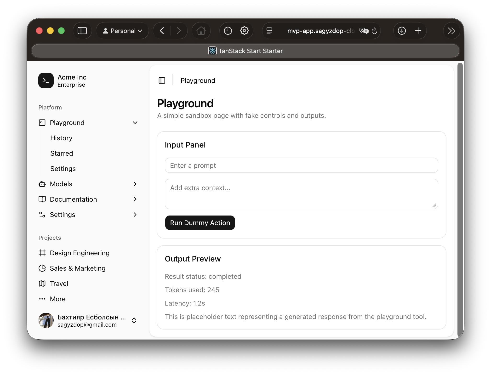

This is a guide to set up a TanStack Start application on the Cloudflare Workers platform with Google Sign-In, using Drizzle ORM, Better Auth and Shadcn UI. The best part: it is all free.

Reference implementation repo: [sagyzdop/mvp-app](https://github.com/sagyzdop/mvp-app).

I see a use case for this in hackathon projects, building an MVP for startup customer development, or small-scale projects. However, you can certainly build something bigger because Cloudflare's free tier is very generous.

This stack uses bleeding-edge tools that are gaining a lot of community support. The downside is that some links in this post will probably break over time. Please contact me if they do. Also, if there is any inconsistency, false information, or room for improvement, please let me know.

## Prerequisites

Before you start, make sure you have:

- A Cloudflare account.
- A Google Cloud account.
- Node.js and npm installed.
- Basic familiarity with React and TypeScript.

## Cloudflare

Cloudflare has an `npm create` command for [starting a TanStack Start application pre-configured for Cloudflare Workers](https://developers.cloudflare.com/workers/framework-guides/web-apps/tanstack-start/).

```sh
npm create cloudflare@latest -- mvp-app --framework=tanstack-start
```

Create `.env` and add this variable:

```env
CLOUDFLARE_ACCOUNT_ID=
```

For consistency, keep all local variables for this guide in `.env`.

### Wrangler

> [Wrangler](https://developers.cloudflare.com/workers/wrangler/) is the Cloudflare Developer Platform CLI and allows you to manage Worker projects.

Create a [D1 database](https://developers.cloudflare.com/d1/).

```sh
npx wrangler@latest d1 create mvp-app-d1
```

If you have never used Wrangler before, it will open your web browser so you can log in to your Cloudflare account.

```sh
mvp-app % npx wrangler@latest d1 create mvp-app-d1
Need to install the following packages:
wrangler@4.76.0
Ok to proceed? (y) y

 ⛅️ wrangler 4.76.0
───────────────────
✅ Successfully created DB 'mvp-app-d1' in region EEUR
Created your new D1 database.

To access your new D1 database in your Worker, add the following snippet to your configuration file:
{
  "d1_databases": [
    {
      "binding": "mvp_app_d1",
      "database_name": "mvp-app-d1",
      "database_id": "686d1a06-1a3c-4ada-aa63-af8f6503de27"
    }
  ]
}
✔ Would you like Wrangler to add it on your behalf? … yes
✔ What binding name would you like to use? … mvp_app_d1
✔ For local dev, do you want to connect to the remote resource instead of a local resource? … no
```

Then you should have this block added in your `wrangler.jsonc` file (`database_id` obviously will be different):

```jsonc
"d1_databases": [
    {
    "binding": "mvp_app_d1",
        "database_name": "mvp-app-d1",
        "database_id": "686d1a06-1a3c-4ada-aa63-af8f6503de27"
    }
]
```

Recreate types for Cloudflare bindings:

```sh
npm run cf-typegen
```

### Checkpoint Commit

After scaffolding and wiring Cloudflare basics, create a checkpoint commit:

```sh
git add -A
git commit -m "chore: set up TanStack Start on Cloudflare Workers"
```

## Drizzle ORM

> [Drizzle ORM](https://orm.drizzle.team/docs/overview) is a headless TypeScript ORM with a head.

We use it to work with the newly created D1 database.

There are instructions on their [website](https://orm.drizzle.team/docs/get-started/d1-new), but parts are outdated for the TanStack Start config we are using. Some pieces are still helpful.

### Step 1 – Create the file structure

Create a folder `db` under `src`. In it create two files: `index.ts` and `schema.ts`.

```ts
// index.ts

import { drizzle } from 'drizzle-orm/d1';
import * as schema from '@/db/schema';

export function db(d1: D1Database) {
  return drizzle(d1, { schema });
}
```

Leave `schema.ts` empty for now, we will populate it with Better Auth tables later.

### Step 2 – Install required packages

```sh
npm install drizzle-orm
npm install -D drizzle-kit tsx
```

### Step 3 – Drizzle config file

Create Drizzle config file `drizzle.config.ts` at root and configure it to work with D1. [Source.](https://orm.drizzle.team/docs/guides/d1-http-with-drizzle-kit)

```ts
// drizzle.config.ts

import { defineConfig } from 'drizzle-kit'

export default defineConfig({
    schema: './src/db/schema.ts',
    out: './migrations',
    dialect: 'sqlite',
    driver: 'd1-http',
    dbCredentials: {
        accountId: process.env.CLOUDFLARE_ACCOUNT_ID,
        databaseId: process.env.CLOUDFLARE_DATABASE_ID,
        token: process.env.CLOUDFLARE_D1_TOKEN,
    },
})
```

Why `process.env` here? `drizzle.config.ts` runs in Node as a CLI/build config file, so it reads values from `.env` via `process.env`.

Add these to `.env`:

```env
CLOUDFLARE_DATABASE_ID=
CLOUDFLARE_D1_TOKEN=
```

You can find `accountId`, `databaseId` and `token` in [Cloudflare dashboard](https://dash.cloudflare.com/login?).

1. To get accountId go to Workers & Pages > Overview > copy Account ID from the right sidebar.
2. To get databaseId open D1 database you want to connect to and copy Database ID.
3. To get token go to My profile > API Tokens and create token with D1 edit permissions.

### Checkpoint Commit

After Drizzle configuration is in place, create another checkpoint:

```sh
git add -A
git commit -m "chore: set up Drizzle D1 and migration config"
```

## Google Cloud

Before configuring Better Auth, get your Google OAuth credentials.

Mainly following the [instructions from Better Auth](https://better-auth.com/docs/authentication/google).

To use Google as a social provider, you need to create a project in the [Google Cloud Console](https://console.cloud.google.com/apis/main).

You will first be prompted to configure Consent Screen. That part is straightforward, and there are many good guides online.

In the Google Cloud Console > Credentials > Authorized redirect URIs, make sure to set:

- `http://localhost:3000/api/auth/callback/google` for local development
- `https://example.com/api/auth/callback/google` for production

If you change the base path of auth routes, update the redirect URL accordingly.

Cloudflare addresses usually look like this: `https://APP_NAME.USERNAME-cloudflare.workers.dev/`. For me, it is `https://mvp-app.sagyzdop-cloudflare.workers.dev/`, so add your own domain to production redirect URIs.

If you want integrations like Google Calendar, you will need additional OAuth scopes (for example `https://www.googleapis.com/auth/calendar.events`). In production, these scopes can require Google OAuth app verification before broad public use.

## Better Auth

> [Better Auth](https://better-auth.com) is an authentication framework. It provides a comprehensive set of features out of the box and includes a Plugin ecosystem that simplifies adding advanced functionalities and infrastructure to help own your auth at scale.

We will mainly follow the recommendations from the [general installation guide](https://better-auth.com/docs/installation) and the [TanStack integration guide](https://better-auth.com/docs/integrations/tanstack).

### Step 1 – Install the Package

```sh
npm install better-auth
```

### Step 2 – Set Environment Variables

Add these to `.env`

```env
BETTER_AUTH_SECRET=
BETTER_AUTH_URL=http://localhost:3000
GOOGLE_CLIENT_ID=
GOOGLE_CLIENT_SECRET=
```

Generate Better Auth secret [here](https://better-auth.com/docs/installation#set-environment-variables).

### Step 3 – Create A Better Auth Instance

Create `./src/lib/auth/auth.ts`:

```ts
// auth.ts

import { betterAuth } from 'better-auth'
import { drizzleAdapter } from 'better-auth/adapters/drizzle'
import { tanstackStartCookies } from 'better-auth/tanstack-start'
import { drizzle } from 'drizzle-orm/d1'
import * as schema from '@/db/schema'
import { env } from 'cloudflare:workers'

export const auth = betterAuth({
  baseURL: env.BETTER_AUTH_URL || 'http://localhost:3000',
  socialProviders: {
    google: {
      prompt: 'select_account',
      scope: ['openid', 'email', 'profile', 'https://www.googleapis.com/auth/calendar.events'],
      clientId: env.GOOGLE_CLIENT_ID as string,
      clientSecret: env.GOOGLE_CLIENT_SECRET as string,
    },
  },
  database: drizzleAdapter(
    drizzle(env.mvp_app_d1 as D1Database, { schema }),
    {
      provider: 'sqlite',
    }
  ),
  plugins: [tanstackStartCookies()],
})
```

Why `env` here? `auth.ts` runs in the Worker runtime, where bindings and secrets are exposed through `env` from `cloudflare:workers`.

Usage example:

```ts
import { env } from 'cloudflare:workers'

const authUrl = env.BETTER_AUTH_URL
```

Notice that I am using only `Sign In with Google`. There are many more [authentication methods](https://better-auth.com/docs/installation#authentication-methods) Better Auth supports if you want something else.

### Step 4 – Create Database Tables

This is the command to create the tables to go in the `schema.ts` I talked about earlier.

```sh
npx auth@latest generate --config ./src/lib/auth/auth.ts
```

It will create a `auth-schema.ts` file at root. Copy its contents into previously created `schema.ts` and delete it.

### Step 5 – Generate Migrations

Create the migrations using Drizzle's CLI tool:

```sh
npx drizzle-kit generate
```

### Step 6 – Mount Handler

To handle API requests, set up a route handler on your server. For TanStack Start, create a `$.ts` file at `src/routes/api/auth/` with the following code:

```ts
// $.ts

import { auth } from '@/lib/auth/auth'
import { createFileRoute } from '@tanstack/react-router'

export const Route = createFileRoute('/api/auth/$')({
  server: {
    handlers: {
      GET: async ({ request }: { request: Request }) => {
        return await auth.handler(request)
      },
      POST: async ({ request }: { request: Request }) => {
        return await auth.handler(request)
      },
    },
  },
})
```

### Step 7 – Create Client Instance

The client-side library helps you interact with the auth server.

Create `src/lib/auth/auth-client.ts`:

```ts
// auth-client.ts

import { createAuthClient } from 'better-auth/react'
export const authClient = createAuthClient({
  baseURL: process.env.BETTER_AUTH_URL,
})
```

### Checkpoint Commit

After Better Auth server/client setup and auth route handler are done:

```sh
git add -A
git commit -m "feat(auth): add Better Auth with Google and D1"
```

## Integration

### Using D1

Now apply the migrations using `wrangler`. First apply migrations for local dev environment with:

```sh
npx wrangler d1 migrations apply mvp_app_d1
```

And for remote D1 (the real production database on Cloudflare) with `--remote` flag:

```sh
npx wrangler d1 migrations apply mvp_app_d1 --remote
```

Change `package.json` scripts to run local dev with the database:

```json
"scripts": {
    "dev": "npm run build && wrangler dev --port 3000",
    "dev:vite": "vite dev",
    "build": "vite build",
    "preview": "npm run build && vite preview",
    "test": "vitest run",
    "deploy": "npm run build && wrangler deploy",
    "cf-typegen": "wrangler types"
},
```

With these scripts, `npm run dev` builds the project and allows you to test D1 locally. Note that it is heavy. If you are only testing UI, use `npm run dev:vite`. I was fine using `npm run dev`, YMMV.

---

At this point you have set up the bare bones. Let us do a midway check:

```sh
npm run dev
```

If everything went well, you should see the following at `localhost:3000`:



---

### TanStack Server Functions

[Server functions](https://tanstack.com/start/latest/docs/framework/react/guide/server-functions) are how you can write backend logic in TanStack. I found this file structure convenient for storing them, although it is [recommended](https://tkdodo.eu/blog/please-stop-using-barrel-files) to avoid barrel exports. In this case, I think this is a good trade-off. These are the functions I used for handling user sessions.

```text
src/
└─ lib/
   └─ user/
      ├─ functions.ts
      ├─ index.ts
      └─ types.ts
```

```ts
// functions.ts

import { createServerFn } from '@tanstack/react-start'
import { getRequestHeaders } from '@tanstack/react-start/server'
import { auth } from '@/lib/auth/auth'
import type { User } from './types'

export const getUserFn = createServerFn({ method: 'GET' }).handler(async (): Promise<User | null> => {
  const session = await auth.api.getSession({
    headers: getRequestHeaders(),
  })

  if (!session?.user) {
    return null
  }

  return {
    id: session.user.id,
    name: session.user.name,
    email: session.user.email,
    image: session.user.image ?? null,
  }
})
```

```ts
// index.ts

export * from './types'
export * from './functions'
```

```ts
// types.ts

export interface User {
    id: string
    name: string
    email: string
    image: string | null
}
```

This session function is handy for protecting routes.

### Checkpoint Commit

After integration and server function wiring is complete:

```sh
git add -A
git commit -m "feat(app): add session functions and protected routes"
```

## Shadcn UI

Finally, the frontend. You should not sweat the UI too much when there is [Shadcn UI](https://ui.shadcn.com/docs). **Step 0 – Clear the components folder**. It should have a single `Header.tsx`. The `__root.tsx` file imports it, so delete that import. We will use the newly downloaded sidebar only for authenticated routes.

### Step 1 – Install required packages

Choose what you like from [here](https://ui.shadcn.com/create), click "Create Project", pick Tanstack Start and copy the command. I'll use the default one.

```sh
npx shadcn@latest init --preset b0 --template start
npx shadcn@latest add --all
```

It will create all the necessary files, and a couple of example files that you can delete.

### Checkpoint Commit

Create a checkpoint right after base shadcn setup and before downloading blocks:

```sh
git add -A
git commit -m "chore(ui): add base shadcn/ui setup"
```

### Step 2 – Shadcn Blocks

Shadcn blocks are pre-built, ready-to-use UI sections like navigation bars, hero sections, forms, and dashboards composed of multiple `shadcn/ui` components.

This MVP boilerplate creates a main page and a profile page with a sidebar. Although this approach to UI [seems to be fading](https://michalmalewicz.medium.com/the-end-of-dashboards-and-design-systems-5d98ec9de627), it is still practical for this use case.

I used the most basic [login block](https://ui.shadcn.com/blocks/login#login-05), and a [sidebar](https://ui.shadcn.com/blocks/sidebar#sidebar-08).

To download them:

```sh
npx shadcn@latest add login-05
npx shadcn@latest add sidebar-08
```

This will download the following files.

```text
app-sidebar.tsx
login-form.tsx
nav-main.tsx
nav-projects.tsx
nav-secondary.tsx
nav-user.tsx
```

They require some tweaking to work with the system we are building.

### Checkpoint Commit

Before you start customizing downloaded shadcn/template files, create a clean checkpoint that captures the generated template state and any other files changed so far:

```sh
git add -A
git commit -m "chore(ui): save generated shadcn boilerplate files"
```

### Side quest 1 – Component File Structure

The first insight I got while building this project was about file management. File-based routing enforces a way to organize and name route files, but it does not say much about components. Placing and naming pages the same way as routes changed everything.

For example, the file structure for a website with login, main, and profile routes will have corresponding pages as below:

```text
src/
├─ components/
│  ├─ routes/
│  │  ├─ login/
│  │  │  └─ index.tsx
│  │  ├─ main/
│  │  │  ├─ components/
│  │  │  │  └─ stats.tsx
│  │  │  └─ index.tsx
│  │  ├─ playground/
│  │  │  └─ index.tsx
│  │  └─ root/ # will be used for shared components (see below)
│  └─ ui/ # shadcn components
└─ routes/
   ├─ _authenticated/
   │  ├─ main.tsx
   │  └─ playground.tsx
   ├─ api/
   │  └─ auth/
   │     └─ $.ts // previously created handler
   ├─ __root.tsx
   ├─ _authenticated.tsx
   ├─ index.tsx
   └─ login.tsx
```

Notice that each route page might have its own `components` folder. That is for collocating page-exclusive components, such as `stats` on the main page shown here. Look in the repo for details: [sagyzdop/mvp-app](https://github.com/sagyzdop/mvp-app).

I think this kind of file organization is useful. However, pages should still be composed from the basic shadcn components in `src/components/ui`.

### Side quest 2 – Tanstack Router and `_authenticated` Routes

TanStack allows [file-based routing](https://tanstack.com/router/latest/docs/routing/file-based-routing). At a basic level, any file you create under `./src/routes` becomes a route with that name.

For example, the most basic route file for the `/example` route will be with the following contents:

```tsx
import { createFileRoute } from '@tanstack/react-router'

export const Route = createFileRoute('/_authenticated/example')({
  component: RouteComponent,
})

function RouteComponent() {
  return <div>Hello "/_authenticated/example"!</div>
}
```

This is generated automatically during build.

However, this guide follows the convention of importing a `Page` function (AFAIK you can name them however you like, but stay consistent whatever you do) from an `index.tsx` located at the folder with the same name as the route, `/example` route:

```tsx
import { createFileRoute } from '@tanstack/react-router'
import { Page } from '@/components/routes/example'

export const Route = createFileRoute('/_authenticated/example')({
  component: ExamplePage,
})

function ExamplePage() {
  return <Page />
}
```

Naturally, we want to have protected routes that only authenticated users can access.

[Tanstack](https://tanstack.com/router/v1/docs/guide/authenticated-routes) provides a technique for protected routes by creating a file with `_` prefix. I preferred calling it `_authenticated.tsx`, you can choose anything you want if you prefer.

The trick is that you create a `_authenticated.tsx` file at the root, and a folder with the same name. The file catches everything trying to access routes in that folder, where you run the auth check. More about it [here](https://tanstack.com/router/v1/docs/how-to/setup-authentication).

Create/update these files under `./src/routes`:

```tsx
// _authenticated.tsx

import {
  createFileRoute,
  Outlet,
  redirect,
  useLocation,
  useRouter,
} from '@tanstack/react-router'
import { getUserFn } from '@/lib/user'
import { authClient } from '@/lib/auth/auth-client'
import { AppSidebar } from '@/components/routes/root/sidebar/app-sidebar'
import {
  Breadcrumb,
  BreadcrumbItem,
  BreadcrumbList,
  BreadcrumbPage,
} from '@/components/ui/breadcrumb'
import { Separator } from '@/components/ui/separator'
import {
  SidebarInset,
  SidebarProvider,
  SidebarTrigger,
} from '@/components/ui/sidebar'
import { Toaster } from '@/components/ui/sonner'
import { TooltipProvider } from '@/components/ui/tooltip'

export const Route = createFileRoute('/_authenticated')({
  beforeLoad: async () => {
    const user = await getUserFn()

    if (!user) {
      throw redirect({ to: '/login' })
    }

    return { user }
  },
  component: AuthenticatedLayout,
})

function AuthenticatedLayout() {
  const router = useRouter()
  const { pathname } = useLocation()
  const { user } = Route.useRouteContext()

  // Added this to make the breadcrumbs work as expected
  const currentSegment = pathname.split('/').filter(Boolean).at(-1)
  const currentPageLabel = currentSegment
    ? currentSegment
        .split(/[-_]/)
        .filter(Boolean)
        .map((part) => part.charAt(0).toUpperCase() + part.slice(1))
        .join(' ')
    : 'Main'

  const handleLogout = async () => {
    await authClient.signOut()
    router.invalidate()
    router.navigate({ to: '/login' })
  }

  return (
    <TooltipProvider>
      <SidebarProvider>
        <AppSidebar user={user} onLogout={handleLogout} />
        <SidebarInset className="min-w-0">
          <header className="flex h-16 shrink-0 items-center gap-2">
            <div className="flex items-center gap-2 px-4">
              <SidebarTrigger className="-ml-1" />
              <Separator
                orientation="vertical"
                className="mr-2 data-[orientation=vertical]:h-max" 
              />
              <Breadcrumb>
                <BreadcrumbList>
                  <BreadcrumbItem>
                    <BreadcrumbPage>{currentPageLabel}</BreadcrumbPage> 
                  </BreadcrumbItem>
                </BreadcrumbList>
              </Breadcrumb>
            </div>
          </header>
          <div className="flex flex-1 min-w-0 flex-col p-4 pt-0">
            <Outlet />
          </div>
        </SidebarInset>
        <Toaster />
      </SidebarProvider>
    </TooltipProvider>
  )
}
```

```tsx
// index.tsx

import { createFileRoute, redirect } from '@tanstack/react-router'
import { getUserFn } from '@/lib/user'

export const Route = createFileRoute('/')({
  beforeLoad: async () => {
    const user = await getUserFn()

    if (user) {
      throw redirect({ to: '/main' })
    } else {
      throw redirect({ to: '/login' })
    }
  },
  component: App,
})

function App() {
  return null
}
```

```tsx
// login.tsx

import { createFileRoute, redirect } from '@tanstack/react-router'
import { Page } from '@/components/routes/login'
import { getUserFn } from '@/lib/user'

export const Route = createFileRoute('/login')({
  beforeLoad: async () => {
    const user = await getUserFn()

    if (user) {
      throw redirect({ to: '/main' })
    }
  },
  component: LoginPage,
})

function LoginPage() {
  return <Page />
}
```

### Step 3 – Pages

Rename the downloaded `login-form.tsx` to `index.tsx` and place it under `./src/components/routes/login/` This is how I changed its contents to leave only `Sign in with Google` button:

```tsx
// index.tsx

import { GalleryVerticalEnd } from 'lucide-react'
import { authClient } from '@/lib/auth/auth-client'
import { cn } from '@/lib/utils'
import { Button } from '@/components/ui/button'
import { Field, FieldDescription, FieldGroup } from '@/components/ui/field'

export function Page({
  className,
  ...props
}: React.ComponentProps<'div'>) {
  const handleGoogleSignIn = async () => {
    try {
      await authClient.signIn.social({
        provider: 'google',
        callbackURL: '/',
      })
    } catch (error) {
      console.error('Sign in failed:', error)
    }
  }

  return (
  <div className="min-h-screen flex items-center justify-center">
    <div className={cn('flex flex-col gap-6', className)} {...props}>
      <div className="flex flex-col items-center gap-2 text-center">
        <a href="#" className="flex flex-col items-center gap-2 font-medium">
          <div className="flex size-8 items-center justify-center rounded-md">
            <GalleryVerticalEnd className="size-6" />
          </div>
          <span className="sr-only">MVP App</span>
        </a>
        <h1 className="text-xl font-bold">Welcome to MVP App</h1>
        <FieldDescription>
          Sign in with your Google account to continue
        </FieldDescription>
      </div>

      <FieldGroup>
        <Field className="grid gap-4">
          <Button
            variant="outline"
            type="button"
            onClick={handleGoogleSignIn}
            className="w-full"
          >
            <svg
              xmlns="http://www.w3.org/2000/svg"
              viewBox="0 0 24 24"
              className="mr-2 h-4 w-4"
            >
              <path
                d="M12.48 10.92v3.28h7.84c-.24 1.84-.853 3.187-1.787 4.133-1.147 1.147-2.933 2.4-6.053 2.4-4.827 0-8.6-3.893-8.6-8.72s3.773-8.72 8.6-8.72c2.6 0 4.507 1.027 5.907 2.347l2.307-2.307C18.747 1.44 16.133 0 12.48 0 5.867 0 .307 5.387.307 12s5.56 12 12.173 12c3.573 0 6.267-1.173 8.373-3.36 2.16-2.16 2.84-5.213 2.84-7.667 0-.76-.053-1.467-.173-2.053H12.48z"
                fill="currentColor"
              />
            </svg>
            Continue with Google
          </Button>
        </Field>
      </FieldGroup>

      <FieldDescription className="px-6 text-center">
        Made by <a href="https://sagyzdop.com" target="_blank" rel="noopener noreferrer" className="underline hover:text-primary">sagyzdop</a>
      </FieldDescription>
    </div>
  </div>
  )
}
```

By the end, it will look something like this:



The sidebar files (`app-sidebar.tsx`, `nav-main.tsx`, `nav-projects.tsx`, `nav-secondary.tsx`, `nav-user.tsx`) I placed under `./src/components/routes/root/sidebar`.

I added a function to handle logout, and changed the links to point to `/main` when clicking the logo and `/playground` when clicking `Playground`.

The route files (under `./src/routes/_authenticated`) look like this:

```tsx
// main.tsx

import { createFileRoute } from '@tanstack/react-router'
import { Page } from '@/components/routes/main'

export const Route = createFileRoute('/_authenticated/main')({
  component: MainPage,
})

function MainPage() {
  return <Page />
}
```

```tsx
// playground.tsx

import { createFileRoute } from '@tanstack/react-router'
import { Page } from '@/components/routes/playground'

export const Route = createFileRoute('/_authenticated/playground')({
  component: PlaygroundPage,
})

function PlaygroundPage() {
  return <Page />
}
```

I also added corresponding `./src/components/routes/main/index.tsx` and `./src/components/routes/playground/index.tsx` placeholder page component files as discussed before.

They look something like this:





You can copy all the files from the GitHub repo ([sagyzdop/mvp-app](https://github.com/sagyzdop/mvp-app)), and examine the commit diffs if needed.

### Checkpoint Commit

After customizing shadcn/template files, route pages, and any other touched project files:

```sh
git add -A
git commit -m "feat(ui): customize shadcn blocks and app layout"
```

## Deploy

### Step 1 – Create the Worker from GitHub

Workers support automatic deploy on push to GitHub, and I recommend using that first. Push your code to GitHub (for example, [sagyzdop/mvp-app](https://github.com/sagyzdop/mvp-app)), then go to `dash.cloudflare.com`, Compute > Workers & Pages > Continue with GitHub and select the repository from your GitHub account.

Set a **Project name**. Delete the **Build command** and leave it empty. Change the **Deploy command** to `npm run deploy`. Click deploy and wait.

This first deploy creates the Worker resource. After that, you can add production secrets in UI or with Wrangler CLI.

### Step 2 – Add Environment Variables to Production

After the Worker exists, add secrets from the Worker web UI or by `npx wrangler secret put` command. To avoid typing every secret by hand, you can use this:

```sh
echo "your_secret_here" | npx wrangler secret put BETTER_AUTH_SECRET && \
echo "your_secret_here" | npx wrangler secret put BETTER_AUTH_URL && \
echo "your_secret_here" | npx wrangler secret put CLOUDFLARE_ACCOUNT_ID && \
echo "your_secret_here" | npx wrangler secret put CLOUDFLARE_DATABASE_ID && \
echo "your_secret_here" | npx wrangler secret put CLOUDFLARE_D1_TOKEN && \
echo "your_secret_here" | npx wrangler secret put GOOGLE_CLIENT_ID && \
echo "your_secret_here" | npx wrangler secret put GOOGLE_CLIENT_SECRET
```

Important: put your domain name into `BETTER_AUTH_URL`, for example `https://mvp-app.sagyzdop-cloudflare.workers.dev`, **NOT** `http://localhost:3000`.

If you are using the UI, add the same keys under Worker Settings > Variables and Secrets.

### Step 3 – Apply Production Migrations

Before first production login, apply migrations remotely if you haven't already:

```sh
npx wrangler d1 migrations apply mvp_app_d1 --remote
```

If everything goes well, your app is live. Optionally, in Worker settings, you can give the Worker a custom domain if you own one.

### Final Checkpoint Commit

Finally, update the README and make a final checkpoint:

```sh
git add -A
git commit -m "docs: update README and finalize MVP boilerplate guide"
```

That is it. Use this however you want. If you do, it would be really nice if you mention it with a link to this post somewhere in your project.

Live version at [mvp-app.sagyzdop-cloudflare.workers.dev](https://mvp-app.sagyzdop-cloudflare.workers.dev).

GitHub repo: [sagyzdop/mvp-app](https://github.com/sagyzdop/mvp-app).

***Happy building!***

---

## Troubleshooting

- If Google login redirects fail, verify the exact callback URL in Google Cloud and make sure it matches your auth route path.
- If local auth works but production fails, re-check Worker secrets (`BETTER_AUTH_URL`, `GOOGLE_CLIENT_ID`, `GOOGLE_CLIENT_SECRET`) and make sure `BETTER_AUTH_URL` is your production domain.
- If database tables are missing in production, run `npx wrangler d1 migrations apply mvp_app_d1 --remote` again.
- If type errors mention missing Cloudflare bindings, run `npm run cf-typegen` after changing `wrangler.jsonc` bindings.
