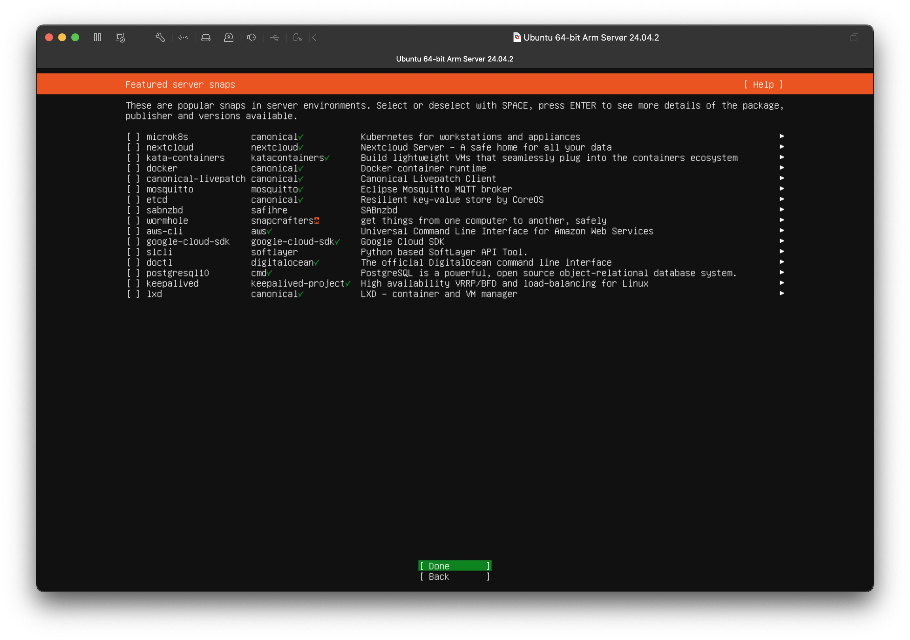

## Introduction

### Tribute to the star of the show

.jpeg)

Before I got a Mac, God bless, I was rocking a [2009 Dell Latitude E6410](https://www.notebookcheck.net/Review-Dell-Latitude-E6410-Notebook.32771.0.html) that ended up in my disposal essentially for free after being decommissioned from some office.

It's so old I don't even recognize some of the ports on this thing. However, I suspect that it was an incredible machine for its time, and I am not gonna lie, even 15 years after its release – it still holds up.

A nice bonus of it being used in a corporate setting is that it is very serviceable. Swapping out the storage is a single screw! The same goes for taking out the back panel, which gives you easy access to all the important components and usual suspects in case of failure. Or maybe that was a common thing for consumer electronics in 2009 and has just gotten worse since.

I ran Windows 10 on it primarily because I just wasn't ready to give up the MS Office suite. Therefore, even with all the optimizations I tried to do and the additional RAM I beefed it up with, I just had to get used to 5-minute startup time.

Now there is no point of keep torturing this old guy with the bloated crap Windows had become. 11 is even worse. Recently, I had to configure a fresh install of Windows 11 on a new machine, and this is how my tab bar looked like near the end:


And most of it is me searching for a way to remove stuff that Microsoft put into Windows to collect your personal data! Hope I'll never have to go back to that ever again.

### Motivation

I got the idea a year ago from my friend's brother. We were flipping through some photo albums on their Google Drive, and he told me that he wanted to set up a home server and stop paying Google.

A year later, I got back to it. On top of that, Google recently gave me some extra motivation to do this.


So, I went on a four-day quest to figure out how to do it. I had no idea what I was doing. The plan was to brute force through it. I figured some things out, and this is what I learned.

### Who is this for?

Consequently, this is for someone who has absolutely no idea about how server systems work but has some experience in tinkering with computers and using the terminal (command line interface). For dads doing a side-quest if you will. Also, it will be a useful reference for myself, if I ever come back to it sometime in the future.

> The image load time might be bad. Just wait a little for the images to load.

## Prerequisites

I assume that you don't have anything to save on your old computer's drive. If you do so, save it somewhere else. Also, I recommend checking your drive's, as well as your overall system's health. There are many utilities ([AIDA64 Extreme](https://www.aida64.com/products/aida64-extreme) is a good one for Windows), some googling will get you there. If you are sure that everything is fine, you can proceed.

Besides that, there are quite a lot of footnotes that give some context and links to useful resources throughout this post, which I recommend looking at as you follow along.

## Ubuntu Server

The first thing to do was to get rid of Windows and install Linux.[^1] Since it will act as a server, it makes sense to get a server distro. I went with [Ubuntu Server](https://ubuntu.com/download/server) as it seems to be the most reliable out of all available options out there.

### Installing Ubuntu Server

First, download the image for the LTS[^2] version of Ubuntu Sever from their [website](https://ubuntu.com/download/server). I recommend using [torrent](https://releases.ubuntu.com/24.04/ubuntu-24.04.2-live-server-amd64.iso.torrent), as it is much faster.

Second, you'll have to "flash" a USB drive with this image and create a bootable USB.[^3] There are tutorials on how to do this from Canonical (the company that makes Ubuntu) for [Mac](https://ubuntu.com/tutorials/create-a-usb-stick-on-macos#1-overview), [Ubuntu](https://ubuntu.com/tutorials/create-a-usb-stick-on-ubuntu#1-overview) and [Windows](https://ubuntu.com/tutorials/create-a-usb-stick-on-windows#3-usb-selection).

Third, turn on your old laptop, get into the Boot Menu by pressing some function key different depending on the model [^4] (`F12` in my case), and choose your USB drive as your boot device. You will see this menu:


> For demonstration purposes, I am performing this installation on a virtual machine. Screenshots are from there too.

Just press enter and wait for the flashing lines on your screen to end. Enjoy feeling like a *hackerman* for a moment.

After initial loading is done, you should see this screen:

##### Choose language screen


Click through the following screens.

##### Keyboard config screen


##### Type of installation screen


##### Network config screen


One thing to note on this screen is that you might have different options. In my VM, it displays one network interface with the name `ens160`, which is an ethernet interface. You might also have something like `wlp2s0b4`, which is Wi-Fi. But you can not worry about it right now because we will do the network configuration after the installation.

##### Proxy config screen


You can leave this blank.

##### Mirror config screen


Wait a bit on this page for the tests to pass, and press enter.

##### Storage config screen (1)


Now, this screen is pretty important. By default `Set up this disk as an LVM group` option is checked, but I would recommend unchecking it.[^5] Using LVM is preferred in some use cases, but for this simple project, it adds, in my opinion, an unnecessary layer of complexity and potentially can make data recovery more challenging in case of a system failure. On the next screen, we will create custom partitions for the OS installation and our data using traditional partitioning.

##### Storage config screen (2)


Here you see 3 lists:
1. `FILE SYSTEM SUMMARY`
2. `AVAILABLE DEVICES`
3. `USED DEVICES`

Since we chose the `Use an entire disk` option on the previous screen the installer partitioned the disk into 2 partitions by default, which you can see under the first and the third list. The tiny partition mounted at `/boot/efi` is important and required, it is where the system stores the data about how to boot your operating system. The partition mounted at `/` is where the operating system – Ubuntu Server – is going to be installed. You could just proceed from here without changing anything, and it will work. However, it is better to split that second partition into two (or more), isolating the OS files from your personal files.

> Note that I am showing this installation on a VM. You will have much more space.

Go ahead and delete the partition mounted at `/`:

##### Storage config screen (3)


##### Storage config screen (4)


Notice that it now appeared in the second list as free space and got removed from the other two.

Now select it and create a partition for the OS that is 15 to 50 GB in size. The size depends on what software you want to install on it and how you plan to use it in the future, but you likely wouldn't need more than 50 GB. On my installation, I went with 40.

##### Storage config screen (5)


##### Storage config screen (6)


> I make `15G` for demonstration because it is on a VM.

Now you see that new entries appeared in the first and third lists again, and there is still some free space left in the second list.

##### Storage config screen (7)


Now, create a partition for personal data.

##### Storage config screen (8)


##### Storage config screen (9)


Under `Mount` choose `Other` and name it something like `data`.

> IMPORTANT: If you want to install Nextcloud this name has to be either `/mnt` or `/media`. Refer to [this part](#configuring-nextcloud) before continuing.

Note that leaving the `Size` field blank will create a partition with all the available space:

##### Storage config screen (10)


##### Storage config screen (11)


Now we have 3 partitions:
1. `partition 1 … /boot/efi 953.000M` – for the bootloader.
2. `partition 2 … / 15.00G` – for the OS.
3. `partition 3 … /data 4.067G` – for personal files.

This structure ensures that data is isolated from the system, and allows to easily wipe out or even change the OS without worrying about losing personal files in case of a software failure or an update.

Continue with the installation.

##### Profile config screen


Next is the profile configuration screen. Nothing hard here, just don't forget the password.

##### Ubuntu Pro screen


We don't need that.

##### SSH config screen


By default, the `Install OpenSSH server` option is unchecked, but you want to enable it for sure. It will allow you to connect to your server from any computer's terminal. Once set up, you wouldn't even have to touch your old laptop anymore!

##### Featured server snaps screen



On this screen, you see some interesting software that you can install with [snap](https://en.wikipedia.org/wiki/Snap_(software)). You can look those things up if you want, but I will skip them for now. You can always install any snap after the installation.

##### Installation screen (1)


Now, wait for the Ubuntu Server to install. Another good moment to feel like a cool *hackerman*.

##### Installation screen (2)


After installation is complete, select `Reboot Now`. You should see this screen:

##### Eject screen


This is normal, just take out the USB drive and press `Enter`. After reboot, you will be greeted with a terminal that will ask you for your credentials:

##### First screen after install (1)


Put in your login and password that you configured earlier and get into the terminal.

##### First screen after install (2)


Great! You have installed the Ubuntu Server.

### Configuring the network

> From here on, almost everything will be done within the command line interface. If you never have used the terminal before – [here](https://ubuntu.com/tutorials/command-line-for-beginners#1-overview) is a guide that you most definitely should take a look at before proceeding. If you know what you are doing, here is a [cheat sheet](https://assets.ubuntu.com/v1/3bd0daaf-Ubuntu_Server_CLI_cheat_sheet_2024_v6.pdf) for a quick reference.

Since we are configuring a server, you would want it to be available 24/7. To ensure a reliable connection to the network, it is obviously better to connect your laptop directly to your router with a LAN cable. But if you are in a situation like mine with no access to the router, Wi-Fi might be your only option. Both of them are configured by a utility called `netplan`.

Get to the `netplan` directory:

```sh
cd /etc/netplan
```

Check what files are in there:

```sh
ls
```

And `sudo nano` into it. In my case, the file is `50-cloud-init.yaml`:

```sh 
sudo nano 50-cloud-init.yaml
```

You should see something like this:

```yaml
network:
  version: 2
  renderer: networkd
  ethernets:
    eno4:
      dhcp4: true
      dhcp4-overrides:
        route-metric: 100
  wifis:
    wlp2s0b4:
      dhcp4: true
      dhcp4-overrides:
        route-metric: 200
      access-points:
        "TP-Link_5G":
          password: "DEEZ2025NUTS"
```

> Don't get scared of the nano editor – all you need to know is a couple shortcuts. You can look them up [here](https://www.nano-editor.org/dist/latest/cheatsheet.html).

I think the file is self-descriptive and what you need to update here is clear enough. Follow consistent indentation. The `renderer: networkd` setting might not be present, and if it is not, it's probably on by default. The `route-metric` setting under `dhcp4-overrides` assigns a routing priority to each interface, and you should set it yourself. The system will prefer interfaces with lower metric values. In this configuration, Ethernet (`eno1`) has a metric of `100`, making it the preferred interface. Wi-Fi (`wlp2s0b1`) has a metric of `200`, serving as a fallback in case the ethernet connection breaks.

That's all I needed to know for this project about networking. If you want to configure more and get into more details about networking – [here is the official documentation.](https://documentation.ubuntu.com/server/explanation/networking/)

Get out of the nano editor and save the file by `Ctrl+X`, `Y`, and `Enter`.

### Connecting via SSH

Get the IP address of the server by:

```sh
ip addr
```

Look for the address that comes after `inet` under the ethernet or Wi-Fi interface you want to use and **remember it** – we will use this very often. I will reference it as `{SERVER_IP_ADDRESS}`.

If everything is working correctly, you should be able to connect to your server via `ssh` from a computer that is in the same network.

> To learn more about SSH [look here](https://www.digitalocean.com/community/tutorials/ssh-essentials-working-with-ssh-servers-clients-and-keys).

From another computer's terminal:

```sh
ssh {YOUR_USERNAME_ON_THE_SERVER}@{SERVER_IP_ADDRESS}
```

For me, it is `sagyzdop@192.168.13.104`. It will probably ask you to [confirm connecting](https://superuser.com/questions/1295569/does-the-authenticity-of-host-cant-be-established-message-in-ssh-reflect-a-se), type `yes`. You will be prompted to enter your login and password for the server user.

Voila! You are now connected to your server, and anything you type in the terminal will execute as if you were typing on it directly.

Run these two and wait for the system to update:

```sh
sudo apt update
sudo apt upgrade --yes
```

### Power configuration

One more thing you probably want to do before we proceed is:

1. Disable the server laptop going to sleep when closing its lid.
2. Turn off the screen of the server laptop while it is on.

Following [this guide](https://gist.github.com/tankibaj/71547848decdd7cc3bf0c6df68935c8f?utm_source=chatgpt.com):

(1) Mask the targets using `systemctl`:

```sh
sudo systemctl mask sleep.target suspend.target hibernate.target hybrid-sleep.target
```

Open the file `logind.conf`:

```sh
sudo nano /etc/systemd/logind.conf
```

Once there, uncomment the following lines by removing the prefixed `#`:

```logind.conf
HandleLidSwitch=ignore
HandleLidSwitchExternalPower=ignore
HandleLidSwitchDocked=ignore
```

Save and exit. (2) Open the file `grub`:

```sh
sudo nano /etc/default/grub
```

Once there, add `consoleblank=60` to `GRUB_CMDLINE_DEFAULT`, it should look like this:

```grub
GRUB_CMDLINE_LINUX_DEFAULT="quiet consoleblank=60"
```

Save and exit. Update the GRUB:

```sh
sudo update-grub
```

The final step for changes to take effect is rebooting your system simply with:

```sh
sudo reboot
```

If everything goes well, you can hide your laptop in a closet (just make sure it is not a fire hazard) and just ssh into it from your personal computer.

---

Now, let's talk about how can we actually use this thing. In the following sections, I will install software that can replace Google Photos and Google Drive. Also, I will talk about additional configuration that needs to be done in order to access these services from over the Internet.

## Immich

[Immich](https://immich.app) is an open-source and self-hosted Google Photos alternative. If you've ever used Google Photos, this will feel like at home. They also have a [demo](https://demo.immich.app/auth/login) if you want to get familiar with the available functionality.


Installing and running Immich on your server is quite straightforward, thanks to good [documentation on their website](https://immich.app/docs/install/docker-compose). I will go with the recommended install method using Docker [^6] Compose.

### Installing Docker

First, install Docker Engine following [these instructions](https://docs.docker.com/engine/install/ubuntu/).

```sh
for pkg in docker.io docker-doc docker-compose docker-compose-v2 podman-docker containerd runc; do sudo apt-get remove $pkg; done
```

Then:

```sh
# Add Docker's official GPG key:
sudo apt-get update
sudo apt-get install ca-certificates curl
sudo install -m 0755 -d /etc/apt/keyrings
sudo curl -fsSL https://download.docker.com/linux/ubuntu/gpg -o /etc/apt/keyrings/docker.asc
sudo chmod a+r /etc/apt/keyrings/docker.asc

# Add the repository to Apt sources:
echo \
  "deb [arch=$(dpkg --print-architecture) signed-by=/etc/apt/keyrings/docker.asc] https://download.docker.com/linux/ubuntu \
  $(. /etc/os-release && echo "${UBUNTU_CODENAME:-$VERSION_CODENAME}") stable" | \
  sudo tee /etc/apt/sources.list.d/docker.list > /dev/null
sudo apt-get update
```

And finally:

```sh
sudo apt-get install docker-ce docker-ce-cli containerd.io docker-buildx-plugin docker-compose-plugin
```

### Installing Immich

Head over to the `/srv` directory:[^7]

```sh
cd /srv
```

Make a folder for Immich:

```sh
sudo mkdir ./immich-app
cd ./immich-app
```

Download [`docker-compose.yml`](https://github.com/immich-app/immich/releases/latest/download/docker-compose.yml) and [`example.env`](https://github.com/immich-app/immich/releases/latest/download/example.env) by running the following commands:

```sh 
sudo wget -O docker-compose.yml https://github.com/immich-app/immich/releases/latest/download/docker-compose.yml
sudo wget -O .env https://github.com/immich-app/immich/releases/latest/download/example.env
```

### Configuring Immich

Open the `.env` file:

```sh
sudo nano .env
``` 

The important things to change in the file that opens up are:

```.env
UPLOAD_LOCATION=./library
DB_DATA_LOCATION=./postgres
DB_PASSWORD=postgres
```

We want to store the library and other data in the separate partition created at the Ubuntu installation [earlier](#storage-config-screen-9). And the password is just a security measure. You don't even have to remember it, just change it to whatever you like.

```.env
UPLOAD_LOCATION=/data/immich-library
DB_DATA_LOCATION=/data/postgres
DB_PASSWORD=DEEZ2025NUTS
```

Now exit and save the changes, and run Immich:

```sh
sudo docker compose up -d
```

Now, if everything went well, you should be able to see Immich if you visit `http://{IP_OF_YOUR_SERVER}:2283` from a device that is on the same network as your server. 

What you need to do after the installation is well documented – [here](https://immich.app/docs/install/post-install/). But one thing I want to share is my storage template:

```
{{filetype}}/{{y}}/{{MM}}-{{MMMM}}/{{dd}}.{{MM}}.{{y}}/{{filename}}
```

What this means is that on the server, namely under the `/data/immich-library/library/{USER}` directory, the photos and videos you upload to Immich are saved with this file structure:

```
 /data/immich-library/library/{USER}/
├── IMG/
│   ├── 2025/
│   │   └── 06-June/
│   │       └── 03.06.2025/
│   │           ├── vacation.jpg
│   │           └── brunch.jpeg
│   └── 2024/
│       └── 12-December/
│           └── 25.12.2024/
│               └── christmas_day.jpeg
└── VID/
    ├── 2025/
    │   └── 06-June/
    │       └── 05.06.2025/
    │           ├── birthday_party.mp4
    │           └── concert.mov
    └── 2024/
        └── 11-November/
            └── 15.11.2024/
                └── holiday_recap.mp4
```

I think this structure preserves some useful information if the Immich goes kaput in the future, and you are left just with your files. But, of course, YMMV.

## Nextcloud

Cool. If photo storage is all you need you can skip this part. But I wanted some basic file storage too. And for my needs – [Nextcloud](https://nextcloud.com) – was the best option. There are multiple [versions](https://nextcloud.com/install/) of it and many ways you can install it, but the one that worked for me is through [snap](https://github.com/nextcloud-snap/nextcloud-snap). (You might have noticed `nextcloud` snap package [earlier](#featured-server-snaps-screen) when installing Ubuntu.)

### Installing Nextcloud

To install it run:

```sh
sudo snap install nextcloud
```

### Configuring Nextcloud

> For the complete documentation, visit [their wiki](https://github.com/nextcloud-snap/nextcloud-snap/wiki). It is very useful but a bit confusing. I tried to extract the most important bits.

The most important settings you would want to configure are the following.

#### Change the data directory to use another disk partition

[Wiki](https://github.com/nextcloud-snap/nextcloud-snap/wiki/Change-data-directory-to-use-another-disk-partition#if-you-just-installed-the-snap-and-havent-created-an-admin-user-yet) specifies:

> The partition you want to use must be mounted *somewhere* in `/media/` or `/mnt/`. These are the only locations the snap can access under confinement with the `removable-media` plug. Connect the `removable-media` plug as mentioned in the [README](https://github.com/nextcloud/nextcloud-snap/blob/master/README.md) in order to grant the snap permission to access external drives.

This means that the custom partition we created here by choosing `Other` in the Ubuntu installation [earlier](#storage-config-screen-9) had to be not `/data` but `/mnt` or `/media`. I have it under `/mnt/nextcloud-library`. Consequently, I also have Immich under `/mnt/immich-libary`. Of course, you can put Immich and Nextcloud on separate partitions altogether, for example, in `/data` and `/mnt` respectively. Or configure it as a [bind mount](https://unix.stackexchange.com/questions/198590/what-is-a-bind-mount). Just make sure that the partition you want to use for Nextcloud is mounted in `/media/` or `/mnt/`.

Enable the connection of the partition:

```sh
sudo snap connect nextcloud:removable-media
```

Following the instructions from the wiki, for my setup, I run the following commands.

```sh
sudo mkdir -p /mnt/nextcloud-library/data
sudo chown -R root:root /mnt/nextcloud-library/data
sudo chmod 0770 /mnt/nextcloud-library/data
```

Open the config file:

```sh
sudo nano /var/snap/nextcloud/current/nextcloud/config/autoconfig.php
```

Change this line to point to the correct location:

```autoconfig.php
 // ...
 'directory' => '/mnt/nextcloud-library/data',
 // ...
```

Then restart the PHP service:

```sh
sudo snap restart nextcloud.php-fpm
```

#### Port configuration

According to the [wiki](https://github.com/nextcloud-snap/nextcloud-snap/wiki/Port-configuration), the default ports used by Nextcloud are `80` and `443` if you enable HTTPS (disabled by default). These are the default network ports used for HTTP and HTTPS web traffic, respectively, which means that someone connecting to your server by your IP is going to be served with the Nextcloud page. It is okay if Nextcloud is the only thing running on the server, but since it is not, it is a good idea to change it to something else. I have them like this:

```sh
sudo snap set nextcloud ports.http=85 ports.https=445
```

#### Creating an admin account

If you visit `http://{SERVER_IP_ADDRESS}:85`, you should see the setup page. Create an admin account and click Install.


On the next screen, you will see this:


Nextcloud is actually not just a file-storing app. It can replace all the Google services altogether, and more! If you are interested, you can look for details on the Internet, I personally didn't need that and just skipped.

You will see a dashboard:


If you navigate to the Files tab you'll see some placeholder files that you can safely delete and start using Nextcloud.


#### Setting trusted domains

By default, Nextcloud blocks connections from outside of the local network. To allow connections, you'll need to [update the list of trusted domains](https://github.com/nextcloud-snap/nextcloud-snap/wiki/Configure-config.php#setting-trusted-domains) in the configuration file. Where to get that domain? You have two options:

1. Set up access to the server under a custom domain with reverse proxy.
2. Use Tailscale and add the MagicDNS to the list of trusted domains.

I am using Tailscale, and to add my MagicDNS I sudo-nanoed into `config.php`:

```sh
sudo nano /var/snap/nextcloud/current/nextcloud/config/config.php
```

edited section

```
 'trusted_domains' =>
  array (
    0 => 'my.magic.dns.ts.net',
  ),
```

And restarted Nextcloud:

```sh
sudo snap restart nextcloud
```

If you set up a custom domain to something like `nextcloud.yourdomain.com` you would put that domain in here. The following section is about how to set that up.

## Accessing your server over the Internet

### Some theory

Every website and/or web service on the Internet is just a computer running 24/7 that has the programs and files that you, in turn, access by its specific IP address. An address like `google.com` is just a pretty way of writing the "ugly" IP address `74.125.68.101` (paste this into your browser and see that it indeed opens up Google).

The "ugly IP address" part is handled by your Internet Service Provider (ISP), who assigns you (your router) a public IP address, usually a dynamic one. If someone enters that IP address in their browser, they will basically make a request to your router. Now, if you have a server running on your local network and configure your router to direct incoming requests to that server (which is called "port forwarding"), you can "serve" that request with something useful, such as a website or Immich and Nextcloud.

The "pretty address" part is controlled by someone called Domain Name Registrar. They essentially store what pretty addresses correspond to what ugly addresses. When you buy a domain name, they remember that domain as yours, and you can then add a DNS record to point it to your public IP. (Buying a domain name does not make you an owner – you just pay to reserve it for a certain amount of time.) Anyone accessing that domain in their browser goes through DNS (domain name system) finds your server's IP, and can access your server over the Internet.

And if represented graphically, it looks something like this:


So, if you want to access your server over the Internet like you would access `photos.google.com`, what you have to do is:
1. Buy a domain name.
2. Add a DNS record that points to your public IP. If your public IP is dynamic, set up an utility that dynamically updates the DNS record.
3. In your router's settings forward the traffic on appropriate ports to your server.
4. If you have multiple apps/websites on your server configure a "reverse proxy" that points to the correct application/website you want to access.

That sounds like a lot. FORTUNATELY, there IS an easier way – Tailscale.

### Tailscale

Considering all that, I discovered that the quickest and easiest way for me to access my server was through a thing called [Tailscale](https://tailscale.com). Basically, it creates a virtual private network, and every device with Tailscale installed and connected to that network (and only those) can access every other device over the Internet. Also, Tailscale has a MagicDNS feature that allows you to use a pretty address, without buying a domain name.

> Tailscale's online resources on how to use their product are unmatched. Take a look [here](https://tailscale.com/kb/1017/install) and their [YouTube channel](https://www.youtube.com/@Tailscale) for more information.

[Install](https://tailscale.com/download) the Tailscale client on devices you want to access your server from and log in (I recommend logging in with Google). Then install Tailscale on the server [by this guide](https://tailscale.com/kb/1476/install-ubuntu-2404):

Ssh into your server, and add Tailscale's package signing key and repository:

```sh
curl -fsSL https://pkgs.tailscale.com/stable/ubuntu/noble.noarmor.gpg | sudo tee /usr/share/keyrings/tailscale-archive-keyring.gpg >/dev/null
curl -fsSL https://pkgs.tailscale.com/stable/ubuntu/noble.tailscale-keyring.list | sudo tee /etc/apt/sources.list.d/tailscale.list
```

Install Tailscale:

```sh
sudo apt-get update
sudo apt-get install tailscale
```

Connect your machine to your Tailscale network and authenticate in your browser:

```sh
sudo tailscale up
```

This will display a message:

```sh
To authenticate, visit:

	https://login.tailscale.com/a/abcdefg12345

```

Visit that link and log in with the account you signed up with to connect your server to the [Tailnet](https://tailscale.com/kb/1136/tailnet) (the private network crated by Tailscale). 


In your Tailscale admin console you should enable MagicDNS. [Here is how to](https://tailscale.com/kb/1081/magicdns). There you should also [disable key expiry](https://tailscale.com/kb/1028/key-expiry) for the server.

> If you installed Nextcloud don't forget to add the MagicDNS address to the list of trusted domains as described [earlier](#setting-trusted-domains).

Aside from the MagicDNS, you can also find sever's regular IPv4 address in the Tailnet by running:

```sh
tailscale ip -4
```

As a result, you can access your server with 3 different addresses:

1. **Local IP address** that you can use if you are connecting from the same network.
2. **Tailnet IP address** that you can use to connect to your server if both the server and the device you are connecting from are running Tailscale and are connected to the same Tailnet.
3. **MagicDNS** that is a pretty version of the Tailnet IP address which is functionally the same.


Thanks to MagicDNS, you can now access Immich and Nextcloud from your browser with an easy to remember address like:

```
server-name.magic-dns.ts.net:2283
server-name.magic-dns.ts.net:85
```

Moreover, you can ssh into your server with the same address:

```sh
ssh {YOUR_USERNAME_ON_THE_SERVER}@server-name.magic-dns.ts.net
```

At this point, you have yourself a fully functional server that replaces Google Photos and Google Drive!

### Accessing the server with a custom domain

Tailscale is probably your best bet for a home server storing photo albums and your personal files. The tremendous benefit of using Tailscale is the fact that you don't have to worry about security risks that come with exposing your server to the Internet. But if you want to use this server, say, for hosting a website(s), you will have to go through all of that that we discussed earlier. Luckily, modern services and software make this process less painful, and it is pretty simple once you understand the general idea. I will follow the path you need to take outlined in [here](#some-theory).

> Note that I never really had a chance to get this part working on my setup because I didn't have access to a public IP,[^8] so the following sections are not as detailed.

#### 1. Custom domain registration

This is the easiest part. Just pick a domain name registrar, choose any domain name you like, and that is it. And I mean any – `helicopterhelicopter.com` is available for only $10.44/year. I personally use Cloudflare and can recommend it.

> Cloudflare also offers many cool features for free, like email routing and website analytics.

#### 2. Creating a DNS Record with Static or Dynamic IP

Most probably, your ISP provides you a dynamic IP address, and usually, a static IP is available for some fee. If you have a static IP already, or you are willing to pay for it, you can just add a DNS record that points your custom domain to that IP and skip to the next part. Here is a [Cloudflare's guide on adding a DNS record](https://developers.cloudflare.com/dns/manage-dns-records/how-to/create-dns-records/). The process is pretty much the same for all providers. But if you don't have static IP, it is relatively trivial to set up a service that will dynamically change your DNS records to point to your server at all times.

> One thing to note – if you have a static public IP address – you can access your server from the Internet just by that IP, without the need for a custom domain. It is just a matter of what you choose to pay for. I'd prefer a pretty address.

The [guide on the Cloudflare website](https://developers.cloudflare.com/dns/manage-dns-records/how-to/managing-dynamic-ip-addresses/) points to [ddclient](https://github.com/ddclient/ddclient). You can follow [this](https://medium.com/@timothy.halim/ddclient-cloudflare-setup-in-ubuntu-e271c53d3ce8) and [this](https://github.com/mcblum/ddclient-cloudflare-ubuntu) excellent guides to get it to work. There is [official documentation](https://ddclient.net), and, of course, Google and ChatGPT.

The general idea is this:
1. Make a DNS record that points to your dynamic public IP.
2. Get an API key from your domain name provider that will allow you to change the DNS record.
3. Install the ddclient on the server and configure it with the API key from your domain name provider.

#### 3. Port forwarding

Now for this part, you'll need to connect to your router via LAN or Wi-Fi. Look up your router's model and find the address to connect to its admin panel. Usually it is `http://192.168.0.1` or `http://192.168.1.1`. Put in your login and password. If you don't know these, both the default login and password on almost all routers is `admin`, but if that doesn't work, you can always reset your router. Google how to do all that for your specific router. Here is a guide from [tp-link](https://www.tp-link.com/us/support/faq/1379/) as an example.

Once in your router's settings, you'll need to forward ports `80` and `443` on your router to the internal IP address of your server (the `{SERVER_IP_ADDRESS}` you found earlier).

#### 4. Reverse proxy server

You might be familiar with the term "proxy server". We all had to use it during the 2022 January Events when the government blocked all Internet in the country. There is a great [article from Cloudflare](https://www.cloudflare.com/en-gb/learning/cdn/glossary/reverse-proxy/) explaining what is reverse proxy server.

In a nutshell, your router forwards incoming web traffic (on ports `80` and `443`) to the server running the reverse proxy. The reverse proxy then inspects the requested domain name (e.g. `immich.yourdomain.com`). Based on this domain, it routes the traffic to the correct internal service (like Immich on `http://localhost:2283` or Nextcloud on `http://localhost:85`).

I tried a couple of services to set up a reverse proxy – [Nginx Proxy Manager](https://nginxproxymanager.com) and [Caddy](https://caddyserver.com). The former one is more beginner-friendly and easier to set up, again, YMMV. Besides that, major benefit of using a reverse proxy is that it can also handle SSL/TLS encryption, allowing you to easily set up secure HTTPS for all your services if you need it.

---

## Notes

Going through this rabbit hole was an interesting learning experience, and this post is me sharing my findings. Therefore, it is important to treat this as such, and not as an expert's guide. This setup is not perfect, and there is definitely a lot more to explore. I tried to highlight some of them in the following sections.

### Multiple drives and backup

It is important to note that this setup only has a single drive and is not protected against any kind of disk failure, so the risk of data loss is very high. But for my intents and purposes, it was okay.

What you want to consider is using multiple drive configuration with a RAID set up. But that is a topic I didn't go into as I don't have any other drives. One neat way to do it with the existing setup would be to replace the DVD drive with an HDD caddy and use RAID 1. If you want to really use this server for storing important files, I recommend reading into that.

### Maintenance and reliability

Why doesn't everyone do this? Well, the reason why people pay Google to store their files and photos is the convenience of not having to worry about solving potential problems.

First thing, those projects are open source and under development, hence there will inevitably be some bugs that you would have to deal with. For example, uploading too many files at once to Immich can cause some of them to be interpreted as duplicates, causing a server error. However, because you can connect to it with 3 different ways – switching between them can solve this issue.

Second, you have to deal with updates. You can set it up to be automatic, but that is some additional work to do.

Third, depending on the quality of your connection, your hardware, and your use case, the upload/download times might be slow. But this is true for Google services too.

Besides, there are also security risks. If you have some sensitive information to store you will need to worry about that.

On the upside, the desktop and mobile apps of these services work quite well. Especially the folder syncing feature on Nextcloud's desktop app works flawlessly and, in my opinion, even better than Google's. Stability-wise, the longest uptime of my setup was two weeks without any problems.

Even with all that though, I think it is still worthwhile and interesting project to try.

If you have any suggestions or notice an error or outdated information – please contact me!

Peace ✌️

.jpeg)


[^1]: My experience with Linux started with dual booting [Ubuntu](https://ubuntu.com) on my older laptop and successfully bricking it when I decided I didn't want Linux anymore, which led me to disassembling my laptop, taking out the HDD and manually copying all the data with another computer, then performing a fresh install of Windows… Ah, good times. Then I tried [Mint](https://linuxmint.com) but ultimately came back to Windows because of Office. Later, I used [Fedora](https://www.fedoraproject.org) on a VM on a Mac for my courses at university, which, to be honest, was a much better experience.
[^2]: LTS stands for "Long Term Support", which guarantees stability and support for longer than the latest version.
[^3]: Flashing a bootable USB means downloading an OS installer to your USB. Then by starting your computer from it you install an OS on the main drive.
[^4]: Google for "boot menu key" for your laptop model. For most computers, it is `ESC`, `F2`, `F10` or `F12`.
[^5]: Look [here](https://www.digitalocean.com/community/tutorials/an-introduction-to-lvm-concepts-terminology-and-operations) to learn more about LVM.
[^6]: It is not required to know what is "Docker" for this, as the provided commands set it up for you, but if you are interested – [here is where to start](https://docs.docker.com/get-started/docker-overview/).
[^7]: `/srv` directory [seems to be the convention](https://refspecs.linuxfoundation.org/FHS_3.0/fhs/ch03s17.html) to place the services provided by the server.
[^8]: Funny story, I didn't know that I didn't have access to a public IP right until I reset my router and found out it was under a [Carrier-grade NAT](https://en.wikipedia.org/wiki/Carrier-grade_NAT) (CGNAT), which meant that my router was getting only a private IP address from the ISP, essentially making direct port forwarding from the Internet impossible.
