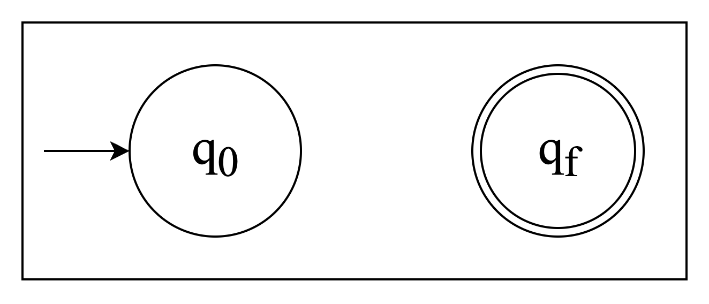
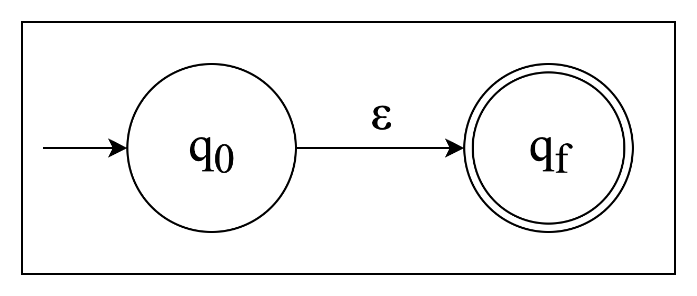
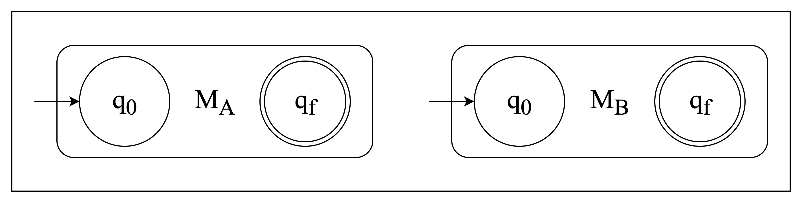
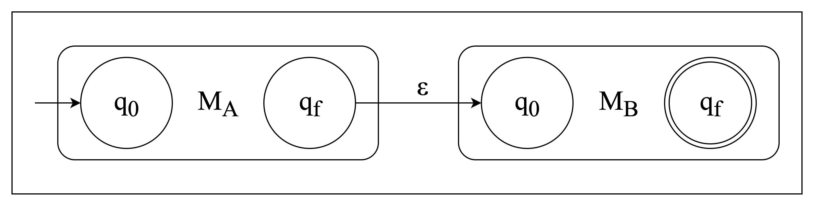
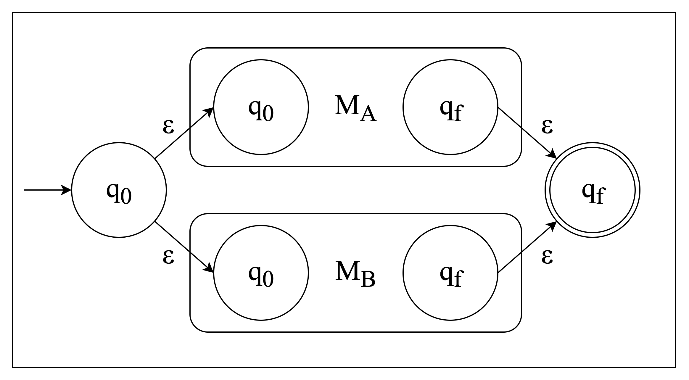
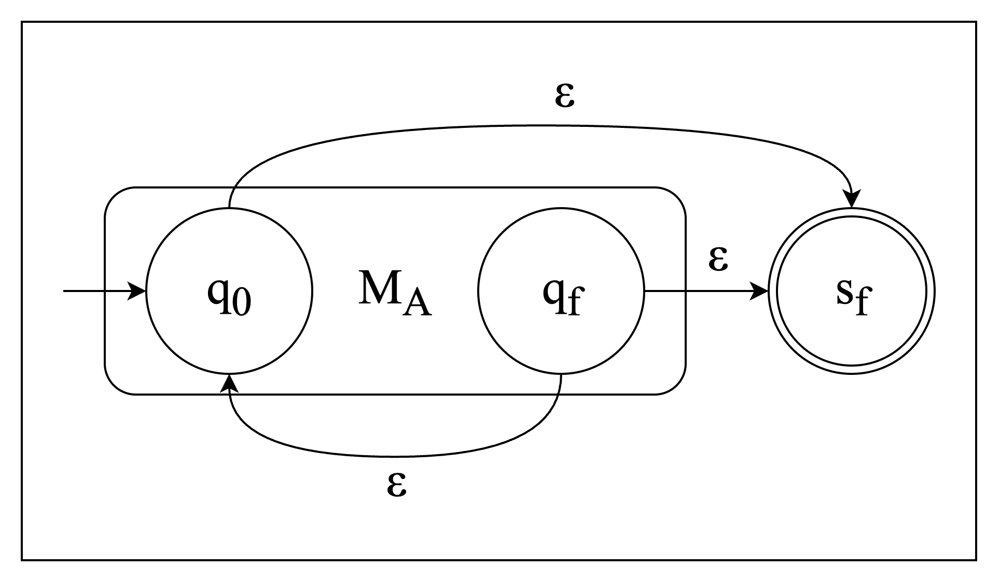
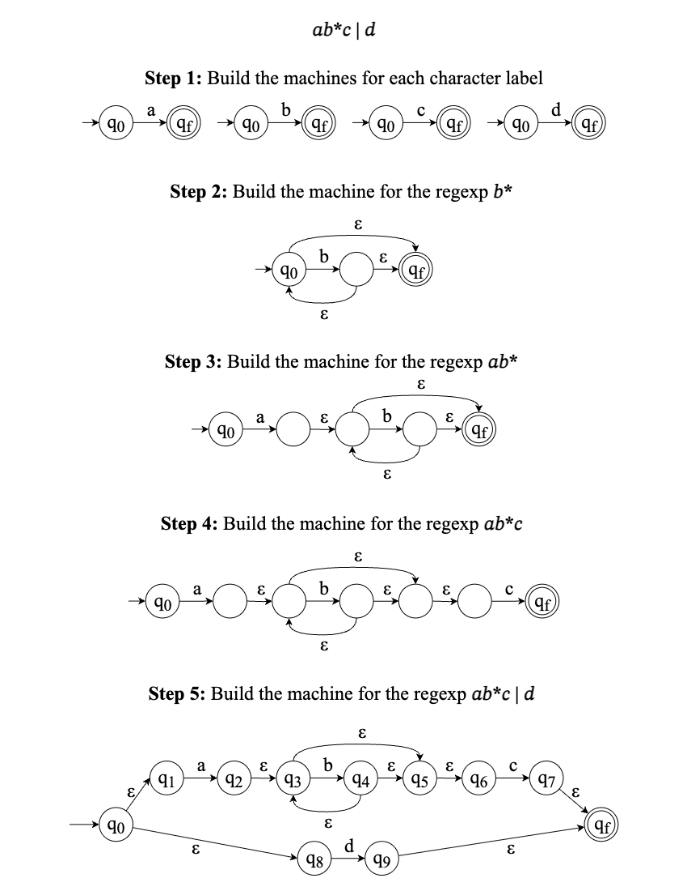
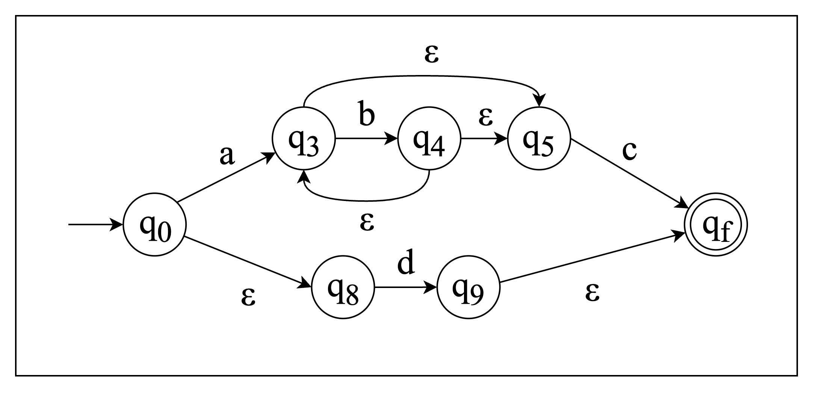

> This post assumes that you already know about regular expressions and NFAs, and just includes the theory relevant to regexp to NFA conversion.

## Regular Expression (RegExp)

| Operator      | Notation           | Description                          |
| ------------- | :----------------: | ------------------------------------ |
| Concatenation | $A \circ B$ or $AB$| An $A$ word, followed by a $B$ word  |
| Alternation   | $A \mid B$         | Either an $A$ word or a $B$ word     |
| Kleene Star   | $A^{\*}$           | Zero or more $A$ words, concatenated |

The order of computation is:

1. Parentheses
2. Kleene star
3. Concatenation
4. Alternation

To get this more clearly let's consider this example regular expression:

$$
ab^{\*}c \mid d
$$

* In the expression $ab^{\*}c \mid d$, the $^{\*}$ (Kleene star) applies only to $b$. So, $b^{\*}$ means "zero or more occurrences of $b$". This $b^{\*}$ is evaluated first, effectively forming a unit like "empty string", "$b$", "$bb$", etc.
* Next, concatenation takes precedence. The $a$ is concatenated with $b^{\*}$, and that result is then concatenated with $c$. This forms the complete pattern $ab^{\*}c$. Consequently, $ab^{\*}c$ will match strings such as $ac$ (when $b^{\*}$ matches the empty string), $abc$, $abbc$, $abbbc$, and so on.
* Finally, the $\mid$ (alternation) operator has the lowest precedence. It offers a choice between the entire pattern $ab^{\*}c$ (formed by the higher-precedence operations) and the literal character $d$.

Therefore, the regular expression $ab^{\*}c \mid d$ will match any of the following:

*   $ac$
*   $abc$
*   $abbc$
*   … (any string starting with $a$, followed by zero or more $b$s, and ending with $c$)
*   OR the literal character $d$

However, if you want to override the default precedence and make the alternation apply to $c$ and $d$ first, followed by $ab^{\*}$, you would use parentheses like in regular math:

$$
ab^{\*}(c \mid d)
$$

In this case, $(c \mid d)$ is evaluated first (meaning "$c$ or $d$"), and then that result is concatenated with $ab^{\*}$. This would match strings like $ab^{\*}c$ or $ab^{\*}d$.

## Non-Deterministic Finite Automaton (NFA)

Can be understood as a less strict version of DFAs:

* Allows multiple transitions from the same state with the same character label. For example, there can be multiple $a$ transitions from a state to two different states.
* Allows $\varepsilon$-transitions.

## Conversion

Regexps and NFAs have the same expressive power as they both describe and recognize the same class of languages, known as **regular languages**. That is why one can be converted to another.

To convert a regular expression into an NFA there are only 6 cases you have to remember:

### Cases

##### Case 1: $L = \emptyset$  (language is empty)

Construct $M_{L}$ as follows ($M$ stands for "Machine" as in Turing Machine):

##### Case 2: $L = \varepsilon$  (language just contains $\varepsilon$)

Construct $M_{L}$ as follows:

##### Case 3: $L = c$  (language just contains $c$)

Construct $M_{L}$ as follows:

##### Case 4: $L = AB$  for regexps $A$ and $B$

If you have two automata $M_{A}$ and $M_{B}$ (assume that inside of these boxes are NFAs):

Construct $M_{AB}$ as follows:

##### Case 5: $L = A \mid B$  for regexps $A$ and $B$

If you have two automata $M_{A}$ and $M_{B}$:

Construct $M_{A \mid B}$ as follows:

##### Case 6: $L = A^{\*}$  for regexp $A$

Construct $M_{A^{\*}}$ as follows:

### Example

Now that you have all of these in your arsenal, lets try to solve an actual example from before:

$$
ab^{\*}c \mid d
$$

> It makes sense to enumerate the states only at the end.

Notice that we follow the order of computation of regexps. And if you want to further simplify the result you can remove the redundant epsilon transitions and get this:

---

To download the PDF cheat sheet with example - <a href="static/RegExp_to_NFA_Cheatsheet_sagyzdop.pdf" target="_blank" download>click here</a>.
