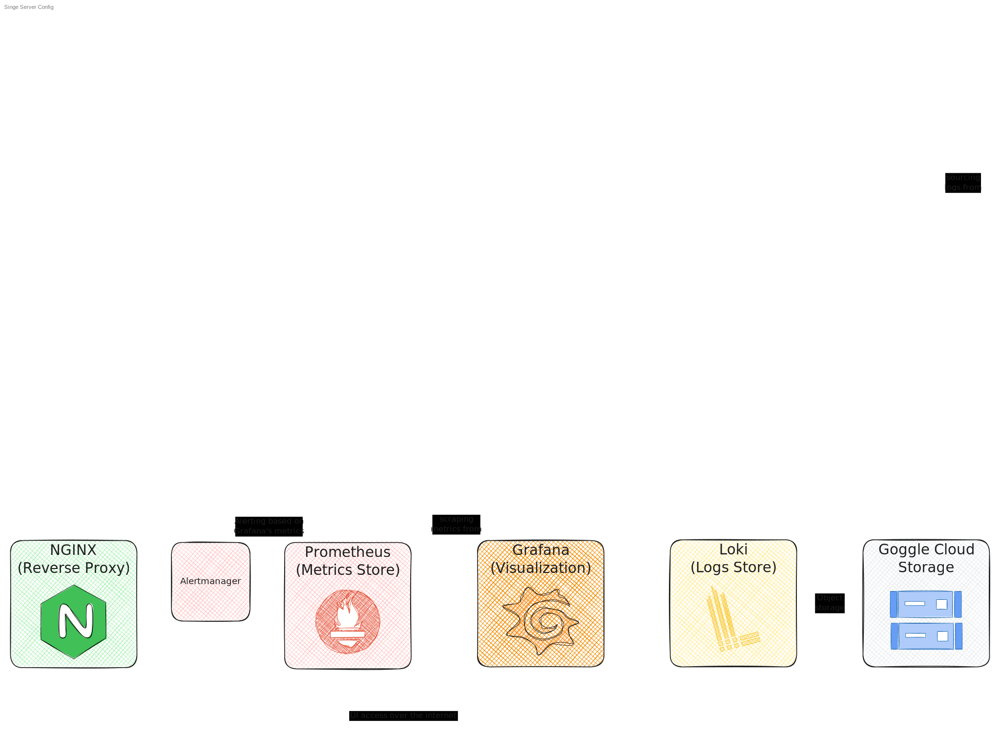
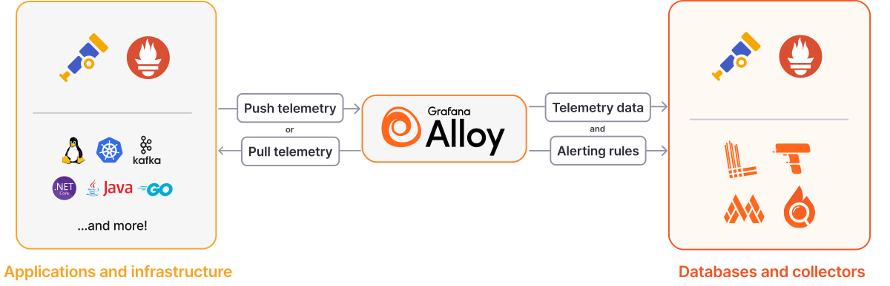
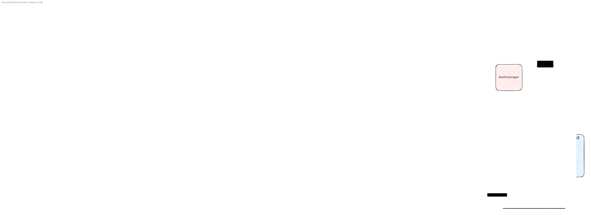

## Introduction

### What is Monitoring?

Imagine driving a car with no dashboard – you'd have no idea how fast you're going, if you're low on fuel, or if there is something wrong with the engine. You'd be essentially driving blindfolded and hoping for the best.

All of that information about the state of the car at any given moment is its **telemetry data** – sensors measure speed, fuel level, engine temperature, and other vital signals, then automatically transmit that data to your dashboard. By its general definition:

> Telemetry (verb) is the in-place collection of measurements or other data at remote points and their automatic transmission to receiving equipment for monitoring. –[Wikipedia](https://en.wikipedia.org/wiki/Telemetry)

It's the same principle whether you're driving a car or running a web service. If your application's reliable operation is important, in cases when it serves a real user base for example, you can't let yourself "drive blindfolded". That's when you should implement some form of **monitoring**:

> Monitoring in software systems refers to the collection and displaying the information about the application's performance and usage patterns so you can identify, mitigate, or resolve issues. –[Microsoft](https://learn.microsoft.com/en-us/devops/operate/what-is-monitoring)

Recently, I got a task to implement monitoring on a project that I became a part of at the end of this Spring – [**NU Space**](https://nuspace.kz).[^1] 

The thing we want to monitor here is a FastAPI application, its utility services, and the server (the virtual machine instance) on which everything is running on. (To learn more about the stack we are using, look [here](https://github.com/ulanpy/nuspace?tab=readme-ov-file#tech-stack).)

### The Three Pillars of Observability: Logs, Metrics, and Traces

The next obvious question is: **What telemetry should we collect?** (I will use telemetry (noun) to refer to telemetry data.)

Quick Google search reveals that there are a lot of articles titled "The Three Pillars of Observability: Logs, Metrics, and Traces".

The new term "Observability" is widely used in this context. From the research I have done, it seems like purely a marketing thing used by vendors of commercial monitoring solutions. Personally, I didn't see any clear difference between observability and monitoring, despite the countless number of articles trying to convince you that it is an "innovation". I am not gonna lie, it caused me some amount of confusion. In this post, I will treat these concepts as the same thing and would advise you to do so as well.

To explain what Logs, Metrics, and Traces are, I will be referencing a good article from [SigNoz](https://signoz.io/blog/three-pillars-of-observability/).

#### Logs

It's the easiest one to understand as a developer. If you have been coding for long enough, you probably had to debug your code with debug messages at some point. Logs can be understood as **time-stamped** debug messages that tell you what has happened in your system and when. From the article, the types of information captured in logs are:

- Error messages and stack traces
- Application state changes
- User actions and system events
- Detailed transaction information

#### Metrics

Metrics are numeric measurements taken at regular intervals. They are usually displayed not as a single data point, but as graphs over time, and used to spot trends or sudden spikes. From the article, key metric types are:

- **Counters** – ever-increasing values (e.g., total HTTP requests)
- **Gauges** – up and down values (e.g., current CPU or memory usage)
- **Histograms** – buckets of values over time (e.g., request duration distributions)

Using the car dashboard analogy, the speed is a metric that is displayed on the speedometer gauge.

#### Traces

Traces were harder to grasp. As I understood, traces are a way of collecting data about a job from start to end. An example from the article:

> "A typical example of a trace is an HTTP request to a web front end, involving multiple tasks to complete and return a response. Consider an HTTP POST request to add a new pet to an owner's profile. This request encompasses 25 units of work ([Spans](https://signoz.io/blog/distributed-tracing-span/)), each containing detailed attributes about the unit of work, SQL statements, thread IDs, and service details… While some of this information can be derived from logs, a trace presents these units of work in a contextual and standardized format."

The first decision I made was to ignore traces, because I didn't see any use for it in the current scale of the project. Aside from these three, there are several other telemetry types that vendors of commercial monitoring solutions offer. I ignored those too.

## Implementation

Now we have the idea about the type of data we need. But to actually make use of it, we have to send it through a monitoring pipeline. It consists of several stages, each with a specific role.

### The Stack Overview

| Stage | Purpose                                                       | Tool                             |
| ----- | ------------------------------------------------------------- | -------------------------------- |
| 1     | Exposing data: Logging, Instrumentation and Exporters         | Prometheus, Grafana Alloy        |
| 2     | Collecting exposed data: Agent/Collector                      | Grafana Alloy                    |
| 3     | Storing collected Data & Indexing: Metrics and Logs Databases |                                  |
| 3.1   | Metrics Storage                                               | Prometheus                       |
| 3.2   | Logs storage                                                  | Grafana Loki                     |
| 3.2.1 | Object Storage for logs on development environment            | Filesystem                       |
| 3.2.2 | Object Storage for logs on production environment             | Google Cloud Storage (GCS)       |
| 4     | Visualization                                                 | Grafana                          |
| 5     | Alerting                                                      | Grafana, Prometheus Alertmanager |
| 6     | Access over the internet                                      |                                  |
| 6.1   | Reverse proxy on the server side                              | NGINX                            |
| 6.2   | VPN                                                           | Wireguard                        |
| +     | Deployment                                                    | Docker Compose                   |

As you can see, I divided the pipeline into 6 stages. In this post, I will go through stages 1 to 5. Configuring VPN in the last stage was its own can of worms, so much so that it deserves a separate post.

In the following sections, I will be referencing [NU Space repository on GitHub](https://github.com/ulanpy/nuspace). You can look at the relevant files and follow along.

If you actually want to implement this monitoring stack on your project, I will be maintaining a [repo](https://github.com/sagyzdop/simple_monitoring) that is designed to be plug-and-play to deploy. You are welcome to contribute!

The file structure and their contents relevant to monitoring in these two repositories might not match, but the latest changes will be in [`simple-monitoring`](https://github.com/sagyzdop/simple_monitoring). It has its own readme going into details of the config files in it.

Here is a schematic of a whole monitoring system:

> [Open in a new tab](images/Monolith_compose.svg) to take a closer look.

This schematic actually displays the contents of the Docker Compose file deployed at our production server (`prod.docker-compose.yaml`). Each block (except the Google Cloud Storage) is a service inside this compose file. The utility services like RabbitMQ and Redis are omitted from the schematic for better readability, and only the FastAPI application service and NGINX reverse proxy service are present. Notice that the whole monitoring implementation requires only 5 additional services added to Docker Compose – Grafana Alloy, Prometheus, Alertmanager, Grafana, and Loki.

Now that we have a general picture in our head, let's dive into the details of each stages of this monitoring system.

### Stage 1. Exposing data: Logging, Instrumentation, and Exporters

The first step is to understand that for an application or system to be monitored, it needs to **expose data** about its internal state and performance. In the context of a web application, this means adding code to your application to broadcast telemetry. This is achieved through logging, instrumentation, and exporters.

Logging is trivial. If something breaks, usually you get an error message in the console. If you need something specific, just print a time-stamped message. One, as it seemed to me, big-brain move I made was to collect the logs from the console outputs of the running Docker containers.

Instrumentation is a little bit more sophisticated, but essentially the same thing. It refers to the process of integrating code into your application to expose data in a specific required format. Since I am using [Prometheus](https://prometheus.io), I need Prometheus metrics. (I will explain what Prometheus is in the following sections, don't worry.) Instrumentation for Prometheus is done via [client libraries](https://prometheus.io/docs/instrumenting/clientlibs/). Since the NU Space is written using FastAPI, I used [Prometheus' client library for Python](https://github.com/prometheus/client_python).

> Instrumentation, IMHO, is a little confusing term for it. "Exposition" would've done the job better. Anyways…

[Exporters](https://prometheus.io/docs/instrumenting/exporters/) (similar to instrumentation) are libraries that help export metrics from third-party systems as Prometheus metrics. They are used in cases where it is not feasible to instrument a given system with Prometheus metrics directly. For example, we can't edit the code of any service other than FastAPI, like Redis and RabbitMQ, but monitoring them is crucial too. Besides that, there are metrics of the Linux system that everything is running on, which also need monitoring. For that very purpose, in my setup I am using [Node Exporter](https://github.com/prometheus/node_exporter ) and [Cadvisor](https://github.com/google/cadvisor) through Grafana Alloy's [`prometheus.exporter.cadvisor`](https://grafana.com/docs/alloy/latest/reference/components/prometheus/prometheus.exporter.cadvisor/) and [`prometheus.exporter.unix`](https://grafana.com/docs/alloy/latest/reference/components/prometheus/prometheus.exporter.unix/) components respectively. (Next section is about Alloy.)

### Stage 2. Collecting telemetry data: Agent/Collector

Once data is exposed, it needs to be actively collected. This is the role of **agents or collectors** (they are the same thing).

Collectors can be responsible for three core stages in the pipeline – collection, processing, and exporting. It gathers metrics and logs from services (either by actively pulling data from sources, or by receiving data pushed to it). Aside from just collecting the data, a collector can perform basic processing like filtering, enriching, or transforming data before forwarding it to appropriate storages.

I used [Grafana Alloy](https://grafana.com/docs/alloy/latest/) as my data collector. Alloy is the core of this monitoring stack. In simpler words, it is a thing that sits between your apps & server and the telemetry storage & indexing services, and orchestrates the data collection and transfer. Here is a schematic [from their website](https://grafana.com/docs/alloy/latest/):

### Stage 3. Storing collected Data & Indexing: Metrics and Logs Databases

Collected data needs a place to reside for long-term storage, querying, and analysis. Different types of data are typically stored in specialized databases.

I found it essential to understand the difference between the storage for indexes and the storage for raw data. For performance, services like Loki and Prometheus keep recent data and indexes in memory or on fast local disk for quick access. For long-term, scalable storage, especially for logs which can grow very large, it's best practice to use a dedicated object store in the cloud.

#### 3.1 Metrics Storage

[Time-Series Databases](https://www.influxdata.com/time-series-database/) (TSDBs) – are databases optimized for storing and querying **time-stamped** data. Aforementioned Prometheus, which stores metrics, and Loki, which stores logs, use this kind of database to operate.

Here is an excellent [2-part blog post](https://blog.palark.com/prometheus-architecture-tsdb/) going into more technical details of how monitoring systems in general, and Prometheus in particular, works. For the purposes of this post it is enough to know that Prometheus has an implementation of such a database, and we are using it. Also note that we are not using cloud object store for storing metrics, because using local storage (the VM's drive) for metrics seems to be fine on our scale.

#### 3.2 Logs Storage

Log Storage Systems are designed to store, index, and allow searching through vast amounts of log data. For it, I used [Grafana Loki](https://grafana.com/docs/loki/latest/).

To learn more about the specifics of Loki storage, look [here](https://grafana.com/docs/loki/latest/get-started/architecture/), [here](https://grafana.com/docs/loki/latest/configure/storage/), then [here](https://grafana.com/docs/loki/latest/operations/storage/). After that, I recommend googling the latest articles on the topic. [Here](https://devopscube.com/grafana-loki-architecture/) is a nice one I found.

> I strongly advise NOT asking AI chatbots about this, they don't know, and most probably cause more confusion.

##### 3.2.1 Object Storage for logs on development environment: Filesystem Store

Notice that the [repo](https://github.com/sagyzdop/simple_monitoring) has two different Loki config files: `loki.yaml` and `loki.prod.yaml`. I think the names are self-explanatory; their difference is in where the logs are stored.

In development environment there is no need for cloud storage, you better not have different devs working on the project send logs from their instances to a single cloud storage, which would result in conflicts.

For that reason, the `loki.yaml` file has storage configured to be used in development and to store everything on the host's filesystem.

##### 3.2.2 Object Storage for logs on production environment: Google Cloud Storage

You might see the problem with storing files on the filesystem in production though – it is not very scalable. A much more viable solution is [object storage](https://cloud.google.com/learn/what-is-object-storage?hl=en).

Let's go on a tangent here and talk about configuring Google Cloud Storage Bucket for storing logs. Personally, this was the most interesting part of this project. I got to learn about the Google Cloud ecosystem and play around with all the cool stuff on there. Despite the terrible web UI, there was a decent command line experience with [gcloud](https://cloud.google.com/sdk/gcloud). I got it working, and here's how. (Open the links as you follow along.)

1. [Create a bucket](https://cloud.google.com/storage/docs/creating-buckets). A couple of things here. I recommend these configurations:
	1. `Location type` as `Region` and choosing the cheapest option close to your VMs location.
	2. `Set a default class` to `Standard`. Now, you might think that `Nearline` or `Coldline` are more suitable since you probably won't be accessing logs that often. However, that is not the case. Even if you are not inspecting the logs yourself, the Loki service is constantly updating the logs on the remote storage. And the price of these classes is cheaper because they have higher [operational costs](https://cloud.google.com/storage/pricing#flat-namespace). So no, you ain't fooling a billion-dollar corporation.
	3. Everything else is fine on the defaults.
2. Next, you would probably want to set a limit on how long the logs are stored to something reasonable. We decided to store logs for 7 days, after which they get automatically deleted. Deletion is handled on Google's side by [adding a rule](https://cloud.google.com/storage/docs/managing-lifecycles#console) to the bucket with a [delete action](https://cloud.google.com/storage/docs/lifecycle#delete). Here, it is worth noting that by default, "soft delete" is enabled on all newly created buckets. It basically acts as a trash on your computer with a default 7-day retention period after which the objects get permanently deleted. You can change that period or disable it altogether. YMMV, but keep in mind that objects in soft delete state also count against your storage costs. I left it on, but you can disable it.
3. Next, you need to [create a service account](https://cloud.google.com/iam/docs/service-accounts-create#iam-service-accounts-create-console) for your bucket. Following [this information](https://grafana.com/docs/loki/latest/configure/storage/#gcp-deployment-gcs-single-store) from the official documentation, give it the `storage.objectUser` role on the `Permissions` section, and grant people access on `Principals with access` on creation.
4. [Create](https://cloud.google.com/iam/docs/keys-create-delete#iam-service-account-keys-create-console) and [get](https://cloud.google.com/iam/docs/keys-list-get#iam-service-account-keys-get-console) the service account key (a `json` file) for the newly created service account. This will be used by Loki to connect to your bucket. Don't forget to put it in the project's `.gitignore`. (Loki docs mention that "GCP recommends [Workload Identity Federation](https://cloud.google.com/iam/docs/workload-identity-federation) instead of a service account key", but I didn't go into that rabbit hole.)
5. Next, configure the Loki config file to have your bucket name and the Docker Compose file to point to the `json` file you downloaded.

As you might have noticed, `loki.prod.yaml` has `gcs` configurations instead of `filesystem`.

---

> Trace Storage. As mentioned earlier, I ignored traces, but I think it is worth noting Grafana Tempo as a seamless integration option to the stack I am using. I will talk about the LGTM stack and the alternatives later in the "Why this way?" section.

### Stage 4. Visualizing the data: Grafana

With data stored, the next crucial step is to make it human-readable and actionable. This is where a visualization tools like [Grafana](https://grafana.com/docs/grafana/latest/?pg=oss-graf&plcmt=hero-btn-2) come in.

Grafana connects to various data sources (log stores, metric stores, etc.) and presents the data in graphical formats – graphs, charts, tables, heatmaps, etc.

In my setup, Grafana connects to both Prometheus (for metrics) and Loki (for logs).

> I want to mention that Grafana's use is not limited to only web services and servers. Each year, they publish a list of memorable use cases of Grafana – [Grafana dashboards in 2024: Memorable use cases of the year](https://grafana.com/blog/2024/12/09/grafana-community-dashboards-memorable-use-cases-of-2024/). [This one](https://grafana.com/blog/2022/09/09/monitoring-a-pet-python-with-grafana/) I was most surprised about.

The power of Grafana comes with the dashboards you can create literally however you like. This freedom and functionality are great if you know what you want; otherwise, it can be overwhelming. Luckily, there is a [library](https://grafana.com/grafana/dashboards/) with plenty of official and community examples that you can download or get inspiration from. I am using [Node Exporter Full](https://grafana.com/grafana/dashboards/1860-node-exporter-full/) and [cAdvisor Docker Insights](https://grafana.com/grafana/dashboards/19908-docker-container-monitoring-with-prometheus-and-cadvisor/) dashboards in my setup.

### Stage 5. Alerting

Monitoring isn't just about looking at dashboards; it's also about being informed when something goes wrong or deviates from expected behavior to address it ASAP and minimize the downtime. This is achieved through **alerting** and it is implemented by **rules** that are based on specific metrics or log patterns. For example, CPU usage above 90% for 5 minutes, or a number of 500 responses from your application in the last 5 minutes, is over 100. When these rules are met, alerts are triggered, and notifications are sent.

I am using [Grafana's alerting](https://grafana.com/docs/grafana/latest/alerting/) as the main alerting agent. We haven't set up much yet at NU Space; currently, it is only sending a Telegram message if the FastAPI service is down.

[Here is a guide](https://grafana.com/tutorials/alerting-get-started/) on how to create an alert in Grafana. However, I think it is a bit confusing, and you are better off poking around in the UI yourself and configuring what you want. Thankfully, the UI is pretty intuitive. After you create the alert in the UI, you can export these alerts and update the appropriate files referencing the [repo](https://github.com/sagyzdop/simple_monitoring). They will be then created automatically on startup.

If you are wondering, what if Grafana itself is down? Here came another, as it seemed to me, a big-brain move I made by using Prometheus' [Alertmanager](https://prometheus.io/docs/alerting/latest/alertmanager/) to look after Grafana. (It is called [meta monitoring](https://grafana.com/docs/grafana/latest/alerting/set-up/meta-monitoring/).) It is the same kind of alerting agent, just running on its own and managed by Prometheus. This setup ensures mutual monitoring of uptime.

What if the VM itself is down? I added an [uptime check on Google Cloud's](https://cloud.google.com/monitoring/uptime-checks#monitoring_uptime_check_create-console) side that sends an alert if nothing is working. (It is becoming a paid service in 2026, which is pretty lame, but it does what it's supposed to do.)

With all that in place, we should be pretty safe against any unnoticed outages.

### Deployment

While not directly part of the data flow, **orchestration and deployment tools** are fundamental for managing and deploying the entire monitoring stack itself.

We are running the entire monitoring stack (Alloy, Loki, Prometheus, Grafana) alongside our main application as a monolith using Docker Compose. For larger production environments, the monitoring will probably be decoupled from the main services, and Kubernetes will be an orchestration tool of choice.

There are some Docker Compose configuration details important to this setup which are commented in the [repo](https://github.com/sagyzdop/simple_monitoring).

## Why this way?

The hardest thing about this was making the architectural decisions of how to do it. It turns out that there are so many solutions to this problem, both open and closed source, which, in itself, is a great thing. However, because of that, I found myself in a *suffering-from-success* situation trying to figure out the optimal approach.

On top of that, none of the AI chatbots have any idea about how to do it correctly. The topic by itself is, arguably, niche, because a regular developer doesn't need to know this, hence the documentation for it is not the first target for scraping. Moreover, some of the tools I used, albeit, pretty well documented, were relatively new, meaning the training data for the models was scarce to begin with.

The criteria I set out were the cost, performance, and the ease of integration into the project. Additionally, I found it important for the implementation to be simple enough to explain to other contributors, to minimize the maintenance overhead, and guarantee pain-free adoption by the devs.

So, what is available? I tried [OpenTelemetry](https://opentelemetry.io), the [LGTM Stack](https://grafana.com) and [Prometheus](https://prometheus.io). Aside from that, there is a widely used [ELK stack](https://www.elastic.co/elastic-stack) that I did not look into. LGTM is also is referred to be the replacement of PLG stack (P standing for deprecated [Promtail](https://grafana.com/docs/loki/latest/send-data/promtail/)). ELK and PLG are used solely for logs though.

OpenTelemetry seems to be the be-all and end-all solution for the first two stages of our pipeline – exposing and collecting telemetry – that is open source and designed to be vendor-agnostic. The problem I had with it comes to the ease of configuration. It was arguably harder to set it up and get it working than the alternatives I ended up using.

The stack I am using is a stripped-down version of the LGTM stack that relies on the products made by [Grafana](https://grafana.com). Each of the letters stands for the Grafana products that fit into the pipeline, namely:

- L – Grafana Loki – logs database
- G – Grafana – visualiztor
- T – Grafana Tempo – traces database
- M – Grafana Mimir – metrics database

Grafana offers [a solution](https://grafana.com/products/cloud/) for all your observability needs that handles everything with this stack. As you might have guessed, it is a paid service, but it has a very [generous free tier](https://grafana.com/pricing), which actually would have been more than enough for our needs. However, we chose not to use it for two reasons:

1. It would be a vendor lock-in.
2. This post wouldn't exist 🤠 Using it would've stripped us of such a wonderful learning opportunity.

The L and the G were discussed before, and as I have said, I chose to ignore traces; therefore, I can't say anything about Tempo.

As far as I know, [Mimir](https://grafana.com/oss/mimir/) actually is the same old Prometheus with some features on top of it that make it more easily scalable. That doesn't mean that Prometheus by itself does not scale, and Prometheus' devs seem to have [opinions on that](https://prometheus.io/docs/introduction/faq/#i-was-told-prometheus-doesnt-scale).

Initially, I actually wanted to use Mimir, even went as far as configuring it. But after some reassessment it seemed overkill for our current scale, and I decided to stick with Prometheus for metrics storage.

Prometheus can be used as a completely standalone service for metrics from start to end. It contains all the needed functionality for:

1. Instrumenting your application
2. Active scraping of metrics
3. Storage
4. Some primitive visualization

I am using its instrumentation functionality for instrumenting the NU Space FastAPI application. The alternative on this stage is the aforementioned [OpenTelemetry Instrumentation](https://opentelemetry.io/docs/concepts/instrumentation/). The reason for making this choice was that Prometheus was just easier to configure. Or maybe I am biased, because they had a [tutorial on how to instrument a server written in Go](https://prometheus.io/docs/tutorials/instrumenting_http_server_in_go/) – a language I am familiar with.

I am using its scraping functionality for meta monitoring of Grafana, as mentioned before. The scraping of everything else is done by Alloy. Obviously, I am using Prometheus as a metrics storage, and its visualization is there just in case.

Also, I wanted to say a couple of words about Grafana Alloy, which is while not being explicitly mentioned in the LGTM abbreviation, is arguably the most important thing in this setup.

It is worth noting that Grafana Alloy is just a modification made by Grafana of another commonly used collector – [OpenTelemetry Collector](https://opentelemetry.io/docs/collector/).

> Other things you might come across are [Promtail](https://grafana.com/docs/loki/latest/send-data/promtail/) and [Grafana Agent](https://grafana.com/docs/agent/latest/), which are deprecated. Grafana Alloy is the new replacement that incorporates the functionality of both, and more!

Funny enough, a YouTuber I have been following – [Christian Lempa ](https://www.youtube.com/@christianlempa)– released a [video](https://www.youtube.com/watch?v=E654LPrkCjo) just several days ago about Grafana Alloy that I recommend you to watch to the end. It would be a nice consolidation of everything that we talked about up to this point.



> I think this stack we made deserves its own name that also includes Alloy. I wanna call it "PromLAG" 🤠 Maybe it'll stick if this gets traction.

### The Decoupled Stack

One last thing. There is another solution to the concern "What if the VM is down?" that we already addressed earlier in alerting section with adding an [uptime check on Google Cloud's](https://cloud.google.com/monitoring/uptime-checks#monitoring_uptime_check_create-console) side.

Instead of that, we can put the monitoring on another server. This would also free up the resources on the application server from the load of the monitoring services. The theoretical decoupled stack will look something like this:

> <a href="/blog/simple-monitoring-for-a-website/images/Decoupled_compose.svg" target="_blank">Open in a new tab</a> to take a closer look.

The nice thing about this, in my opinion, is the fact that it uses the same things as in the monolithic implementation. Besides, notice that only ONE additional service – Grafana Alloy – is added to the compose file on the application server. Everything else is on another server.

The reason we didn't take this path is, again, the current scale of the project. Weighing the pros and cons of decoupling it I made the decision to keep everything in one place for now.

## Conclusion and Takeaways

There is a reason for this article to be titled "**Simple** Monitoring". This implementation of monitoring is made for a medium-sized web project that is expected to have a limited amount of user base. I suspect most of the projects on the web fit into that category.

Besides that, concepts and tools discussed in this post might be useful if you have your own home server, or want to make use of it in some other interesting way, like the ones in Grafana's Memorable use cases lists.

This was a great learning opportunity that cleared up many concepts, not just about monitoring, but about server systems and web applications in general. I tried out many new tools and got more confident and competent with the ones I already used, like Docker.

What made this more interesting was the fact that it being niche and the tools being new that I hit the limitations of AI chatbots. It felt nice actually googling stuff at google.com again.

In Part 2 of this series I will talk about how we deployed this on the production server and how we are using the tooling that we have set up.

If you have any suggestions or questions, or you have found a mistake or outdated information in this post, feel free to contact me!

[^1]: In a nutshell, NU Space is a super-app that incorporates different infrastructure unique to our university and offers them in a convenient all-in-one web service to people at our university. The idea actually lies on the surface, and I am really surprised that no one has made such a thing before. At the time I had my own ideas about such a platform, and even wrote them down. How surprised and excited I was to discover that some guys were making the same thing! Having my first experience with working on something bigger than a personal project, I realized how much faster you learn working in a team. Two months into it, I worked with stuff I wouldn't have known even existed on my own. I want to thank [Ulan](https://www.linkedin.com/in/ulansharipov/) for the opportunity. There are other similar projects popping up in our community like [innu.kz](https://innu.kz). There is still a lot of work ahead, but I feel like we are making something worthwhile.
