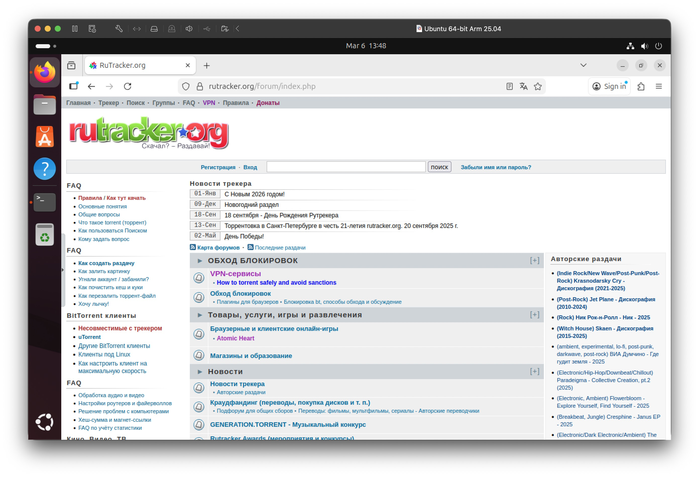
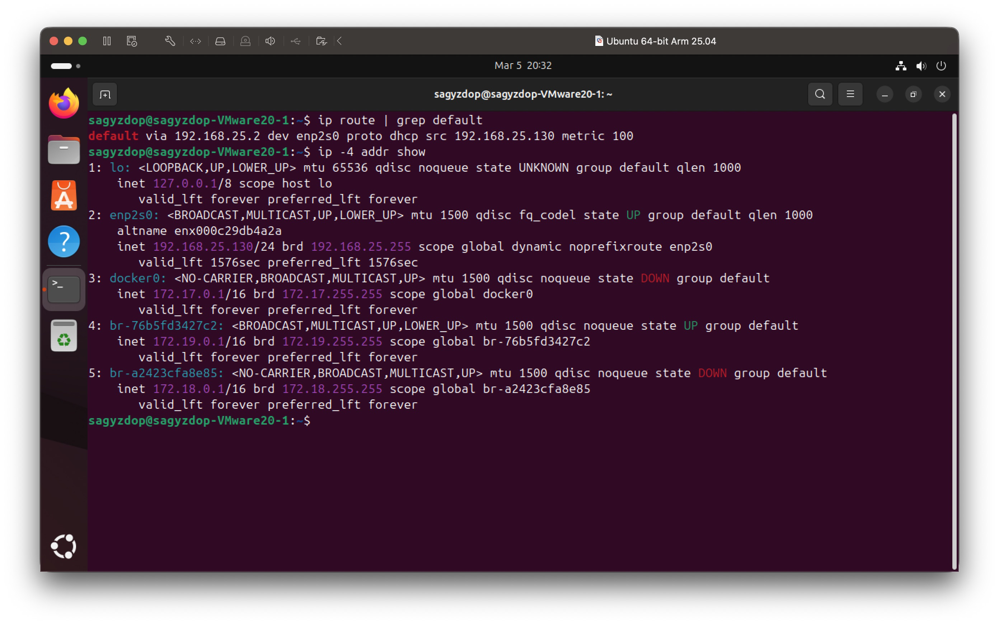
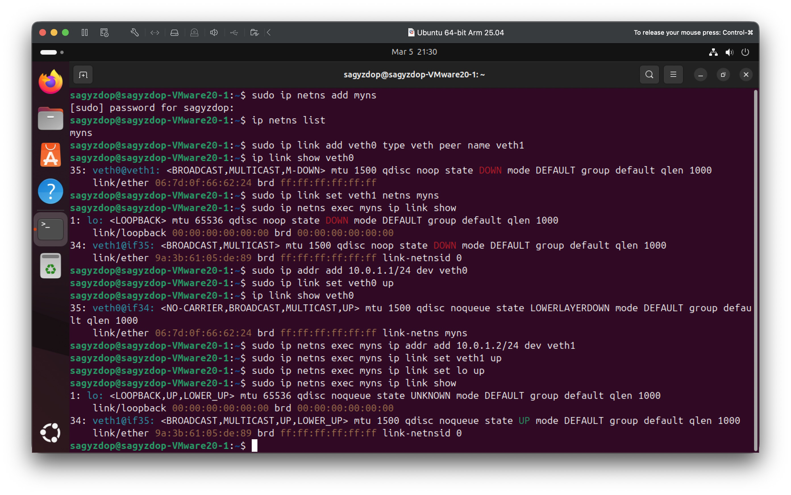
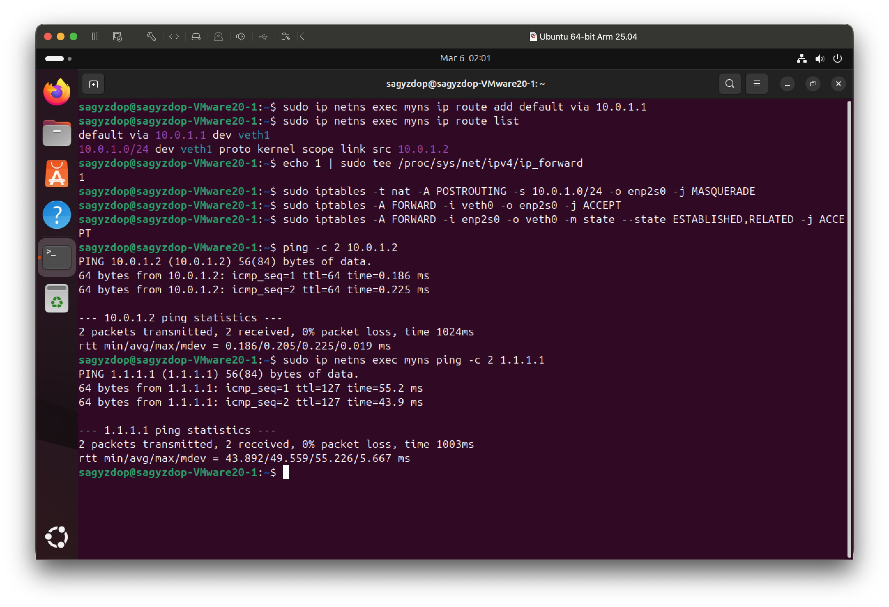
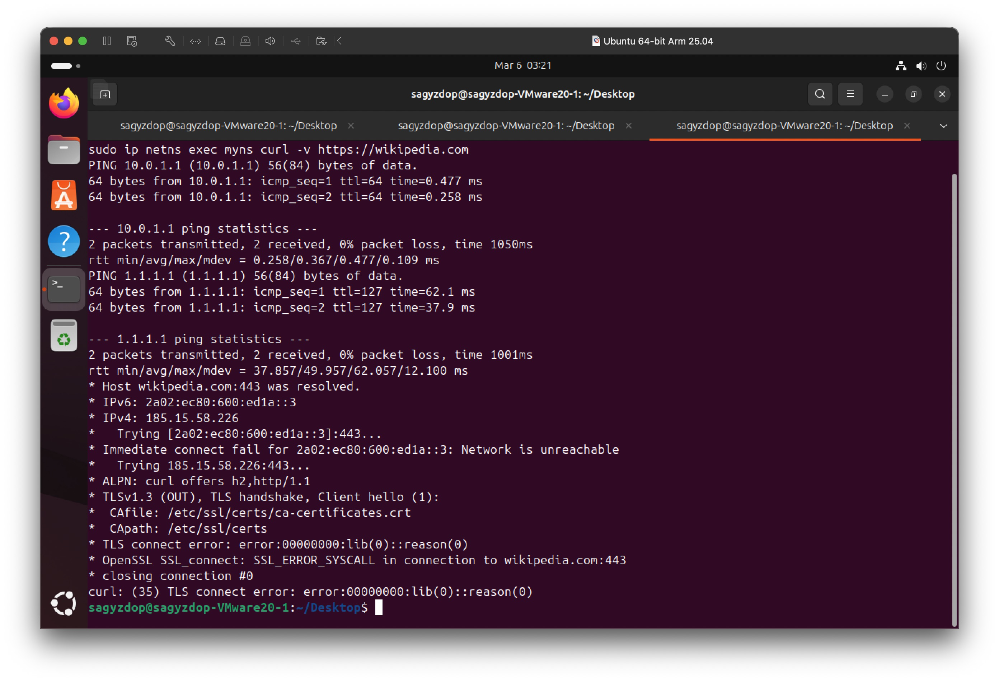
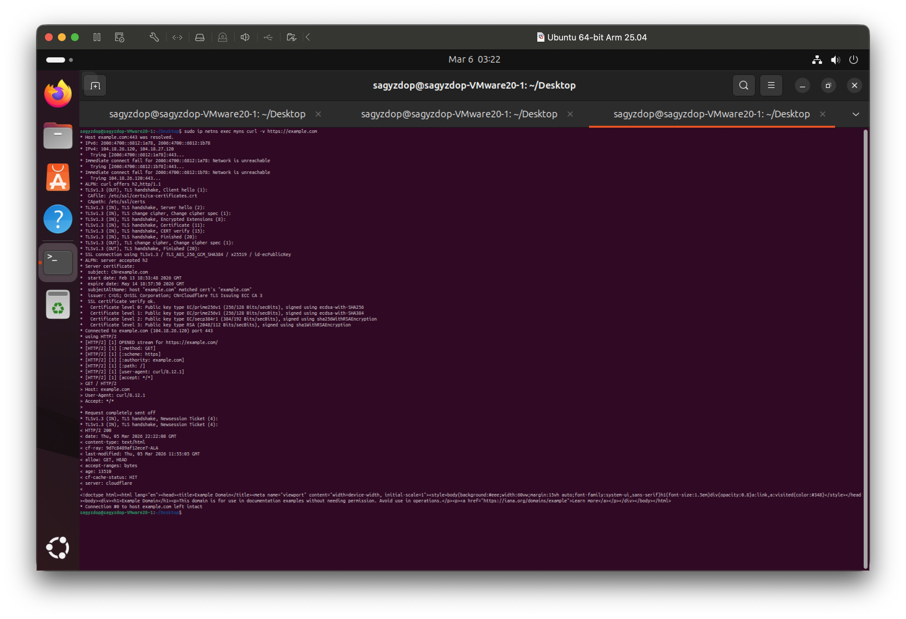
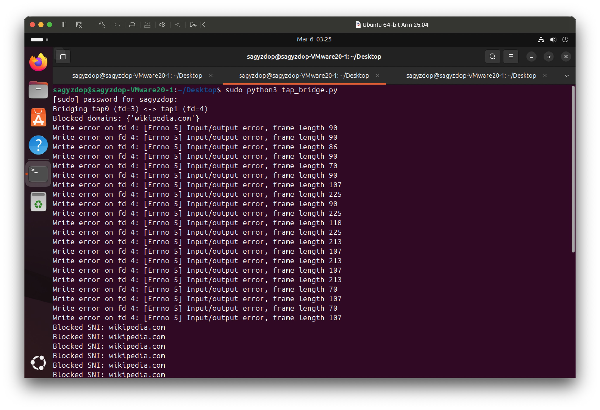

Development task 2 and network task 3 were fully implemented, others are only explained. The source code for implemented tasks are on [GitHub](https://github.com/sagyzdop/Tasks).

## Development Tasks

### Task 1 – Packet Entropy Monitor

Write a command‑line program (Go or C) that:

1. Prints the entropy value periodically.
2. Captures packets from a given network interface.
3. Filters packets by a specified IP address (source or destination).
4. Computes the entropy of the packet data over a sliding window of the last N packets.

The program must work from the command line. Language: Go or C. You may use `DPDK` frameworks or the `libpcap` library – the choice is yours.

---

First of all, I needed to figure out was what does entropy mean in this context.

Fist intuition from prior knowledge from physics tells me this has something to do with randomness.

Allegedly, Claude Shannon – AKA the father of information theory – introduced a similar measure to quantify the information content or uncertainty of a message source. For a discrete random variable $X$ that can take $n$ possible values with probabilities $p_{1},\ p_{2},\ …,\ p_{n}$, the Shannon entropy $H$ is defined as:

$$
H = -\sum_{i=0}^{255} \frac{freq[i]}{totalBytes} \cdot \log_2\left(\frac{freq[i]}{totalBytes}\right)
$$

- High entropy means that the bytes are nearly uniformly distributed – the data appears random. This is typical of encrypted or compressed traffic.
- Low entropy indicates that some byte values dominate – the data is repetitive or structured, e.g., plain text, protocol headers with fixed fields, or repeated patterns.

Thus, entropy serves as a "measure of diversity" of the packet data. By tracking it over a **sliding window**, one can observe how the randomness of the traffic changes over time – for instance, when an encrypted connection starts, entropy may suddenly rise.

Second of all, I need to figure out the proposed tools, namely `DPDK` and `libpcap`.

- `DPDK` (Data Plane Development Kit) is a set of libraries and drivers for fast packet processing in the user space. It bypasses the Linux kernel's networking stack entirely.
- `libpcap` (Packet Capture Library) is the industry standard for capturing network traffic on Unix-like systems. It provides a portable framework for low-level network monitoring. Applications like `tcpdump` and `Wireshark` are built on top of it.

| Feature                | libpcap                                                                          | DPDK (Data Plane Development Kit)                                                   |
| ---------------------- | -------------------------------------------------------------------------------- | ----------------------------------------------------------------------------------- |
| **Abstraction Level**  | High-level operating system API. Packets are captured via kernel.                | Low-level, runs entirely in userspace, bypasses the kernel.                         |
| **Performance**        | Moderate. Copies packets from kernel to user space (one copy).                   | Very high. Zero‑copy, poll‑mode drivers (PMDs) deliver line rate.                   |
| **Complexity**         | Simple. A few function calls to start capturing.                                 | Complex. Requires hugepages, CPU core isolation, and a specialized programming model. |
| **Typical Use Case**   | Traffic analysis tools (tcpdump, Wireshark), moderate‑speed monitoring.          | High‑speed packet processing (routers, firewalls, 5G gateways, trading systems).    |
| **Language Support**   | Native C. Go bindings via `gopacket`.                                            | Native C. Experimental Go bindings exist but are not trivial to use.                |
| **How It Works**       | Uses BPF in the kernel to filter packets, then copies them to userspace.         | Maps NIC hardware rings directly into the application; application polls for packets. |
| **Kernel Bypass**      | No – packets traverse the kernel network stack.                                  | Yes – complete kernel bypass.             |

As I am taking Computer Networks course at university right now and have done some labs with Wireshark. It being build on top of `libpcap` gave me intuition.

The next task seemed similar to this one, so I will discuss in there.

### Task 2 – Sniffer + Analyzer

Write two programs that communicate:

Sniffer (Program A):
1. Captures packets from an interface.
2. Filters by a given IP address.
3. Extracts the **packet length** and the **5‑tuple** (src IP, dst IP, src port, dst port, protocol).
4. Sends this information to the analyzer program.

Analyzer (Program B):
1. Receives the information from the sniffer.
2. Updates per‑host statistics: for each unique IP address (both source and destination), keep a count of packets and total bytes.
3. Periodically prints:
   - The IP address with the highest number of packets.
   - The IP address with the highest number of bytes.

---

Right off the bat there is a clear file structure:

```md
DEV-2/
├── cmd/
│   ├── sniffer/
│   │   └── main.go
│   └── analyzer/
│       └── main.go
├── internal/
│   └── packetinfo/
│       └── packetinfo.go   // shared struct and helpers
├── go.mod
└── README.md
```

I created a shared package `packetinfo` that defines the data structure used for communication between the sniffer and the analyzer.

```go
package packetinfo

import "encoding/json"

type Message struct {
	SrcIP    string `json:"src_ip"`
	DstIP    string `json:"dst_ip"`
	SrcPort  uint16 `json:"src_port"`
	DstPort  uint16 `json:"dst_port"`
	Protocol string `json:"protocol"`
	Length   int    `json:"length"`
	FilterIP string `json:"filter_ip,omitempty"`
}

func Marshal(msg Message) ([]byte, error) {
	return json.Marshal(msg)
}

func Unmarshal(data []byte) (Message, error) {
	var msg Message
	err := json.Unmarshal(data, &msg)
	return msg, err
}
```

One caveat was to not include the `HOST_IP` in the ranking, so it shows only the IPs of who communicates with the filtered host. Otherwise, the host IP would dominate the output.

The full source code is on [GitHub](https://github.com/sagyzdop/Tasks).

The first task would be generally similar to this implementation, just the analyzer would compute the entropy.

### Task 3 – Top 20 Words

Write a Go program that reads a text file (given as a command‑line argument) and outputs the 20 most frequent words, exactly as the following bash script does:

```bash
#!/usr/bin/env bash
cat $1 | tr -cs 'a-zA-Z' '[\n*]' | grep -v "^$" | tr '[^upper:]' '[^lower:]' | sort | uniq -c | sort -nr | head -20
```

- Language: **Go only**.
- **No use of Go `map`**.
- **No use of Go `string` type** (work with `[]byte`).
- **Slices are allowed**.
- Must handle binary files without crashing (e.g., `/boot/vmlinuz`).

---

This one seems the most trivial. It can be done with basic read and regular expressions.

## Network Tasks

### Task 1 – DPDK Telemetry CLI Utility

Build DPDK locally:

```bash
sudo dpdk-testpmd --no-huge -l 0-1 -m 1024 --vdev net_af_packet0,iface=eth0 -- --forward-mode=rxonly

sudo dpdk-telemetry.py <<< /ethdev/xstats,0 | jq
```

Write a CLI utility that shows **RX/TX bytes and packets** for one or more DPDK ports by using the DPDK telemetry interface.

---

Having the context about DPDK from the first development task this task seemed similar to the second development task.

Here are some definitions I looked up:

- RX/TX bytes and packets –
- DPDK telemetry interface –

### Task 2 – Zapret and Bypassing Censorship

- Run `zapret` (a DPI bypass tool) to access `wireguard.org` (a site blocked in Kazakhstan) **without using a VPN or proxy**.
- Provide a detailed explanation of how it works.

---

- [Zapret repo on GitHub](https://github.com/bol-van/zapret2?tab=readme-ov-file).
- [Install script](https://keift.gitbook.io/guides/linux/install-zapret) on Keift.

Looking at the extensive documentation what I got is that it intercepts traffic, captures packets, divides them in a way that confuses the blockers.

Key Concepts:
- DPI (Deep Packet Inspection) – A technology used by ISPs to analyse packet contents (e.g., TLS Server Name Indication, HTTP Host header) and block connections to forbidden domains.
- NFQUEUE – A netfilter target that passes packets from the kernel to a user‑space program (like nfqws2) via a queue. The program can inspect, modify, accept, or drop each packet.
- nftables / iptables – Linux kernel firewalls. nfqws2 uses them to redirect selected packets to NFQUEUE.
- conntrack (connection tracking) – A kernel feature that keeps state about network flows. nfqws2 has its own user‑space conntrack to remember TCP sequence numbers, packet counts, and direction.
- dissect – The internal representation of a packet after parsing (IP headers, TCP/UDP headers, options, payload). Lua scripts work with this structured data.
- profile – A set of filters (ports, IP lists, hostnames, L7 protocol) and a list of Lua actions (called "instances") that are applied to a matching flow.
- strategy – A combination of Lua actions (e.g., multidisorder, fake, seqovl) that together fool the DPI. Different ISPs may need different strategies.
- blockcheck2 – The built‑in testing tool that automatically tries hundreds of strategy combinations against a given domain and reports which ones work.

First, you run the included **blockcheck2** tool, which automatically tests hundreds of different packet‑tweaking tricks (called **strategies**) against the blocked site – for example, splitting the website's initial greeting into pieces or sending pieces out of order. Once a working strategy is found, you tell **zapret2** to use it. When you later visit the site, the Linux kernel passes the first few packets of your connection to the **nfqws2** program, which breaks each packet apart into a detailed **dissect** (showing IP addresses, ports, and the actual data inside) and keeps track of the whole conversation with its own **conntrack** system. Based on the settings you provided (the **profile**), nfqws2 runs small **Lua scripts** that apply the chosen strategy – maybe splitting a TLS "Client Hello" so the censorship machine sees only a harmless fake domain, while the real server receives all the pieces and assembles them correctly. The modified packets are then sent on their way, and because the DPI is fooled, the connection succeeds without any VPN or proxy.

#### Step‑by‑Step Installation & Configuration for Linux

1. Clone the repository and compile

```sh
git clone https://github.com/bol-van/zapret2.git
cd zapret2
make
```

3. Run install scripts

```sh
sudo ./install_prereq.sh
sudo ./install_easy.sh
```

4. Test with blockcheck2 to find a working strategy for wireguard.org

```sh
sudo ./blockcheck2.sh 
```

Then it will test hundreds of strategy combinations. This can take several minutes.
At the end, it prints a list of successful strategies for IPv4 and IPv6.

5. Configure `nfqws2` to use that strategy

At this step I stopped, because it is about configuration shenanigans which don't directly relate to the matter. But I verified that it is working by visiting the default domain that it opens `rutracker.org`:



### Task 3 – Custom TAP‑Based Filter

Part 1 – Basic netns with veth and NAT

1. Create `netns` network namespace.
2. Connect it to the default namespace using `veth`.
3. Configure IP addresses and **NAT (masquerading)** so that the namespace can access the internet.
4. Verify by pinging `1.1.1.1` from within the namespace.

Part 2 – Replace veth with a custom Python program using TAP interfaces

1. Replace the veth pair and instead create **two TAP interfaces** (one in each namespace).
2. Write a Python program that reads raw Ethernet frames from one TAP, processes them, and writes to the other TAP.
3. The program must **block traffic based on TLS SNI** (e.g., block `wikipedia.com`).
4. Test:
   - Verify internet access still works (ping `1.1.1.1`).
   - Verify that accessing the blocked domain fails (e.g., `curl https://wikipedia.com` times out or is reset).
   - Verify that non‑blocked sites work.

---

I chose to complete this task because it was the most interesting one in terms of novelty and opportunity to learn something new.

- NAT - Network Address Translation is a process that enables one, unique IP address to represent an entire group of computers. Good resource [article from VMware](https://www.vmware.com/topics/network-address-translation).
- TUN and TAP are virtual network interfaces implemented in the kernel. TUN (TUNnel) operates at the Network layer, TAP on the Link layer.
- Server Name Indication (SNI) is an extension to the Transport Layer Security (TLS) protocol. It was created to solve a specific problem: hosting multiple secure websites (HTTPS) on the same server and IP address. The HTTP request (which contains the `Host` header) is encrypted in TLS. So, before the server can decrypt that request, it needs to know which website's TLS certificate to use. The SNI information is sent in the **ClientHello message**, which is unencrypted at the start of the TLS handshake.

To complete this task I used a VM, namely Ubuntu on VMware Fusion with default NAT networking mode. It is a mode that creates a network interface inside my Mac's interface, so the link to the internet from the VM looks like:
1. Ubuntu VM
2. VMware virtual switch – a software switch that connects the VM to the host's NAT network
3. VMware NAT device – a service running on the Mac that performs network address translation
4. Mac's physical network interface – the actual hardware that connects my Mac to my local network and the internet
5. Internet



- **`default`** – this tells that this is the **default route**. It is kind of a catch-all route that the machine sends packets too if there is no record in its routing table with that destination address.
- **`via 192.168.25.2`** – that's the **gateway IP address**. It's the next‑hop router that your VM uses to reach the internet. In my VMware setup, this is the virtual NAT device running on my Mac.
- **`dev enp2s0`** – the network interface that this route uses. `enp2s0` is the VM's virtual Ethernet adapter (the one connected to VMware's NAT network).
- **`src 192.168.25.130`** – VM's own IP on that interface, i.e. the source IP address the VM will use when sending packets via this route.

#### Part 1

1. Create the network namespace with `sudo ip netns add myns`
2. Verify with `ip netns list`
3. Create a `veth` pair with `sudo ip link add veth0 type veth peer name veth1`
4. Verify with `ip link show veth0`
5. Move one end into the namespace `sudo ip link set veth1 netns myns`
6. Verify with `sudo ip netns exec myns ip link show`
7. Assign IP addresses

On the host side (`veth0`):

```sh
sudo ip addr add 10.0.1.1/24 dev veth0
sudo ip link set veth0 up
```

Inside the namespace (`veth1`):

```sh
sudo ip netns exec myns ip addr add 10.0.1.2/24 dev veth1
sudo ip netns exec myns ip link set veth1 up
sudo ip netns exec myns ip link set lo up   # loopback
```



8. Add a default route inside the namespace with `sudo ip netns exec myns ip route add default via 10.0.1.1 # set default route`
9. Enable IP forwarding on the host (Ubuntu virtual machine) with `echo 1 | sudo tee /proc/sys/net/ipv4/ip_forward`
10. Masquerade rule `sudo iptables -t nat -A POSTROUTING -s 10.0.1.0/24 -o enp2s0 -j MASQUERADE`
11. Allow forwarding between `veth0` and `enp2s0`

```sh
sudo iptables -A FORWARD -i veth0 -o enp2s0 -j ACCEPT
sudo iptables -A FORWARD -i enp2s0 -o veth0 -m state --state ESTABLISHED,RELATED -j ACCEPT
```

12. Test the connection with `ping`

```sh
ping -c 2 10.0.1.2    # from VM to the namespace
sudo ip netns exec myns ping -c 2 1.1.1.1    # from namespace
```



#### Part 2

1. Create namespace and TAPs with

```sh
sudo ip netns add myns
sudo ip tuntap add tap0 mode tap
sudo ip tuntap add tap1 mode tap
```

2. Bring up tap0 in the host with `sudo ip link set tap0 up`
3. Start the Python script with `sudo python3 tap_bridge.py`
4. Move `tap1` into the namespace and set it up

```sh
sudo ip link set tap1 netns myns
sudo ip netns exec myns ip link set tap1 up
sudo ip netns exec myns ip link set lo up
```

5. Assign IP addresses and default route

```sh
sudo ip addr add 10.0.1.1/24 dev tap0
sudo ip netns exec myns ip addr add 10.0.1.2/24 dev tap1
sudo ip netns exec myns ip route add default via 10.0.1.1
```

6. Enable IP forwarding and add `iptables` rules

```sh
echo 1 | sudo tee /proc/sys/net/ipv4/ip_forward
sudo iptables -t nat -A POSTROUTING -s 10.0.1.0/24 -o enp2s0 -j MASQUERADE
sudo iptables -A FORWARD -i tap0 -o enp2s0 -j ACCEPT
sudo iptables -A FORWARD -i enp2s0 -o tap0 -m state --state ESTABLISHED,RELATED -j ACCEPT
```

7. Add DNS inside the namespace with `sudo ip netns exec myns bash -c "echo 'nameserver 8.8.8.8' > /etc/resolv.conf"`
8. Finally, test the connection with `ping`

```sh
sudo ip netns exec myns ping -c 2 10.0.1.1
sudo ip netns exec myns ping -c 2 1.1.1.1
sudo ip netns exec myns curl -v https://wikipedia.com
sudo ip netns exec myns curl -v https://example.com
```

Blocking `wikipedia.com`:



But working on others:



The program's output:



Source code for the Python program is on [GitHub](https://github.com/sagyzdop/Tasks).

It should be noted that the code assumes TLS `ClientHello` is fully in one TCP segment. Real traffic often fragments, so misses are expected. Moreover, domain matching checks for exact match only it should normalize case and handle subdomains like `www.wikipedia.com`. It is also written by AI, so it is just a PoC.
