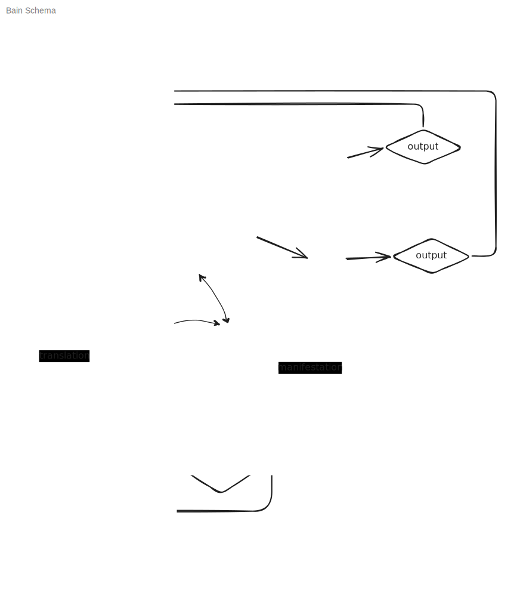

> This article is long overdue, I have had this draft for more than two years now 🤠

### Disclaimer

Most of what I am talking about here are things that are on the edge of known – a place where no one knows shit. A place where the most dedicated ones take an educated guess and occasionally come up with something new and groundbreaking that pushes that edge further. I am not one of those, and what I have been doing so far was saying – "here are some thoughts I had in the shower, fight me".

Hence, acknowledging my ignorance, my goal here is not to change the world, nor is it to introduce every theory that is out there. This is rather a suggestion of "how it might be" that fits the framework I've been constructing in the previous two articles. Of course it might be wrong too, and probably is. However, the utility of it is in introducing some concepts I will be using in the future discussion about morality.

---

> Is the Brain just a computer? Is Love just a program?

In the previous two posts in this series we've aimed our focus outward to explain the world around us. Now, we turn the lens inward. The subject in question is arguably the most complex object in the known universe – the human brain.

I assume that modern science has a pretty good understanding of the brain's physical essence – what it is made of and how it functions at cellular and molecular levels. However, no one has yet figured out how that thing came up with quantum physics.

The collective name for all the processes that happen in the brain is "cognition," and the following discussion is an attempt to understand it.

> [Cognition](https://cambridgecognition.com/what-is-cognition/) – is the mental action or process of acquiring knowledge and understanding through thought, experience, and the senses.

In this article I divided it into four integral parts: active and passive interpretation, rationalization, memorization, and prediction. We will go through each one.

## The Brain as a Prediction Machine

Imagine your brain as a helpless, wet, wrinkly, jiggly blob of matter locked in a black box, nothing more, nothing less. To make sense of the world, it relies on sensory organs triggered by physical stimuli – light, heat, sound, etc. These signals then get translated and become **information**. 

But here is the catch – the brain doesn't just sit there waiting for data to arrive and only react to it after the fact. That would be too slow and inefficient.

Instead, the brain builds a "model" of reality. In fact, this "model" of the reality your brain builds IS the reality you experience and live in. Based on this model the brain makes predictions about the world and its own state. To ensure model's correctness, that is to maximize its utility, it constantly checks its math against the "real" world. When reality matches the prediction – all is well. When it doesn't – the brain updates its model or acts on the world to make the prediction come true.

This idea is relatively new but has been gaining a lot of traction. One of the most prominent figures in the field is neuroscientist Karl Friston, famous for his [**Free Energy Principle**](https://en.wikipedia.org/wiki/Free_energy_principle). The actual theory is highly technical and requires sophisticated mathematical rigor, which I don't have. However, the core idea is intuitive – the brain doesn't merely react to sensory data, but acts as an active prediction engine constantly trying to guess what's going to happen next. This process is driven by mechanistic goal of minimizing free energy, in other words, to minimizing surprise or uncertainty.

### Energy, Entropy, and Prediction

As Friston's principle suggests, the brain works to minimize free energy – that is, to keep itself in a low-surprise, low-uncertainty, low-entropy[^1] state. **Prediction** is how it does this cheaply. Every time the brain successfully learns something and **memorizes** it, it converts a formerly surprising input into an expected one. The next time that input arrives, the brain doesn't have to process it from scratch – it just confirms the prediction and moves on, spending less energy. This is how we acquire **knowledge**.

When a prediction fails, the brain registers a **prediction error** – a signal that the model is wrong and needs updating. That update costs energy, and the mechanism the brain uses to do it efficiently is **attention**.

### Attention: The Spotlight of Learning

Attention is the cognitive resource we deploy to handle prediction errors. Knowledge does not require attention, **learning** does. Driving a car on a familiar route without consciously being aware of every turn is an example of this. But if a person jumps onto the road, that massive prediction error gets your attention immediately.

Here is some pop-sci on the topic:
- [Free Energy Principle – Karl Friston (YouTube)](https://www.youtube.com/watch?v=NIu_dJGyIQI)
- [How the brain shapes reality - with Andy Clark (YouTube)](https://www.youtube.com/watch?v=A1Ghrd7NBtk)

---

This was a gentle introduction to the discussion. I am already making quite substantial assumptions here that you have to accept for what comes next to make sense.

---

## A Framework for Conceptualizing Cognition

To be on a same page I propose a vocabulary – definitions I'll use in the context of this article. I will try to stay consistent with them to the best of my ability.
- **Data** – raw, uninterpreted fact about the reality (outside of the model).
- **Information** – the result of the **interpretation** of **data** by the brain (or anything capable of interpreting it).
- **Interpretation** – the process of assigning **meaning** to **data**. (It can be passive and active, more about it later.)
- **Meaning** – a concept in the brain's internal model.
- **Memorization** – the physical storage of information, i.e. change in neural structure.
- **Prediction** *(verb)* – generation of expected state of the model;
- **Prediction** *(noun)* – expected state of the model.
- **Prediction error** – the difference between what was predicted and what arrived. The signal that triggers **attention** and **learning**.
- **Attention** – the cognitive resource deployed in response to prediction errors. Knowledge doesn't require it; learning does.
- **Learning** – the process of acquiring knowledge.
- **Knowledge** – meaning that has been confirmed, stored, and has become part of the model.
- **Rationalization** – the process of assigning **meaning** to the model's prediction. (I think there is no need for distinguishing passive and active types for it, more about it later.) "Rationale" then is an explanation of a specific prediction.
- **Intellect** – the degree of ability to rationalize.

The difference between information and meaning is simple. The concept of "color" and the concept of a "car" are **meanings** – they are there even if you close your eyes. The yellow car passing by is **information** about the outside world.

Also note that interpretation and rationalization are not used as synonyms. Interpretation is the process of assigning meaning to data. Rationalization is assigning meaning to the model's own prediction.

Now that we have somewhat clear vocabulary, let's build some useful concepts using it.

### From "Meaning" to the "FUC" – Fundamental Underivable Concept

The brain's model is built from meanings, and meanings must come from somewhere. By the definition above, the pipeline is straightforward – data arrives, interpretation processes it, meaning is formed.

But not all data is "tangible", some meanings are only abstract. When you read the word "justice" no physical object enters your visual field. What arrives is an abstract signal that the brain interprets into meaning through the same process. The model is perfectly capable of building meanings from descriptions, from ideas, from words pointing at other words. A large portion of what we know, we know this way – through information that is entirely abstract, never directly experienced.

This is powerful, but it has a limit.

Some meanings cannot be built from descriptions, no matter how precise or detailed they are. They have to arrive through direct experience, because no arrangement of other concepts will produce them. Call these **Underivable Concepts**.

"Color" is the cleanest example. You can describe red as "a wavelength around 700 nanometers" or "what blood looks like" – but none of that produces the experience of redness. No combination of non-color descriptions will get you there if you never seen color. The meaning has to be experienced directly. That is what makes it **underivable**. This argument is famously known in philosophy of mind as [Mary's room](https://en.wikipedia.org/wiki/Knowledge_argument).

> This makes an interesting case for people born blind. "Color" isn't an underivable concept for them – not because they lack intelligence, but because the experience that would ground it never arrived. Their model is built from different underivables: texture, temperature, sound.

| Concept                               | **Essential**                                    | **Non-essential**                                     |
| ------------------------------------- | ------------------------------------------------ | ----------------------------------------------------- |
| **Underivable (must be experienced)** | EUC – *color, love, contrast*                    | Underivable but optional – *a specific shade of blue* |
| **Derivable (can be described)**      | Derived essential – *justice, object permanence* | Ordinary concept – *sports car, birthday party*       |

The remaining three cells of the table follow the same logic, and each is worth a moment.

Some underivable concepts are simply not load-bearing. A specific shade of blue has to be experienced to be known — no description will produce it — but the brain's model functions perfectly without it. You could live an entire life without ever encountering that particular hue and lose nothing foundational. These are the concepts in the top-right cell: experientially irreplaceable for those who have them, but not structural requirements of the model itself.

Then there are concepts that are essential but don't require direct experience to form. "Justice" or "object permanence" can be built from descriptions, from language pointing at other concepts, from reasoning about things you have never directly perceived or experienced. Nevertheless, they are essential because you could argue that to effectively function as a human being you probably need those concepts in your model.

And finally, ordinary concepts – "sports car," "birthday party" – derivable and non-essential. They are the useful concepts built upon the essential concepts, but not essential on their own. The bulk of what we know lives here.

I think much of it comes to concept's utility in the model. If it is important enough to help you survive and spend less energy – it will find a place in this matrix. 

To solidify the idea let's use an example with the same EUC of color. Why do you stop at a red light? Because red means stop. And there the chain ends – "color" doesn't have to be explainable by anything simpler in the model.

EUCs are precisely these terminal points in rationalization – the meanings that function as final answers to "because" that don't have to be questioned further. They are where explanation bottoms out, or at least, should, in the context of everyday life and usual circumstances.

But that doesn't necessarily mean that building a model without "color" is impossible. Blind people just don’t have that concept in their model, yet remain completely functionally capable.

More interestingly, notice that "Love" sits in the same cell as color. That is not an accident. You can describe everything that produces love – the chemistry, psychology behind it, and yet none of that description produces the experience of it. 

Someone who has never felt love would understand it the way a blind person who knows everything there is to know about color would understand color. Arguably, love seems far more complex than color. Experientially, they share the same essential property – you cannot get there from words alone.

This is why love should be treated as the base unit it functionally is. That doesn't mean that description of what it is is useless, but because the description is not the thing. The point at which further decomposition loses more than it gives is what I'll later call the **reduction limit of rationalization**.

With that in place, I think we can go further and find a concept so foundational that all other EUCs depend on it. I called it the **Fundamental Underivable Concept – FUC**.

> So what is the FUC? (Pun intended.)

"Something" seems like a good candidate for a FUC. After all, "something" is the starting point of everything, and without the assumption that "There exists something" that we made in the very first article, all of this would fall apart. However,

> "Something" cannot exist without "nothing."

Our sensory systems are designed to detect **changes**. Eyes detect shifts in light, ears detect vibrations in air, skin detects pressure differences. Without contrast, input is completely predictable – zero entropy, no informative content.[^1] In a perfectly uniform environment, even if "something" exists, our sensors have no differential to register. The definition of "something" comes from its **contrast** with "nothing."

Therefore, the concept I think is more fundamental to the brains' model is **Contrast**.

> Contrast is essential to meaning.

A static universe has no data besides its own existence. No way to interpret it from the inside, so no information. No information – no meaning. This might be a good opener for a purely philosophical discussion – "The meaning of life is **change**."

If contrast is the baseline of all meaning, how does the brain actually process it? 

Every time the brain encounters a contrast it didn't predict, it has to update its internal model – which requires computational power. In the biological world, computation costs calories. To survive, the brain needs an operating system built to manage unexpected contrasts as efficiently as possible.

## Prediction Machine Architecture

The diagram above makes the architecture of this concrete. Stimuli arrive from two directions simultaneously – from the outside world through sensory organs, and from inside the body through internal sensors monitoring things like heart rate, hormone levels, and organ states. Both streams get translated into signals and arrive at the brain as raw data. The brain is processing both at the same time, all the time.

Sitting at the center is the **virtual model** – the brain's accumulated best guess about the state of the world and the state of the body. This is where Friston's principle becomes tangible. The brain tests the model against reality at every moment, updating it where it fails.

The output of this process splits into two modes, shown in the diagram as active and passive interpretation.

- **Passive interpretation** is the brain running on confirmed predictions – low energy, low attention, automatic.
- **Active interpretation** is what happens when a prediction error is significant enough to demand a response – attention engages, and the output feeds back into the model as new information.

To avoid confusion I want to make some useful distinction that the English language allows.

I suggest using the verb (to) **experience** for the act of passive interpretation of **emotion**, as we use (to) see and (to) hear. Similarly, the verb (to) **feel** for the act of active interpretation of emotion as we use (to) look and (to) listen. Hence, the noun (a) feeling becomes the meaning that we assign to a certain emotion(s).

Consequently, an emotion becomes a piece of information—like light or sound—that we can experience or feel.

Notice that the output arrow loops back to the top of the diagram. The brain makes sure not only to respond to the stimuli, your behavior changes the stimuli you receive next, which updates the model, which changes the next prediction. The brain is not merely reacting – it is constantly acting on the world to make the world match its predictions.

The internal stimuli branch is easy to overlook but it is crucial. The brain is modeling the body the same way it models the outside world – predicting its states, detecting errors, and updating. This is interception.

Moreover, I suspect, that the body is inseparable from the brain activity, as far as being an essential part of it. Evolutionary and biological nature of cognition makes me think that it can't be emulated without also emulating the body and the vital processes that happen within it.[^2]

For example, I imagine people with cardiac implants might experience a form of cognitive dissonance when they are subjected to stress but their heart rate does not increase as expected. The brain might model that the heart rate is up, but not have the increase in blood flow. This mismatch between their perceived emotional state and their body's unexpected physiological response, or rather lack of it may create an unsettling prediction error, leading to the cognitive dissonance, consequently, maybe, stress, or anxiety.

I will come back to this later when talking about emotions, for now the fact that the body is part of the model brings us to the next important point.

### The Model Is Physical

When I say the brain "builds" an internal model of the world, I don't mean this metaphorically, I mean it literally. The "model" and consequently everything in that is a part of that model is not some abstract representation floating in a mental realm – it is a physical object. It is the literal structure and electrochemical state of your neurons, and possibly the body, at any given moment. When you know what a chair is, that knowledge is not stored "somewhere in your mind". It is instantiated in a specific state of biological tissue.

This is a physicalist position, and I'm going to hold it consistently. It has an interesting implication – if you change the physical state of the brain, you change the model and everything in it.

Following this logic, learning something is physically shaping your brain into new configuration, and forgetting something for good is literally irreversibly changing it. It is also why I find the argument for mind-body [dualism](https://plato.stanford.edu/entries/dualism/#DuaMinBodPro) ridiculous. If a stroke or a hard hit on the head can collapse the neural structure and alter the personality of a person completely, how can one claim that there is a soul floating around somewhere?

This distinction matters because it means that everything we're about to say about meanings, concepts, emotions, and identity is not talking about software running on a brain – it is talking about the brain's and body's physical configuration.

### A Word on Free Will

In this model, prediction and attention are energy-preservation mechanisms. The results of our cognitive processes are, therefore, arguably defined by a mathematical imperative to minimize surprise. There is no "will" in it, nor is it "free" – it's a deterministic process. From this perspective, the feeling of making a choice is just the brain's post-hoc narrative explaining a decision that was already made by these underlying predictive processes.

Obviously, this is a controversial view. One empirical proof that could be used in favor of this argument is [the Libet experiments](https://www.informationphilosopher.com/freedom/libet_experiments.html) that famously showed that measurable brain activity precedes conscious awareness of a decision by several hundred milliseconds. However, whether this settles the debate is still argued. I am not going to resolve it here and just hold the position that there is no free will.

What matters for this framework is the question – if we are just merely minimizing surprise, why is there is an illusion of "me" experiencing this deterministic algorithm as if we have agency? To try to bridge this gap between a cold prediction engine and a subjective human experience, I suggest looking at how this machinery boots up and develops over time.

## A Speculative Model of Development

I'll now try to divide the development of the brain into three distinct stages based on the evolution of attention. This is a completely arbitrary distinction and it is completely out of my ass. I am proposing this framework for its utility in the explanation for how **subjective experience** might happen. In reality, neural development is highly interactive, not strictly sequential, and again, no one is completely sure about this yet, anyway.

### Stage 1: Non-Selective Attention and Innate Behavior

Imagine your brain is turned on for the first time. (I don’t know when exactly it happens, and it doesn't really matter here, you might still be in your mother's womb. But for the sake of this argument, let's discuss it from the perspective of a newborn.) The world is a chaotic flow of raw **data**. It has no **meaning** yet. Your actions are only innate reflexes. Your interpretation is always active, meaning your attention is "always on", constantly scanning for **contrast** to recognize patterns that you can then contextualize and remember. This is when construction of the first EUCs happen.

Aside from fundamental EUCs like "dark" and "light" or "loud" and "quiet", this stage is characterized by the formation of a feedback loop between a motor action and its sensory consequence. You have an innate reflex to cry, to which the world responds to. The brain then correlates its own outputs with the contrasts that follow, and slowly, learns the patterns.

These are the first EUCs, and they are purely relational and primitive – "Action A reliably produces Contrast B" – which serve as the baseline for the virtual model. Before the brain can build a model of objects, people, or itself, it has to first establish that its own actions have predictable consequences. This is when it starts differentiating itself from the wold.

### Stage 2: Selective Attention, Learned Behavior, and the "Self" as a Virtual Organ

You now have some EUCs. If there is nothing new in your environment, your interpretation becomes passive. You can "see" and "hear" without actively "looking" or "listening".

[Research suggests](https://www.researchgate.net/publication/12181667_The_Development_of_Visual_Attention_in_Infancy) that infant attention develops from a state of "obligatory looking" – where babies get genuinely stuck on stimuli, unable to disengage – to a more voluntary, selective system. This directly maps onto the prediction framework – as you acquire more knowledge, the brain learns what it can safely ignore and preserve energy. Attention becomes a resource that can be aimed.

I suspect that this is also where the **Self** begins to form, initially for a practical reason. Consider what happens when you move your eyes – the entire visual field shifts. From a raw signal perspective, this looks identical to the whole world suddenly moving. Without a way to account for its own movement, the brain would register every eye movement as a massive prediction error. It would spend enormous energy recalculating a world that hadn't actually changed.

The solution is to build a model of the body itself – a **virtual organ** that tracks the brain's own movements and subtracts them from incoming sensory data before processing. This is the **[reafference problem](https://pmc.ncbi.nlm.nih.gov/articles/PMC7934971/#s2)**, and the Self is its solution. By labeling certain changes as "self-generated" the brain can filter them out entirely, freeing up resources for things that actually are unexpected.

The Self at this stage is a way of differentiating off "me" from "not me" to navigate through the world.

### Stage 3: Meta-Cognition and "Self" as an EUC

In this stage the brain notices a **contrast** with its own behavior and the behavior of others.

Stage 3 requires modeling things that don't directly depend on observed properties of the objects or "subjects", but instead on things like beliefs and desires. There is now a contrast between itself and "other minds". It becomes a game of predicting what another "self" will do next. This is when the "Self" expands from merely a representation of the body in space into an EUC.

I suppose it can be learned what other minds think, but I think to successfully predict it, I think, the brain has to infer their internal state, which requires simulating[^2] another mind. The brain starts to treat its own mental processes as an object it can examine and manipulate. That is **meta-cognition** – thinking about thinking. This I think is the cognitive root of empathy, theory of mind, and social intelligence. Lack of empathy and psychopathy hence might just be an error in the brain's development; or it can be because the brain haven't seen that contrast.

The tragic case of [Genie](https://en.wikipedia.org/wiki/Genie_(feral_child)), a feral child deprived of social interaction, supports this idea. Genie was a child kept in near-total isolation until the age of thirteen, deprived of social interaction during the critical developmental window for exactly this stage. Without social input, her cognitive and self-concept development were severely limited. In other words, without other minds to model, her sense of "self" never properly developed. The Self that goes beyond just movement, it seems, cannot fully form without the contrast of an "other mind" to define itself against.

Once meta-cognition is established, the "Self" becomes a psychological entity, something with a history, intentions, and a perspective. This is the point at which **Me** and **My Brain** stop being the same thing.

However, it is important that it is not because something non-physical has appeared, but because a new EUC has formed from the newly observed contrast with other minds. The representation of all EUCs in general and Self EUC in particular are all still described by the physical state of the brain and the body.

From here, the brain builds an entire layer of **Higher-Order EUCs** in the context of the Self – free will, beauty, justice, love – that only make sense with Self EUC.

---

We now have all the pieces – the brain the prediction machine, the Self, and a set of higher-order EUCs. Now let's see what this model actually looks like when applied to something concrete.

---

## Putting It All Together: Rationalization of Perception & Emotion

Let's apply this framework to two very different human experiences. I categorize our **interpretations** into two groups – **Perceptions** and **Emotions**.

### Case Study 1: "I See a Yellow Car"

Let's use color perception. We understand the physical mechanics of it pretty well. Most humans are trichromats, possessing three types of cone cells for conveying color information. This gives us a three-dimensional color space ([here is a 3D RGB visualization to see what it looks like](https://alexanderell.is/posts/rgb-color-space/)). We know that red light corresponds to longer wavelengths, around 620 to 750 nanometers.

But this leaves the qualia problem (also known as [Hard problem of consciousness](https://en.wikipedia.org/wiki/Hard_problem_of_consciousness)) – there's no way to know if the "red" you see is the same "red" I see. Moreover, the distinction is made up in that "red" doesn't exist in the universe, it is merely an electromagnetic wave (however, modern physics allows you to argue on that too). In other words, it only exists in your model inside your brain.

> Color is just a state of the brain and body that occurs when certain stimuli are present that we have assigned a certain meaning to.

So, when you say, "I see a yellow car," what you really mean is:

> "My brain has interpreted the signal from my eyes and recognized that the information corresponds to the meanings of 'car' and 'yellow' stored in its internal model of the world, which I have learned before."

### Case Study 2: "I Love You"

Now apply the same lens to an emotion. The difference between a perception and an emotion, using the taxonomy introduced in the beginning, comes down to the domain they operate in. "Love", being one of the higher-order EUCs requires the context of the Self EUC to be felt, i.e. "interpreted". (And yes, I am calling "Love" an emotion, fight me.)

So when you say "I love you", what you really mean is:

> "My brain has entered a predictive, self-modeling state that integrates external signals with my interoceptive map and my prior experience of this person, and recognized that the internal configuration corresponds to the meaning of 'love' stored in its model of the world."

The qualia problem applies here too. There's no way to know if the "Love" you feel is the same "Love" I feel.

We can completely rationalize our vision. We know what cells in our eyes are responsible for it, what regions of the brain process it and so on and so forth. Our brains have mapped these interpretations for good and we don't have to question them actively to make sense of them. 

Now, the problem with feelings, or in other words, **actively interpreted emotions**, it is difficult to rationalize. In fact, it was the whole reason for writing this article.

I think it comes from our inability to comprehend their complexity. I suspect that we just don't have the biological or/and intellectual capacity to rationalize such complex emotions as "Love". Maybe the thing is our brains just are not developed enough to comprehend emotions as naturally and as discretely as colors. Maybe evolution will get us there someday and "Love" will be as clear as the "color red".

This is why I'd like to call "emotions" as our ==reduction limit of rationalization==.

## Emotional ≠ Irrational

Most important argument I want to make out of this discussion though is that I think the common framing that emotions get in the way of rational thinking is wrong. 

Emotions aren't interference in the reasoning process – they are part of it. The brain's reasoning chain has to include them because fighting an emotion out of the model just makes it incomplete.

Instead of trying to fight them off, I think people should focus on identifying the boundaries by which feelings are represented and in what context. Remember the earlier discussion about cognitive dissonance. I think people have hard time with emotions because their model operates lacking context necessary for successful prediction. I think that context is available to us through language.

## Language

To understand feelings better, the question becomes – how does the brain make sense of it in its model. My intuition is that the model, at least the conscious part of it that we have access to, represents them in the form of words. Hence, I think, we gotta talk about the language we use more seriously.

In a way, language is the interface for our internal model. It is the only way that we can communicate our "models" with each other. Earlier I said:

> "Red" doesn't exist in the universe, it's only in your model.

Still, we somehow all somewhat know what "red" is. Language is how we reach a consensus and build the [shared subjective reality](https://sagyzdop.com/blog/are-you-real/#argument-for-you-and-me-argument-for-shared-subjective-reality).

Now imagine that there is no word for "red" at all. Some people don't have to imagine because there are [languages](https://www.fl4k.com/blog/the-piraha-language) that don't have a word for "red". Does that mean that they don't see the color red? Certainly not. Maybe they describe it using some other words or concepts, but that is arguably harder having a word that is loaded with everything needed to describe a concept.

Linguistic meaning mapping not by describing it by other things, but by themselves is applied to emotions too. Some languages have words for emotions that others don't, like the famous example of Russian **"тоска"** (a deep, melancholic yearning). I think, this concept, often described as untranslatable, highlights how language provides the labels and boundaries for our internal EUCs.

> This view is, as expected, also highly debated. To learn more see [Philosophy of language](https://iep.utm.edu/lang-phi/).

However, I think it goes beyond that. Language doesn't just describe the brain's model – it actively shapes it. When you learn the word "тоска", you get a clear label for a pre-existing feeling, but also you get a new EUC. The concept becomes thinkable in a way it wasn't before. 

We can experience feelings no matter the language, it is just that language defines the boundary and makes it accessible to the brain's model as an EUC. It becomes easier to identify and operate with it. I would argue that there is an existential need for learning new languages if you want to feel to the fullest.

Moreover, I think talking about one's intellect, emotional included, the ability to rationalize is the metric that we should use. If the language makes things easier to use in your rationalization, I would argue that there is an existential need for learning new languages if you want to be smarter.

However, being so powerful, language alone doesn't solve the hard problem. I can’t hand you my internal state of "red" – I can only say the word and trust that your model has been trained on similar enough data to converge on the same concept.

Emotions make this harder. When two people say "I love you" their internal models might be in wildly different configurations that includes interoceptive signals, social context, and personal history. This is why we argue so much about what love *really* means.

## Computah, make this person feel love!

Considering all the things discussed up to this point, experience is not something produced by brain states – it **IS** what those states **ARE** like when instantiated in a predictive, self-modeling system.

Human love, though, is not just a brain state. Earlier I argued that the body is inseparable from cognition. Love involves interoceptive predictions about heart rate, hormones, gut feelings, and a whole history of physical experiences. The body is part of the hardware. A computer made of silicon cannot copy that exact physical setup. So I don't think a computer can feel love the way a human does simply because it lacks the right kind of body.

That does not mean a computer cannot be conscious at all. The main obstacles I see are energy efficiency and information storage. If a machine ever matches the human brain's efficiency and stores information as compactly as biological neurons do, it could enter the same kind of recursive self-modeling loop that creates a Self. It could have its own subjective experience.

And once it has a Self, it could form its own higher-order EUCs. It could care about certain predictive patterns and label some of those states with a word that we might translate as "love". That love would not be human love. It would be a machine's love, shaped by whatever the machine's body is. But it would still be very real. The state would still be the feeling.

The interesting part is that for a machine, we might know exactly which bits hold that feeling. We could point to a hard drive and say – 'This is love' – and in doing so, solve the hard problem at least for a computer system.

We started with two questions:

> Is the Brain Just a Computer? Is Love Just a Program?

The framework says, yes, the brain is a prediction machine, and love is a state of that machine – and, for us, of the body it runs on. The word "just" hides the whole history of a self-model that learned to feel. Computers may never run our exact program, but they could run their own. And if they do, that program will be love, too.

[^1]: In information theory, entropy quantifies the uncertainty, or average "surprise", of a signal. A low‑entropy state is highly predictable and carries little new information; a perfectly constant, uniform signal has zero entropy – it is completely predictable and contains no informative content. See [Entropy (information theory)](https://en.wikipedia.org/wiki/Entropy_(information_theory)).
[^2]: In computing, *simulation* typically replicates a system’s external behaviour using a different internal mechanism, while *emulation* aims to reproduce the internal processes exactly (e.g., running old software on new hardware by mimicking the original processor).  See [Simulation](https://en.wikipedia.org/wiki/Simulation) and [Emulation (computing)](https://en.wikipedia.org/wiki/Emulation_(computing)).