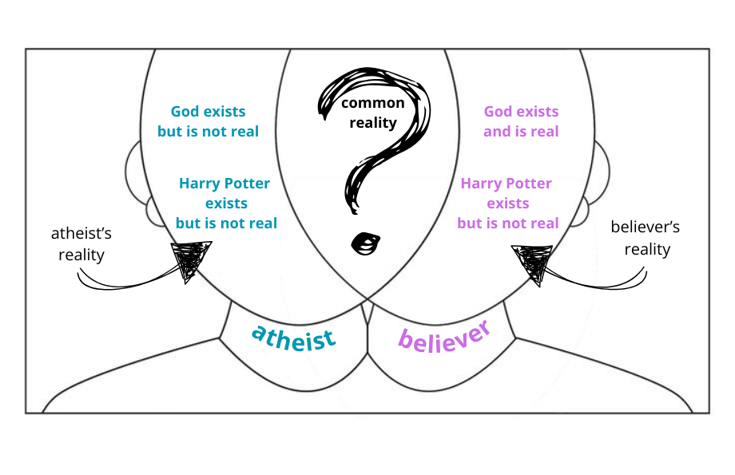
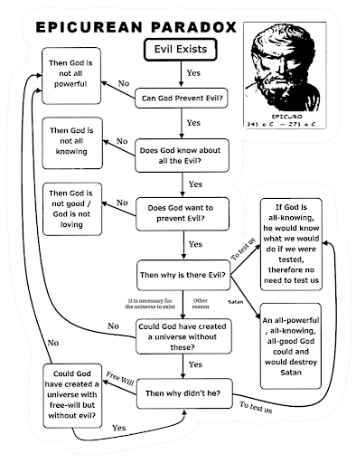
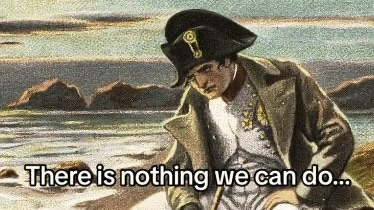

Okay, let’s continue our journey through this existential crisis. Recall the example with Harry Potter and God from the [previous article](../../../2024/10/19/Are-You-Real.html). 

> Everything that you can possibly think of – exists, but might not be real.

The most crucial take from this is that we made the distinction between existing and being real. For something to be real for both of us, it has to exist AND be a part of both of our realities. However, keep in mind that what we described as **Ultimate Objective Reality** cannot be reached. 

Now, what does the reality that is **real for both of us** look like? In other words:

> What are the things that we can agree to include in our realities?

## Elements of **Common Reality**

**Time.** The first thing we can agree on is the direction of time. It is true that in different circumstances the perception of time can change dramatically. The same 60 minutes can feel like an eternity on a boring lecture, but fly by quickly on an exam. However, no one's clock ticks backward. You don't get younger as time passes.

**Causality.** You might deny all of physics but you would agree that nothing happens without a reason. In principle, we can always find an explanation for anything, because you can always trace back the cause to either yourself, i.e. your own free will, God(s), or some physical, biological, or psychological phenomenon.

**Laws of Physics.** Third – we cannot control nature. Laws of physics are true regardless of our opinion, even our existence. We weren’t flying around in space before an apple fell on the head of Newton. You are going to fall down and die if you jump from a plane without a parachute. Always. Even if you believe you can fly.

Surprisingly, this is all we need. Now if we agree on all of the above, the next question to ask is how can we get the best description of the world with all of these elements in it? In other words: 

> What is the best explanation for the things that happen in reality constituted by these elements?

## Theory

The easiest way is to take a guess. In the context of this discussion, such a guess would mean a claim that describes the world. In other words, a claim that explains something that happens in reality. In everyday sense, we can call such a claim a theory. The next question is:

> How do you know that a theory is good?

A good theory is one that consistently makes correct predictions about the thing it describes, i.e. has more **predictive power**. If there is experimental or observational data that confirms the claims made by the theory we can say that there is **evidence** for the theory being good, and the process of finding this evidence we can call **testing** a theory.

In this sense, a theological theory about the world is a valid, testable one, both in principle and in practice. However, all the testing to date shows no evidence for it, which is a problem.

## Traditional Religion

### Is Ultimate

The first problem I find in traditional religions is that they claim to be the ULTIMATE truth about the world. They are based on universal statements that fall apart upon closer inspection and lead to contradictions within themselves. 

### Is Normative

Secondly, traditional religion is normative. I highly doubt the idea that ethics is something that is woven into the fabric of the universe. I will talk more about ethics in another post dedicated to value theory.

### Is Too Good To Be True

In my opinion, traditional religion is a result of the arrogance of the self-centric human mind that places too much importance upon its own existence. If traditional God is real, it/he/she wouldn't care about people.

Despite all these problems, the simplicity and spiritual power of theological theory that fuels the indomitable human spirit is undeniable. Faith is what kept, keeps and will keep many to do great things. However, to build a “good theory” by the definition given above, we need something else.

## So, Why Physicalism?

Ever since being introduced to physics in seventh grade I developed a physicalist view of reality. I remember being fascinated by the kinetic theory of gasses according to which temperature is nothing more than the sum of kinetic energies of the molecules. It appeared to me that physics is the most straightforward explanation for everything that ever happens in nature.[^1]

A system being nothing more than the sum of its parts is known as reductionism and I assume that this is true. From this assumption I define physicalism as a theory that claims that the common reality is fully reducible to physics. Both of these are reasonably highly debatable. So then why physicalism? 

> Because it just works the best.

Physicalism is a theory that **works** within the boundaries of the common reality that we identified before. As opposed to any divine theory it withstands rigorous scientific testing and therefore has a lot of supporting evidence.

### Argument for Physicalism

1. There are some things that are part of everyone’s reality.  
2. The reality constituted by those elements can be described with a theory that makes claims and predictions about it.  
3. For a theory to be good it has to have evidence.  
4. To date, the theory that has the most evidence is physicalism.  
5. Therefore, physicalism is the theory that all of us should accept.

## Can Science Find An Answer?

The focus of modern physics for the last century was finding the theory of everything – a unifying, final theory with which we could explain everything, and possibly answer the Ultimate Question asked in the first article: 

> **Why is there something rather than nothing?**

You might be familiar with [Laplace's demon](https://en.wikipedia.org/wiki/Laplace%27s_demon). It’s a thought experiment that suggests if we could know the exact state of every particle in the universe at a specific moment, we could, in theory, calculate everything that happened before and everything that will happen after. This concept relies on the assumption that the universe is completely deterministic.

But there is a problem: even if such a theory exists, it would require infinite energy and computational capacity to use it fully. And we’re nowhere near that. We don't even have the capacity to surely calculate the solution for the [three-body problem](https://en.wikipedia.org/wiki/Three-body_problem). Now imagine scaling that up to the entire universe.

Moreover, the uncertainty principles of quantum mechanics mean that some things, like the exact position and momentum of a particle, can’t be known at the same time. Chaos theory adds more unpredictability, making it impossible to fully predict the behavior of complex systems. These built-in limitations of science mean that even with endless progress, we’re unlikely to have the tools to explain everything.

Science is great at answering the *how* but isn’t designed to answer *why*. Therefore, science cannot possibly be THE answer. And therefore, science can’t ever, even in theory, disprove god. In fact, there always will be a place for God. 

> God Will Never Die.

A God without contradictions is possible, but not in the way described by traditional religions. The God that **works** in the common reality is only an answer to the ultimate question, nothing more, nothing less.

### Argument For God

1. There is no way to answer the ultimate question other than God.  
2. Therefore God will never die.

## Agnosticism – an Acceptance of Ignorance

Here is a hot take\!

> Believing in divine reason is refusing to accept ignorance.

With the metaphysical foundation we have constructed up to this point, we are now stepping into the epistemological discussion of “true knowledge” and whether we can have it or not. 

> How can we **know** anything at all?

What is it to “know” something? Do you know anything? How do you know that you know what you know? [They don't know that we know they know we know\!](https://www.youtube.com/watch?v=a4CS2tCjAgk)

Here is how I look at it. There is a certain limit to human comprehension. What is comprehensible is what we can understand and describe, what is not comprehensible is magic, God, love, emotions, and everything else that we refer to as spiritual, beautiful, and supernatural. 

Our understanding of the world is just the interpretation of reality by our brain that is evolved to be energy efficient and survive. The keyword here is “**energy**”.

Imagine being consciously aware of every single process that happens in your body, meaning you can sense individual cells, molecules, neuron signals, etc., trace their movements and interactions, and in the end correctly process and understand all that in real-time. Then there would be no mystery to you in *why* you feel a certain way at any given time. You could say: “I feel sleepy because there is not enough oxygen in my bloodstream”\! (Or something like that, you got the point.) 

That sounds like a superpower, doesn’t it? However, if you were to gain such power you would probably just instantly die of exhaustion. Google says the human brain uses 20 watts of energy. That is crazy efficiency for something that managed to make Bluetooth out of dirt, sand, and stones. Especially, when comparing it with the current state-of-the-art AI technology that requires kilowatts to mimic a fraction of human intelligence ([Microsoft bought a nuclear power plant to power AI](https://techcrunch.com/2024/09/20/microsoft-taps-three-mile-island-nuclear-plant-to-power-ai/)) that efficiency is an engineering miracle. However, it is only possible thanks to the fact that we can only know so much at a time. 

In my opinion this results in an interesting implication that the emergence of consciousness and free will is the direct result of the limitation of our brain to construct the causal relationship between things happening in the world. But since it has to end somewhere personal agency is the most **efficient** way to explain it. I will talk more about it in the next article about the origins of the mind. For now, the important thing is the fact that in principle, everything is explainable within the boundaries of the common reality that we defined previously.

## Determinism and Free Will

Determined life and no free will is a very hard pill to swallow.

Quantum mechanics introduces some randomness that tries to save some room for free will. However, I think it fails to do so. Randomness in itself does not translate into personal agency or conscious choice that free will traditionally implies. This randomness is blind and impersonal because it does not imply control over outcomes but rather that things may happen purely by chance.

Moreover, quantum indeterminacy operates on scales that are so small that on the scales of the human brain, they largely average out and follow the laws of classical physics, where deterministic or probabilistic processes take over. Free will, in most philosophical contexts, involves the capacity for rational deliberation and intentional action, not decisions influenced by random quantum fluctuations.

> There is no free will.

With our current knowledge about the world, it just doesn't make sense. 

Even if you are not convinced by physical evidence, it doesn't even make sense by pure reason, coming from the assumption that essentialism and existentialism must both be true. Essentialism suggests that certain traits or qualities are innate—things like your genetic makeup. Existentialism, on the other hand, argues that your environment and experiences shape who you become. Both of these factors, however, are entirely out of your control. You don’t choose your genes, and you don’t choose the circumstances you’re born into or the experiences you go through.

Every decision you make, then, is a result of these two forces. Your preferences, fears, habits, and even the way you weigh options are determined by your biology and environment. When you decide what to eat, it might feel like a choice, but it’s influenced by a mix of genetic predispositions (like your taste preferences) and environmental factors (like what’s available or culturally familiar). The same principle applies to more complex decisions, like choosing a career or a partner. Every step in your decision-making process can be traced back to factors you didn’t and couldn’t control.

This isn’t just a philosophical claim – neuroscience supports it too. Research has shown that brain activity linked to decision-making often occurs before a person is even aware of their choice. This suggests that what feels like a conscious decision is, in reality, a reflection of processes that have already happened in your brain, shaped by your past experiences and biology.

So, while the idea of free will might feel intuitive, it doesn’t hold up to scrutiny. If every choice can be traced to factors outside of your control, then what we call "free will” is merely an illusion.

 

> *Falling in love is not at all the most stupid thing that people do — but gravitation cannot be held responsible for it. - A. Einstein*

I think he is wrong. Ironically, the reason for it is Einstein's own theory. As I mentioned above, our best theories imply that the world is deterministic, and even if it isn't – we can't control it. In such a world, there is nothing we can do to change its course.

Similarly, the Beatles' song “Can't Buy Me Love” is a false claim. In principle, if capitalism will live long enough, there will be a drug that will stimulate a brain just the right way for you to feel love, and surely enough, you will be able to buy it.

This might sound depressing. It is hard to find meaning in such a universe. But the good news is that it does not matter.

## Pragmatism and Emergence of Meaning

The absence of free will or ultimate meaning doesn’t stop us from living meaningful lives in a practical sense. That’s where **pragmatism** comes in.

I take an agnostic stance on the possibility of true knowledge – the idea that we cannot understand the universe in some absolute, objective way. However, I support the idea of **pragmatic knowledge** – the kind of understanding that **works** for us, that we can use to navigate our daily lives and solve problems. True or not, it’s knowledge that has utility.

We’ve developed tools to build this kind of knowledge. **Deduction**, **induction**, and **abduction** are three logical methods we use to reason about the world. Using these tools, we’ve gotten remarkably good at turning observations into knowledge and applying that knowledge to improve our lives. From understanding the natural world to developing technology, this process has allowed us to progress, even in a universe that might lack inherent meaning.

## Conclusion

Summing up this contemplation about existence we can conclude that:

All of the science by itself is as real as Santa Claus. But the power of it is in the consistency of the predictions it makes about the reality that most of us collectively experience. So believing in science is just pragmatism, more specifically instrumentalism. However, once again, there is no way of reaching the objective reality. But, if you agree with me, since we defined our reality with science it is totally fine to say that science describes THE reality for “somewhat meaningful life” purposes.

No science is complete and physics is no exception. Complete physics would mean the discovery of the "Theory of Everything" with which, in theory, we would be able to predict the future. However, it requires complete and true knowledge that we cannot possibly have, so predicting the future is not possible in principle. Moreover, the theory will be practically useless without the discovery of infinite energy which is, again, not possible. Therefore, the fact that the universe is determined has no practical effect on our lives.

Therefore, however advanced the science gets, however accurately our theories describe the world, and however precise our measurements get, it does not pose a threat to our existence as “free-willed” individuals. It doesn't matter that we live in a deterministic world.

Moreover, the fact that we cannot “know” for sure also is not that important, because we “know enough”. In this context, God can be viewed as the thing that fills this epistemic gap in our understanding of the world, but it is not necessary, nor is it as important as the traditional religions describe it.

In the next article in this series, we will think about how we even end up with thoughts. We will explore the origins of the human mind and consciousness, exploring topics such as the problem of identity, rationalization, and emotions.

[^1]:  I will be using reality, nature and the world equivalently. This clarification is important because there is also a view of naturalism, which is quite different from physicalism. However, when referring to nature I exclusively mean the reality that is described by physics (and other natural sciences), and when calling something "natural" I mean "as expected in said reality". Everything that is not expected, or not necessary to describe the reality – is not real, i.e. supernatural or unnatural. By this definition anything that does not violate the laws of physics is natural. People often use "nature" to justify their opinion. For instance, remarks about women being emotionally unstable or men being brutally violent because it is "natural", or how being gay is against nature. I think these arguments can have a truth value in the right context and with the appropriate definition of nature. However, in the context of this and following articles "nature" only relates to physics.
